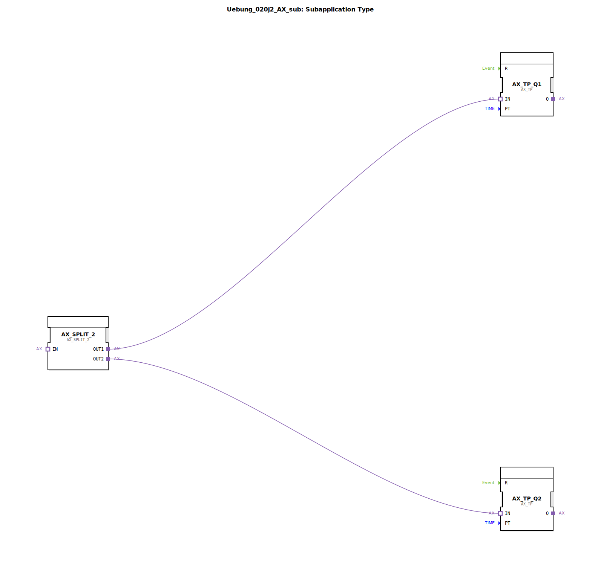

# Uebung_020j2_AX_sub: Subapplication Type

* * * * * * * * * *

## Einleitung

Diese Subapplikation dient als Baustein für die Ansteuerung von zwei Ausgängen (`Q1`, `Q2`) mit zeitverzögerten Impulsen. Sie wird über einen einzelnen Eingang (`IN`) gesteuert und ermöglicht die individuelle Einstellung der Impulsdauern für jeden Ausgang (über die Parameter `TQ1` und `TQ2`). Die Subapplikation kapselt die Logik zur Aufteilung eines Eingangsereignisses und zur zeitlichen Steuerung zweier unabhängiger Ausgangssignale.

## Verwendete Funktionsbausteine (FBs)

Die Subapplikation besteht aus einem selbstdefinierten SubAppType, der folgende interne Funktionsbausteine enthält:

### Sub-Baustein: `Uebung_020j2_AX_sub`
- **Typ**: SubAppType (selbstdefinierte Subapplikation, Wiederverwendung als Baustein)
- **Verwendete interne FBs**:

    - **`AX_SPLIT_2`**
        - **Typ**: `adapter::events::unidirectional::AX_SPLIT_2`
        - **Parameter**: Keine direkten Parameter (Standardbaustein)
        - **Ereignisausgang/-eingang**: Ereigniseingang `IN` → Ereignisausgänge `OUT1`, `OUT2`
        - **Datenausgang/-eingang**: Keine Daten
        - **Funktionsweise**: Verteilt ein eingehendes Ereignis auf zwei Ausgänge. Dadurch wird das Eingangssignal parallel an die nachfolgenden Timer weitergeleitet.

    - **`AX_TP_Q1`**
        - **Typ**: `adapter::events::unidirectional::timers::AX_TP`
        - **Parameter**: Zeitdauer `PT` = `TQ1` (vom Subapplikationseingang)
        - **Ereignisausgang/-eingang**: Ereigniseingang `IN` → Ereignisausgang `Q` (nach Ablauf der eingestellten Zeit)
        - **Datenausgang/-eingang**: Dateneingang `PT` (Zeit)
        - **Funktionsweise**: Erzeugt bei einem Ereignis am Eingang einen Impuls auf dem Ausgang, dessen Dauer durch den Parameter `PT` bestimmt wird.

    - **`AX_TP_Q2`**
        - **Typ**: `adapter::events::unidirectional::timers::AX_TP`
        - **Parameter**: Zeitdauer `PT` = `TQ2` (vom Subapplikationseingang)
        - **Ereignisausgang/-eingang**: Siehe `AX_TP_Q1`
        - **Datenausgang/-eingang**: Siehe `AX_TP_Q1`
        - **Funktionsweise**: Identisch zu `AX_TP_Q1`, jedoch mit eigener Zeitvorgabe `TQ2`.

## Programmablauf und Verbindungen

Der Ablauf innerhalb der Subapplikation ist wie folgt:

1. Ein Ereignis am Adaptereingang `IN` wird an den Splitter `AX_SPLIT_2.IN` weitergeleitet.
2. Der Splitter teilt das Ereignis auf seine beiden Ausgänge auf:
   - `AX_SPLIT_2.OUT1` → verbunden mit `AX_TP_Q1.IN`
   - `AX_SPLIT_2.OUT2` → verbunden mit `AX_TP_Q2.IN`
3. Gleichzeitig werden die Zeitwerte von den Datenparametern der Subapplikation übergeben:
   - `TQ1` (Dateneingang der Subapplikation) → `AX_TP_Q1.PT`
   - `TQ2` (Dateneingang der Subapplikation) → `AX_TP_Q2.PT`
4. Jeder Timer erzeugt nach Ablauf seiner jeweiligen Zeit ein Ausgangsereignis:
   - `AX_TP_Q1.Q` → verbunden mit Adapterausgang `Q1`
   - `AX_TP_Q2.Q` → verbunden mit Adapterausgang `Q2`

**Lernziele dieser Übung**:
- Verstehen und Erstellen einer Subapplikation in 4diac IDE.
- Arbeiten mit Adaptern für unidirektionale Ereignis- und Datenkommunikation.
- Einsatz von Standardbausteinen wie Splitter (`AX_SPLIT_2`) und Timer (`AX_TP`).
- Parametrierung von Bausteinen über Subapplikationseingänge.

## Zusammenfassung

Die Subapplikation `Uebung_020j2_AX_sub` realisiert eine einfache, aber häufig benötigte Funktion: Aus einem eingehenden Ereignis werden zwei zeitlich unabhängige Ausgangsimpulse erzeugt. Die Impulsdauern können über die Eingänge `TQ1` und `TQ2` festgelegt werden. Die Kapselung in einer Subapplikation ermöglicht eine einfache Wiederverwendung und trägt zur Strukturierung komplexerer Automatisierungslösungen bei.