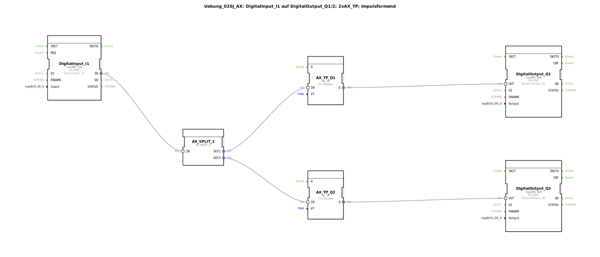

Hier ist die Dokumentation für die Übung `Uebung_020j_AX` basierend auf den bereitgestellten XML-Daten.

# Uebung_020j_AX: DigitalInput_I1 auf DigitalOutput_Q1/2; 2xAX_TP; Impulsformend

* * * * * * * * * *

## Einleitung
Die Übung **Uebung_020j_AX** demonstriert die Verwendung von Adapter-Verbindungen zur Signalverarbeitung. Ein digitales Eingangssignal (`Input_I1`) wird eingelesen, aufgeteilt und zur Ansteuerung von zwei digitalen Ausgängen (`Output_Q1` und `Output_Q2`) verwendet. Dabei kommen impulsformende Zeitglieder (Timer) zum Einsatz, die über Adapter-Schnittstellen kommunizieren.

## Verwendete Funktionsbausteine (FBs)

In dieser Übung werden verschiedene Bausteine innerhalb des Netzwerks verschaltet, um die gewünschte Logik zu realisieren.

### Sub-Bausteine: DigitalInput_I1
- **Typ**: `logiBUS::io::DI::logiBUS_IXA`
- **Beschreibung**: Dieser Baustein stellt die Schnittstelle zum physischen Eingang her.
- **Parameter**:
    - `QI` = `TRUE` (Baustein aktiviert)
    - `Input` = `Input_I1` (Zuordnung der Hardware-Ressource)

### Sub-Bausteine: AX_SPLIT_2
- **Typ**: `adapter::events::unidirectional::AX_SPLIT_2`
- **Beschreibung**: Ein Splitter-Baustein für Adapter-Verbindungen. Er nimmt eine eingehende Adapter-Verbindung entgegen und teilt sie auf zwei Ausgänge auf, um das Signal an mehrere Empfänger weiterzuleiten.

### Sub-Bausteine: AX_TP_Q1
- **Typ**: `adapter::events::unidirectional::timers::AX_TP`
- **Beschreibung**: Ein Impuls-Timer (Pulse Timer) basierend auf Adapter-Technologie. Er erzeugt einen Impuls definierter Länge.
- **Parameter**:
    - `PT` = `T#800ms` (Impulsdauer von 800 Millisekunden)

### Sub-Bausteine: AX_TP_Q2
- **Typ**: `adapter::events::unidirectional::timers::AX_TP`
- **Beschreibung**: Ein zweiter Impuls-Timer für den zweiten Ausgangspfad.
- **Parameter**:
    - `PT` = `T#1200m` (Impulsdauer von 1200 Minuten – *Hinweis: Hierbei handelt es sich laut IEC 61131-3 Syntax um Minuten. Im Kontext von Übungen ist oft Millisekunden (ms) gemeint, der Code spezifiziert jedoch `m`*).

### Sub-Bausteine: DigitalOutput_Q1
- **Typ**: `logiBUS::io::DQ::logiBUS_QXA`
- **Beschreibung**: Schnittstelle zum ersten physischen Ausgang.
- **Parameter**:
    - `QI` = `TRUE`
    - `Output` = `Output_Q1`

### Sub-Bausteine: DigitalOutput_Q2
- **Typ**: `logiBUS::io::DQ::logiBUS_QXA`
- **Beschreibung**: Schnittstelle zum zweiten physischen Ausgang.
- **Parameter**:
    - `QI` = `TRUE`
    - `Output` = `Output_Q2`

## Programmablauf und Verbindungen

Der Ablauf der Übung gestaltet sich wie folgt:

1.  **Signaleingang**: Das Signal wird über den Baustein `DigitalInput_I1` (Ressource `Input_I1`) in das System geholt.
2.  **Signalverteilung**: Die Adapter-Verbindung vom Eingang (`IN`) geht auf den Eingang des `AX_SPLIT_2` Bausteins. Dieser vervielfältigt die Adapter-Information auf zwei Ausgänge (`OUT1` und `OUT2`).
3.  **Signalverarbeitung Pfad 1**:
    - Der Ausgang `OUT1` des Splitters ist mit dem Timer `AX_TP_Q1` verbunden.
    - Sobald ein Signalereignis eintritt, generiert dieser Timer einen Impuls von **800 ms**.
    - Der Ausgang des Timers (`Q`) steuert direkt den `DigitalOutput_Q1` an.
4.  **Signalverarbeitung Pfad 2**:
    - Der Ausgang `OUT2` des Splitters ist mit dem Timer `AX_TP_Q2` verbunden.
    - Dieser Timer ist auf eine Dauer von **1200 m** (Minuten) konfiguriert.
    - Der Ausgang dieses Timers (`Q`) steuert den `DigitalOutput_Q2` an.

**Lernziele:**
- Verständnis von Adapter-Konzepten in 4diac (`AX`-Bausteine).
- Verwendung von `AX_SPLIT`-Bausteinen zur Verzweigung von Daten- und Ereignisflüssen, die in Adaptern gekapselt sind.
- Parametrierung von Adapter-Timern (`AX_TP`).

## Zusammenfassung
Die Übung `Uebung_020j_AX` zeigt eine Parallelschaltung von zwei Ausgängen, die durch einen gemeinsamen Eingang ausgelöst werden. Durch die Verwendung von Adapter-Timern werden unterschiedliche Impulsdauern für `Q1` und `Q2` realisiert, ohne dass klassische Event- und Data-Connections separat gezogen werden müssen. Besonderes Augenmerk liegt auf der korrekten Verwendung des Splitter-Bausteins und der Zeit-Syntax der Parameter.