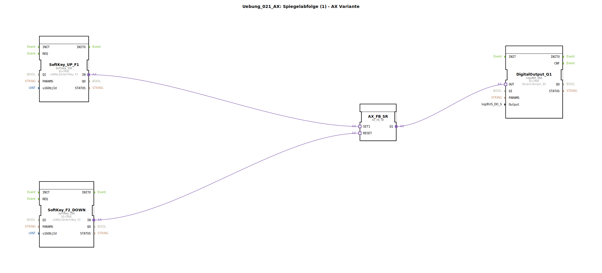

# Uebung_021_AX: Spiegelabfolge (1) - AX Variante

* * * * * * * * * *

## Einleitung

Diese Übung realisiert eine einfache Steuerung für eine **Spiegelabfolge (1)** – AX Variante. Mithilfe zweier Softkeys (F1 und F2) kann ein digitaler Ausgang gesetzt und zurückgesetzt werden. Der Funktionsbaustein bildet eine Art **Start/Stopp-Logik** für einen Antrieb (AX), der durch die Softkeys angesteuert wird. Die Übung vermittelt grundlegende Kenntnisse über die Nutzung von Softkeys, SR-Flipflops und digitalen Ausgängen in der 4diac-IDE.

## Verwendete Funktionsbausteine (FBs)

### Softkey_UP_F1
- **Typ**: `isobus::UT::io::Softkey::Softkey_IXA`
- **Parameter**:
  - `QI` = TRUE (Baustein aktiv)
  - `u16ObjId` = `SoftKey_F1` (verwendet die im Pool definierte Taste F1)
- **Adapterausgang**: `IN` – wird mit dem Set-Eingang des SR-Flipflops verbunden.
- **Funktion**: Sendet bei Betätigung der Softkey-F1 ein Signal (Impuls) an den angeschlossenen Adapter.

### SoftKey_F2_DOWN
- **Typ**: `isobus::UT::io::Softkey::Softkey_IXA`
- **Parameter**:
  - `QI` = TRUE
  - `u16ObjId` = `SoftKey_F2` (Taste F2)
- **Adapterausgang**: `IN` – verbunden mit dem Reset-Eingang des SR-Flipflops.
- **Funktion**: Sendet bei Betätigung der Softkey-F2 ein Signal an das SR-Glied.

### AX_FB_SR
- **Typ**: `adapter::iec61131::bistableElements::AX_FB_SR`
- **Parameter**: keine weiteren
- **Adaptereingänge**:
  - `SET1` – wird durch SoftKey_UP_F1 angesteuert
  - `RESET` – wird durch SoftKey_F2_DOWN angesteuert
- **Adapterausgang**:
  - `Q1` – Ausgangssignal, das den digitalen Ausgang ansteuert
- **Funktion**: Ein **SR-Flipflop** (setzen – rücksetzen). Solange der Set-Eingang aktiv ist, bleibt Q1 = TRUE. Ein Signal am Reset-Eingang setzt Q1 auf FALSE.

### DigitalOutput_Q1
- **Typ**: `logiBUS::io::DQ::logiBUS_QXA`
- **Parameter**:
  - `QI` = TRUE (Baustein aktiv)
  - `Output` = `Output_Q1` (die physische oder virtuelle Ausgangsadresse)
- **Adaptereingang**: `OUT` – empfängt das Steuersignal vom SR-Flipflop.
- **Funktion**: Steuert den digitalen Ausgang Q1 entsprechend des anliegenden Signals (TRUE → Ausgang aktiv, FALSE → Ausgang inaktiv).

## Programmablauf und Verbindungen

1. **Initialzustand**: Der SR-Ausgang `Q1` ist FALSE, der digitale Ausgang `Output_Q1` ist inaktiv.
2. **Start (Softkey F1)**: Wird die Taste **F1** gedrückt (kommentiert als „START-Knopf“), erzeugt `SoftKey_UP_F1` einen Impuls an `AX_FB_SR.SET1`. Dadurch wird der Flipflop gesetzt: `Q1` wird TRUE und bleibt es – auch wenn die Taste losgelassen wird.
3. **Stopp (Softkey F2)**: Wird die Taste **F2** gedrückt (kommentiert als „Endlage“), sendet `SoftKey_F2_DOWN` einen Impuls an `AX_FB_SR.RESET`. Der Flipflop wird zurückgesetzt: `Q1` wird FALSE, der Ausgang schaltet ab.

Die Verbindungen sind als **Adapterverbindungen** realisiert (Pfeile zwischen den Adaptern):

- `SoftKey_UP_F1.IN` → `AX_FB_SR.SET1`
- `SoftKey_F2_DOWN.IN` → `AX_FB_SR.RESET`
- `AX_FB_SR.Q1` → `DigitalOutput_Q1.OUT`

**Lernziele**:
- Einrichtung und Parametrierung von Softkeys in 4diac
- Verwendung eines SR-Flipflops zur speichernden Logik
- Ansteuerung eines digitalen Ausgangs
- Verständnis von Adapterverbindungen (Kommunikation zwischen FBs)

**Benötigte Vorkenntnisse**: Grundlegende Bedienung der 4diac-IDE, Kenntnis der Bibliotheken `isobus` und `logiBUS`.

## Zusammenfassung

Die Übung **Uebung_021_AX** demonstriert eine einfache Spiegelabfolge zur Steuerung eines digitalen Ausgangs über zwei Softkeys. Ein SR-Flipflop dient als speicherndes Element, das durch Taste F1 gesetzt und durch Taste F2 zurückgesetzt wird. Der Ausgang Q1 wird entsprechend geschaltet. Sie eignet sich als Einstieg in die Signalverarbeitung mit bistabilen Gliedern und in die Nutzung von Softkey-FBs zur Mensch-Maschine-Kommunikation.