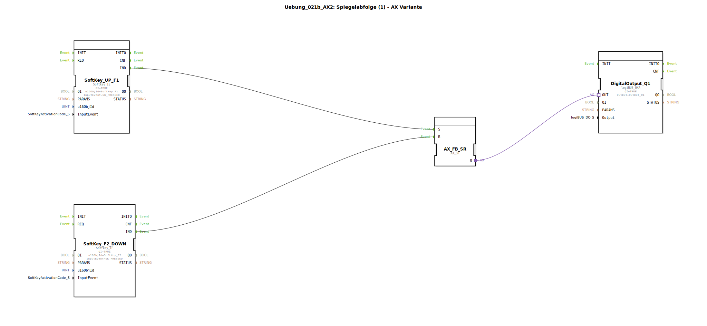

# Uebung_021b_AX2: Spiegelabfolge (1) - AX Variante

* * * * * * * * * *

## Einleitung

Diese Übung demonstriert die Steuerung einer einfachen Spiegelabfolge mithilfe eines AX‑Flipflops (AX_SR). Über zwei Softkeys (F1 und F2) wird der Ablauf gestartet bzw. zurückgesetzt. Der Ausgang des Flipflops steuert einen digitalen Ausgang (Output_Q1), der z. B. einen Spiegelantrieb ansteuern kann. Die Übung zeigt den grundlegenden Umgang mit adapterbasierten Ereignis-Flipflops und digitalen Ausgängen in der 4diac‑IDE.

## Verwendete Funktionsbausteine (FBs)

- **DigitalOutput_Q1**  
  - **Typ**: `logiBUS::io::DQ::logiBUS_QXA`  
  - **Parameter**:  
    - `QI` = `TRUE`  
    - `Output` = `Output_Q1`  
  - **Ereigniseingänge**: `OUT` (Adapter)  
  - **Funktion**: Schaltet den physikalischen Ausgang `Output_Q1` auf TRUE, sobald am Adaptereingang ein TRUE‑Signal anliegt.

- **SoftKey_UP_F1**  
  - **Typ**: `isobus::UT::io::Softkey::Softkey_IE`  
  - **Parameter**:  
    - `QI` = `TRUE`  
    - `u16ObjId` = `SoftKey_F1` (Softkey F1)  
    - `InputEvent` = `SK_PRESSED`  
  - **Ereignisausgänge**: `IND`  
  - **Funktion**: Erzeugt ein Ereignis am Ausgang `IND`, sobald die zugeordnete Softkey‑Taste (F1) gedrückt wird. Der Softkey ist ständig freigegeben (QI=TRUE).

- **AX_FB_SR**  
  - **Typ**: `adapter::events::unidirectional::AX_SR`  
  - **Parameter**: Keine Parameter  
  - **Ereigniseingänge**: `S` (Set), `R` (Reset)  
  - **Adapterausgang**: `Q`  
  - **Funktion**: Ein asynchroner SR‑Flipflop‑Adapter. Bei einem Ereignis auf `S` wird der Ausgang `Q` auf TRUE gesetzt, bei einem Ereignis auf `R` auf FALSE zurückgesetzt. Der Ausgang bleibt bis zum nächsten Ereignis erhalten.

- **SoftKey_F2_DOWN**  
  - **Typ**: `isobus::UT::io::Softkey::Softkey_IE`  
  - **Parameter**:  
    - `QI` = `TRUE`  
    - `u16ObjId` = `SoftKey_F2` (Softkey F2)  
    - `InputEvent` = `SK_PRESSED`  
  - **Ereignisausgänge**: `IND`  
  - **Funktion**: Wie SoftKey_UP_F1, aber reagiert auf Softkey F2. Erzeugt ein Ereignis bei Tastendruck auf F2.

## Programmablauf und Verbindungen

Der Ablauf ist in zwei Kommentarfelder unterteilt:
- **START-Knopf** (bei Softkey F1)  
- **Endlage** (bei Softkey F2)

### Ereignisverbindungen
- `SoftKey_UP_F1.IND` → `AX_FB_SR.S`  
  Ein Druck auf Softkey F1 sendet ein Ereignis an den Set‑Eingang des Flipflops.
- `SoftKey_F2_DOWN.IND` → `AX_FB_SR.R`  
  Ein Druck auf Softkey F2 sendet ein Ereignis an den Reset‑Eingang des Flipflops.

### Adapterverbindung
- `AX_FB_SR.Q` → `DigitalOutput_Q1.OUT`  
  Der Ausgang des Flipflops wird als Adaptersignal an den digitalen Ausgangsbaustein weitergeleitet. Liegt Q auf TRUE, schaltet der Ausgang `Output_Q1` durch.

### Funktionsweise
1. **Start der Spiegelabfolge**: Drücken von Softkey F1 → Setzt das AX-Flipflop. Der Ausgang Q wird TRUE → der digitale Ausgang schaltet ein (z. B. Spiegel fährt aus).
2. **Endlage / Reset**: Drücken von Softkey F2 → Reset des Flipflops. Q wird FALSE → der digitale Ausgang schaltet aus (Spiegel fährt zurück).
3. Der Zustand bleibt erhalten, bis der andere Softkey gedrückt wird.

## Zusammenfassung

In dieser Übung wird ein AX‑SR‑Flipflop verwendet, um eine einfache Spiegelsteuerung zu realisieren. Sie lernen:
- Wie man Softkey‑Ereignisse in die Steuerungslogik einbindet.
- Die Funktionsweise eines adapterbasierten SR‑Flipflops (Setzen und Rücksetzen über Ereignisse).
- Die Ansteuerung eines digitalen Ausgangs (logiBUS_QXA) über Adapterverbindungen.
- Grundlegende Ereignisverdrahtung und Parameterkonfiguration in der 4diac‑IDE.

Die Übung eignet sich für Einsteiger in die ereignisgesteuerte Programmierung mit 4diac und legt das Fundament für komplexere Ablaufsteuerungen.