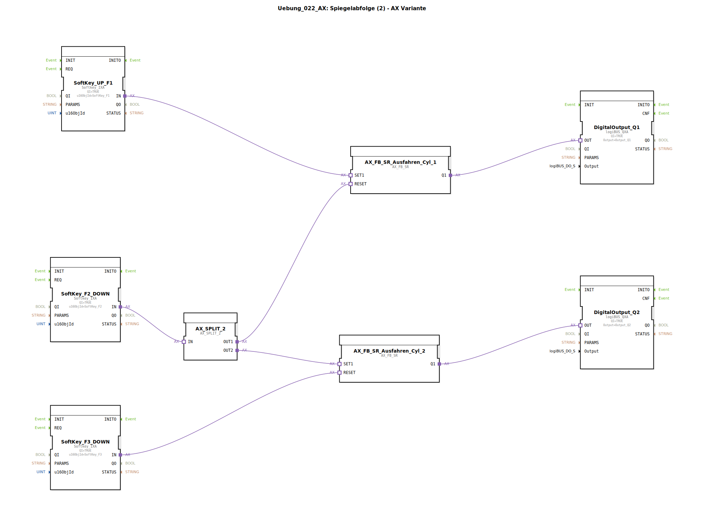

# Uebung_022_AX: Spiegelabfolge (2) - AX Variante

Kein Bild verfügbar.

* * * * * * * * * *

## Einleitung

Diese Übung realisiert eine **Spiegelabfolge** für zwei Zylinder unter Verwendung der **AX-Variante** (Adapter-basierte Funktionsbausteine). Die Steuerung erfolgt über drei Softkeys (F1, F2, F3). Die Funktionsweise ist wie folgt:

- **SoftKey F1** → Zylinder 1 fährt aus.
- **SoftKey F2** → Zylinder 1 fährt ein, gleichzeitig Zylinder 2 fährt aus (Spiegelung).
- **SoftKey F3** → Zylinder 2 fährt ein.

Die digitalen Ausgänge Q1 und Q2 steuern die Endlagen der Zylinder (z. B. Ventile). Der Ablauf ist typisch für industrielle Abfolgesteuerungen mit einem „Verschieben“ des aktiven Zylinders.

## Verwendete Funktionsbausteine (FBs)

Die Übung besteht aus einem SubApp-Netzwerk mit sieben Funktionsbausteinen und einem Ereignis-Splitter.

### Sub-Bausteine

### DigitalOutput_Q1, DigitalOutput_Q2

- **Typ**: `logiBUS::io::DQ::logiBUS_QXA`  
- **Parameter**:  
  - `QI` = `TRUE`  
  - `Output` = `Output_Q1` bzw. `Output_Q2`  
- **Funktionsweise**: Stellt einen digitalen Ausgang dar. Der Ausgang wird aktiv, wenn der Eingang (über den Adapter-Port `OUT`) ein Signal erhält.

### SoftKey_UP_F1, SoftKey_F2_DOWN, SoftKey_F3_DOWN

- **Typ**: `isobus::UT::io::Softkey::Softkey_IXA`  
- **Parameter**:  
  - `QI` = `TRUE`  
  - `u16ObjId` = Referenz auf den entsprechenden Softkey (`SoftKey_F1`, `SoftKey_F2`, `SoftKey_F3`)  
- **Funktionsweise**: Erzeugt ein Ereignis am Adapter-Ausgang `IN`, sobald die zugeordnete Taste (F1, F2, F3) gedrückt wird. Der Eingang `QI` aktiviert das Bauteil.

### AX_FB_SR_Ausfahren_Cyl_1, AX_FB_SR_Ausfahren_Cyl_2

- **Typ**: `adapter::iec61131::bistableElements::AX_FB_SR`  
- **Parameter**: Keine (alle Konfiguration über Adapter-Schnittstelle)  
- **Verwendete interne FBs**:  
  - Es handelt sich um ein **SR-Flipflop** (Set-Reset) in der AX-Adapter-Variante.  
  - **Adapter-Ports**: `SET1` (Setzen), `RESET` (Rücksetzen), `Q1` (Ausgang).  
- **Funktionsweise**: Ein Set-Impuls an `SET1` setzt den Ausgang `Q1` auf `TRUE` und hält diesen, bis ein Reset-Impuls an `RESET` erfolgt. Das Verhalten entspricht einem dominanten Set-Flipflop.

### AX_SPLIT_2

- **Typ**: `adapter::events::unidirectional::AX_SPLIT_2`  
- **Parameter**: Keine  
- **Funktionsweise**: Ein Ereignis-Splitter. Ein eingehendes Ereignis am Eingang `IN` wird auf zwei Ausgänge (`OUT1`, `OUT2`) verteilt – beide werden gleichzeitig aktiviert. Dient zur Weiterleitung eines Tastendrucks an zwei Ziele.

## Programmablauf und Verbindungen

Der Ablauf wird durch die Adapter-Verbindungen im SubApp-Netzwerk festgelegt:

1. **F1 (SoftKey_UP_F1)** → setzt `AX_FB_SR_Ausfahren_Cyl_1` (über `SET1`).  
   - Der Ausgang `Q1` von Cyl_1 wird `TRUE` und schaltet den **DigitalOutput_Q1** ein (Zylinder 1 fährt aus).

2. **F2 (SoftKey_F2_DOWN)** → wird über `AX_SPLIT_2` auf zwei Pfade verteilt:  
   - **OUT1** → `RESET` von `AX_FB_SR_Ausfahren_Cyl_1` → Zylinder 1 fährt ein (Q1 = FALSE).  
   - **OUT2** → `SET1` von `AX_FB_SR_Ausfahren_Cyl_2` → Zylinder 2 fährt aus (Q2 = TRUE).  
   - Damit wird die Spiegelung realisiert: Der aktive Zylinder wechselt von 1 zu 2.

3. **F3 (SoftKey_F3_DOWN)** → `RESET` von `AX_FB_SR_Ausfahren_Cyl_2` → Zylinder 2 fährt ein (Q2 = FALSE).

**Übersicht der Signalflüsse:**

- F1 → Set Cyl_1 → Q1 aktiv  
- F2 → Reset Cyl_1 + Set Cyl_2 → Q1 inaktiv, Q2 aktiv  
- F3 → Reset Cyl_2 → Q2 inaktiv  

Die Kommentare im Netzwerk markieren die Softkeys als „START-Knopf“ (F1) und die Endlagen der Zylinder.

## Zusammenfassung

Die Übung **Uebung_022_AX** demonstriert eine einfache Spiegelabfolge für zwei Zylinder mit AX-Adapter-Bausteinen. Die Steuerung erfolgt rein ereignisbasiert über drei Softkeys. Ein SR-Flipflop pro Zylinder speichert den Zustand, während ein Ereignis-Splitter den Befehl von F2 auf zwei Ziele verteilt. Diese Struktur ist typisch für die Umsetzung von Ablaufsteuerungen in der IEC 61499 mit Adapter-Schnittstellen.