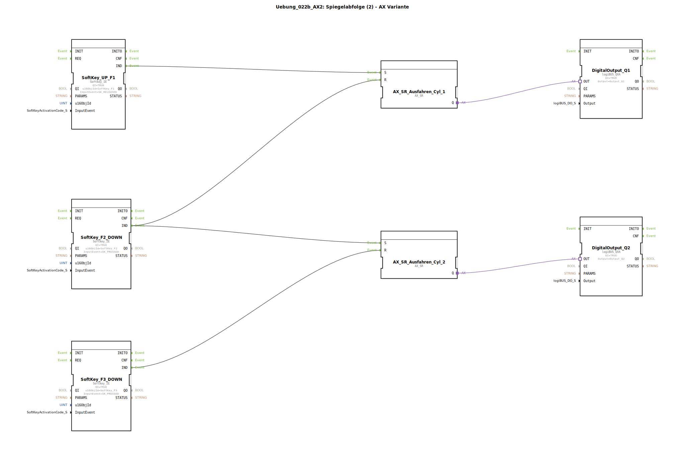

# Uebung_022b_AX2: Spiegelabfolge (2) - AX Variante




* * * * * * * * * *

## Einleitung

Diese Übung realisiert eine **Spiegelabfolge** für zwei pneumatische Zylinder (Cyl_1 und Cyl_2) unter Verwendung von Softkeys als Bedienelemente und AX_SR‑Funktionsbausteinen zur Ansteuerung der Digitalausgänge. Die Abfolge wird durch drei Tasten (F1, F2, F3) gesteuert: Mit F1 wird Zylinder 1 ausgefahren, mit F2 wird Zylinder 1 eingefahren und gleichzeitig Zylinder 2 ausgefahren, mit F3 wird Zylinder 2 eingefahren. Die Übung vermittelt den Umgang mit Set‑Reset‑Adapterbausteinen und deren Verknüpfung mit Ereignissen und Datenausgängen.

* * * * * * * * * *

## Verwendete Funktionsbausteine (FBs)

Die Übung besteht aus fünf Funktionsbausteinen, die im SubApp‑Netzwerk verdrahtet sind:

1. **SoftKey_UP_F1**  
   - **Typ**: `isobus::UT::io::Softkey::Softkey_IE`  
   - **Parameter**:
     - `QI` = `TRUE`  
     - `u16ObjId` = `SoftKey_F1`  
     - `InputEvent` = `SK_RELEASED` (Ereignis bei Loslassen der Taste F1)  
   - **Ereignisausgang**: `IND` (wird bei Betätigung der Taste ausgelöst)

2. **SoftKey_F2_DOWN**  
   - **Typ**: `Softkey_IE`  
   - **Parameter**:
     - `QI` = `TRUE`  
     - `u16ObjId` = `SoftKey_F2`  
     - `InputEvent` = `SK_PRESSED` (Ereignis beim Drücken der Taste F2)  
   - **Ereignisausgang**: `IND`

3. **SoftKey_F3_DOWN**  
   - **Typ**: `Softkey_IE`  
   - **Parameter**:
     - `QI` = `TRUE`  
     - `u16ObjId` = `SoftKey_F3`  
     - `InputEvent` = `SK_PRESSED` (Ereignis beim Drücken der Taste F3)  
   - **Ereignisausgang**: `IND`

4. **AX_SR_Ausfahren_Cyl_1**  
   - **Typ**: `adapter::events::unidirectional::AX_SR` (Set‑Reset‑Funktionsbaustein)  
   - **Adapter**: unidirektional, Ausgang `Q` liefert `TRUE`, wenn gesetzt  
   - **Ereigniseingänge**:
     - `S` – Setzen (Ausgang Q = TRUE)  
     - `R` – Rücksetzen (Ausgang Q = FALSE)  

5. **AX_SR_Ausfahren_Cyl_2**  
   - **Typ**: `AX_SR` (baugleich zu Cyl_1)  
   - **Ereigniseingänge**:
     - `S` – Setzen  
     - `R` – Rücksetzen  

6. **DigitalOutput_Q1**  
   - **Typ**: `logiBUS::io::DQ::logiBUS_QXA`  
   - **Parameter**:
     - `QI` = `TRUE` (Ausgang freigegeben)  
     - `Output` = `Output_Q1` (physischer Ausgang)  
   - **Adaptereingang**: `OUT` – steuert den Ausgang bei `TRUE`

7. **DigitalOutput_Q2**  
   - **Typ**: `logiBUS_QXA`  
   - **Parameter**:
     - `QI` = `TRUE`  
     - `Output` = `Output_Q2`  
   - **Adaptereingang**: `OUT`

### Sub‑Bausteine

Keine separaten Unter‑Bausteine vorhanden. Die gesamte Logik ist direkt im SubApp‑Netzwerk realisiert.

* * * * * * * * * *

## Programmablauf und Verbindungen

Die Steuerung folgt einer festen Abfolge:

1. **Taste F1 loslassen** → Ereignis von `SoftKey_UP_F1.IND`  
   → Setzt `AX_SR_Ausfahren_Cyl_1.S` → **Zylinder 1 fährt aus** (DigitalOutput_Q1 = TRUE).

2. **Taste F2 drücken** → Ereignis von `SoftKey_F2_DOWN.IND`  
   → Wird an zwei Ziele verteilt:  
   - `AX_SR_Ausfahren_Cyl_1.R` → **Zylinder 1 fährt ein** (Q1 = FALSE).  
   - `AX_SR_Ausfahren_Cyl_2.S` → **Zylinder 2 fährt aus** (Q2 = TRUE).

3. **Taste F3 drücken** → Ereignis von `SoftKey_F3_DOWN.IND`  
   → Setzt `AX_SR_Ausfahren_Cyl_2.R` → **Zylinder 2 fährt ein** (Q2 = FALSE).

Die Verbindungen im Detail:

| Von | Nach | Typ |
|-----|------|-----|
| `SoftKey_UP_F1.IND` | `AX_SR_Ausfahren_Cyl_1.S` | Ereignis |
| `SoftKey_F2_DOWN.IND` | `AX_SR_Ausfahren_Cyl_1.R` | Ereignis |
| `SoftKey_F2_DOWN.IND` | `AX_SR_Ausfahren_Cyl_2.S` | Ereignis |
| `SoftKey_F3_DOWN.IND` | `AX_SR_Ausfahren_Cyl_2.R` | Ereignis |
| `AX_SR_Ausfahren_Cyl_1.Q` | `DigitalOutput_Q1.OUT` | Adapter |
| `AX_SR_Ausfahren_Cyl_2.Q` | `DigitalOutput_Q2.OUT` | Adapter |

**Ablaufdiagramm (vereinfacht):**

```
F1 (loslassen)  → Setze SR1 (Zyl1 aus)
F2 (drücken)    → Rücksetze SR1 (Zyl1 ein) + Setze SR2 (Zyl2 aus)
F3 (drücken)    → Rücksetze SR2 (Zyl2 ein)
```

**Lernziele:**
- Verwendung von Set‑Reset‑Funktionsbausteinen (AX_SR) in 4diac.
- Verknüpfung mehrerer Ereignisquellen mit einem Ziel (Fan‑Out).
- Steuerung von Digitalausgängen über Adapter.
- Erstellen einer einfachen Ablaufsteuerung mit Tasteneingaben.

**Schwierigkeitsgrad:** Einfach  
**Vorkenntnisse:** Grundlagen der IEC 61499, Umgang mit dem 4diac‑IDE

**Hinweise zum Starten:**  
Die Übung ist als SubApp‑Typ vorgefertigt. Einbinden in ein geeignetes Projekt und mit einem Laufzeitsystem (z. B. FORTE) ausführen. Die physischen Ausgänge Q1 und Q2 müssen entsprechend den verwendeten Komponenten (z. B. Ventile) angeschlossen sein.

* * * * * * * * * *

## Zusammenfassung

Die Übung **Uebung_022b_AX2** demonstriert eine zweistufige Ablaufsteuerung für zwei Zylinder mithilfe von AX_SR‑Funktionsbausteinen. Durch die geschickte Verteilung der Ereignisse (F2 löst sowohl Rücksetzen des ersten als auch Setzen des zweiten Zylinders aus) wird eine „Spiegelabfolge“ realisiert. Der Aufbau ist einfach, erweiterbar und zeigt die Grundprinzipien der ereignisgesteuerten Automatisierung in 4diac. Die Verwendung von Adaptern statt direkter Datenverbindungen sorgt für eine saubere Trennung von Steuerlogik und Aktorik.