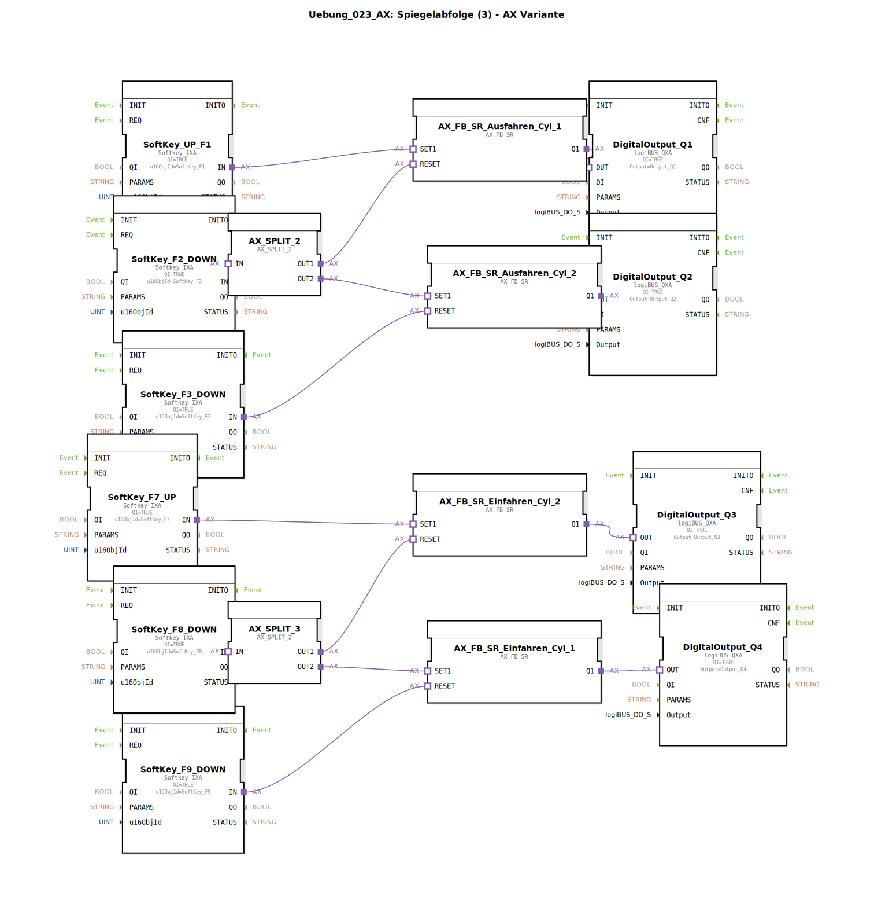

# Uebung_023_AX: Spiegelabfolge (3) - AX Variante

* * * * * * * * * *

## Einleitung

Diese Übung realisiert eine **Spiegelabfolge** für zwei doppeltwirkende Zylinder. Ziel ist es, eine sequenzielle Steuerung für das Aus- und Einfahren zweier Zylinder mithilfe von AX-Funktionsbausteinen (SR-Bistabile) und Softkeys aufzubauen. Die Steuerung wird über Softkeys am Terminal bedient, die digitalen Ausgänge steuern die Stellglieder (z. B. Ventile) an.

Die Abfolge ist in zwei Teilbereiche gegliedert:
- **Ausfahren der Zylinder** (Zylinder 1 und 2)
- **Einfahren der Zylinder** (Zylinder 2 und 1)

Durch die AX_SPLIT-Adapter werden Ereignisse auf mehrere Pfade verteilt, sodass die Befehlsketten in der korrekten Reihenfolge ablaufen.

## Verwendete Funktionsbausteine (FBs)

Es werden keine weiteren Sub-Bausteine (SubAppTypes) verwendet – alle Funktionsbausteine sind direkt im Netzwerk eingebunden.

### Eingangsbausteine (Softkeys)

- **SoftKey_F1 (UP)**  
  Typ: `isobus::UT::io::Softkey::Softkey_IXA`  
  Parameter:  
  - `QI` = TRUE  
  - `u16ObjId` = SoftKey_F1  
  Funktion: Starttaste **Ausfahren** für Zylinder 1.

- **SoftKey_F2 (DOWN)**  
  Typ: `isobus::UT::io::Softkey::Softkey_IXA`  
  Parameter:  
  - `QI` = TRUE  
  - `u16ObjId` = SoftKey_F2  
  Funktion: Löst über `AX_SPLIT_2` das Zurücksetzen von Zylinder 1 Ausfahren und gleichzeitiges Setzen von Zylinder 2 Ausfahren aus (Spiegelung).

- **SoftKey_F3 (DOWN)**  
  Typ: `isobus::UT::io::Softkey::Softkey_IXA`  
  Parameter:  
  - `QI` = TRUE  
  - `u16ObjId` = SoftKey_F3  
  Funktion: Reset (Einfahren) für **Ausfahren Zylinder 2**.

- **SoftKey_F7 (UP)**  
  Typ: `isobus::UT::io::Softkey::Softkey_IXA`  
  Parameter:  
  - `QI` = TRUE  
  - `u16ObjId` = SoftKey_F7  
  Funktion: Starttaste **Einfahren** für Zylinder 2.

- **SoftKey_F8 (DOWN)**  
  Typ: `isobus::UT::io::Softkey::Softkey_IXA`  
  Parameter:  
  - `QI` = TRUE  
  - `u16ObjId` = SoftKey_F8  
  Funktion: Löst über `AX_SPLIT_3` das Zurücksetzen von Zylinder 2 Einfahren und gleichzeitiges Setzen von Zylinder 1 Einfahren aus (Spiegelung).

- **SoftKey_F9 (DOWN)**  
  Typ: `isobus::UT::io::Softkey::Softkey_IXA`  
  Parameter:  
  - `QI` = TRUE  
  - `u16ObjId` = SoftKey_F9  
  Funktion: Reset (Ausfahren) für **Einfahren Zylinder 1**.

### Verarbeitungsbausteine

- **AX_FB_SR_Ausfahren_Cyl_1**  
  Typ: `adapter::iec61131::bistableElements::AX_FB_SR`  
  Parameter: keine (keine weiteren Parameter in der XML)  
  Funktion: SR-Bistabil für den Ausfahrbefehl von Zylinder 1.  
  Setzen durch SoftKey_F1, Zurücksetzen durch `AX_SPLIT_2.OUT1`.

- **AX_FB_SR_Ausfahren_Cyl_2**  
  Typ: `adapter::iec61131::bistableElements::AX_FB_SR`  
  Parameter: keine  
  Funktion: SR-Bistabil für den Ausfahrbefehl von Zylinder 2.  
  Setzen durch `AX_SPLIT_2.OUT2`, Zurücksetzen durch SoftKey_F3.

- **AX_FB_SR_Einfahren_Cyl_2**  
  Typ: `adapter::iec61131::bistableElements::AX_FB_SR`  
  Parameter: keine  
  Funktion: SR-Bistabil für den Einfahrbefehl von Zylinder 2.  
  Setzen durch SoftKey_F7, Zurücksetzen durch `AX_SPLIT_3.OUT1`.

- **AX_FB_SR_Einfahren_Cyl_1**  
  Typ: `adapter::iec61131::bistableElements::AX_FB_SR`  
  Parameter: keine  
  Funktion: SR-Bistabil für den Einfahrbefehl von Zylinder 1.  
  Setzen durch `AX_SPLIT_3.OUT2`, Zurücksetzen durch SoftKey_F9.

### Ereignisverteilung

- **AX_SPLIT_2**  
  Typ: `adapter::events::unidirectional::AX_SPLIT_2`  
  Parameter: keine  
  Funktion: Verteilt das Ereignis von SoftKey_F2 auf zwei Ausgänge:  
  - OUT1 → RESET von AX_FB_SR_Ausfahren_Cyl_1  
  - OUT2 → SET von AX_FB_SR_Ausfahren_Cyl_2

- **AX_SPLIT_3**  
  Typ: `adapter::events::unidirectional::AX_SPLIT_2`  
  Parameter: keine  
  Funktion: Verteilt das Ereignis von SoftKey_F8 auf zwei Ausgänge:  
  - OUT1 → RESET von AX_FB_SR_Einfahren_Cyl_2  
  - OUT2 → SET von AX_FB_SR_Einfahren_Cyl_1

### Ausgangsbausteine

- **DigitalOutput_Q1**  
  Typ: `logiBUS::io::DQ::logiBUS_QXA`  
  Parameter:  
  - `QI` = TRUE  
  - `Output` = Output_Q1  
  Funktion: Gibt den Ausgang Q1 (Ausfahren Zylinder 1) aus. Gesteuert von `AX_FB_SR_Ausfahren_Cyl_1.Q1`.

- **DigitalOutput_Q2**  
  Typ: `logiBUS::io::DQ::logiBUS_QXA`  
  Parameter:  
  - `QI` = TRUE  
  - `Output` = Output_Q2  
  Funktion: Gibt den Ausgang Q2 (Ausfahren Zylinder 2) aus. Gesteuert von `AX_FB_SR_Ausfahren_Cyl_2.Q1`.

- **DigitalOutput_Q3**  
  Typ: `logiBUS::io::DQ::logiBUS_QXA`  
  Parameter:  
  - `QI` = TRUE  
  - `Output` = Output_Q3  
  Funktion: Gibt den Ausgang Q3 (Einfahren Zylinder 2) aus. Gesteuert von `AX_FB_SR_Einfahren_Cyl_2.Q1`.

- **DigitalOutput_Q4**  
  Typ: `logiBUS::io::DQ::logiBUS_QXA`  
  Parameter:  
  - `QI` = TRUE  
  - `Output` = Output_Q4  
  Funktion: Gibt den Ausgang Q4 (Einfahren Zylinder 1) aus. Gesteuert von `AX_FB_SR_Einfahren_Cyl_1.Q1`.

## Programmablauf und Verbindungen

### Ausfahrsequenz

1. **Start Ausfahren Zylinder 1**  
   Durch Drücken von **SoftKey_F1** (UP) wird der Eingang SET1 von `AX_FB_SR_Ausfahren_Cyl_1` gesetzt. Dadurch wird `Q1` aktiv und der Ausgang Q1 schaltet.

2. **Spiegelung auf Zylinder 2**  
   Durch Drücken von **SoftKey_F2** (DOWN) wird ein Ereignis an `AX_SPLIT_2` gesendet.  
   - Der Ausgang OUT1 von `AX_SPLIT_2` resettet das SR-Bistabil `AX_FB_SR_Ausfahren_Cyl_1` → Q1 wird inaktiv, Zylinder 1 fährt nicht mehr aus.  
   - Der Ausgang OUT2 setzt gleichzeitig `AX_FB_SR_Ausfahren_Cyl_2` → Q2 aktiv, Zylinder 2 fährt aus.

3. **Reset Zylinder 2**  
   Durch Drücken von **SoftKey_F3** (DOWN) wird `AX_FB_SR_Ausfahren_Cyl_2` zurückgesetzt → Q2 inaktiv.

### Einfahrsequenz (in umgekehrter Reihenfolge)

1. **Start Einfahren Zylinder 2**  
   Durch Drücken von **SoftKey_F7** (UP) wird `AX_FB_SR_Einfahren_Cyl_2` gesetzt → Q3 aktiv.

2. **Spiegelung auf Zylinder 1**  
   Durch Drücken von **SoftKey_F8** (DOWN) wird `AX_SPLIT_3` angesteuert:  
   - OUT1 resettet `AX_FB_SR_Einfahren_Cyl_2` → Q3 inaktiv.  
   - OUT2 setzt `AX_FB_SR_Einfahren_Cyl_1` → Q4 aktiv.

3. **Reset Zylinder 1**  
   Durch Drücken von **SoftKey_F9** (DOWN) wird `AX_FB_SR_Einfahren_Cyl_1` zurückgesetzt → Q4 inaktiv.

### Verbindungsstruktur (AdapterConnections)

Die Adapterverbindungen sind im Netzwerk wie folgt verknüpft:

- `SoftKey_UP_F1.IN` → `AX_FB_SR_Ausfahren_Cyl_1.SET1`  
- `SoftKey_F2_DOWN.IN` → `AX_SPLIT_2.IN`  
- `AX_SPLIT_2.OUT1` → `AX_FB_SR_Ausfahren_Cyl_1.RESET`  
- `AX_SPLIT_2.OUT2` → `AX_FB_SR_Ausfahren_Cyl_2.SET1`  
- `SoftKey_F3_DOWN.IN` → `AX_FB_SR_Ausfahren_Cyl_2.RESET`  

- `SoftKey_F7_UP.IN` → `AX_FB_SR_Einfahren_Cyl_2.SET1`  
- `SoftKey_F8_DOWN.IN` → `AX_SPLIT_3.IN`  
- `AX_SPLIT_3.OUT1` → `AX_FB_SR_Einfahren_Cyl_2.RESET`  
- `AX_SPLIT_3.OUT2` → `AX_FB_SR_Einfahren_Cyl_1.SET1`  
- `SoftKey_F9_DOWN.IN` → `AX_FB_SR_Einfahren_Cyl_1.RESET`  

- `AX_FB_SR_Ausfahren_Cyl_1.Q1` → `DigitalOutput_Q1.OUT`  
- `AX_FB_SR_Ausfahren_Cyl_2.Q1` → `DigitalOutput_Q2.OUT`  
- `AX_FB_SR_Einfahren_Cyl_2.Q1` → `DigitalOutput_Q3.OUT`  
- `AX_FB_SR_Einfahren_Cyl_1.Q1` → `DigitalOutput_Q4.OUT`

### Lernziele

- Verständnis der Spiegelabfolge (Abfolgebildung mit Rücksetzen und Setzen in einem Schritt)  
- Anwendung von **AX_FB_SR** (bistabile Elemente nach IEC 61131)  
- Einsatz von **AX_SPLIT_2** zur Ereignisverteilung  
- Verknüpfung von Softkey-Eingaben mit digitalen Ausgängen über logiBUS  
- Einüben des vierstufigen Ablaufs: Starten – Spiegeln – Stoppen – Rücksetzen

### Hinweise

- Die Übung erfordert Grundkenntnisse in der 4diac-IDE und im Umgang mit Adapterverbindungen.  
- Alle Softkeys sind als **DOWN**- bzw. **UP**-Tasten definiert; die Zuordnung erfolgt über die Objekt-ID (z. B. `SoftKey_F1`).  
- Die digitalen Ausgänge `Output_Q1` bis `Output_Q4` müssen den realen Ventilen oder Anzeigen zugeordnet sein.

## Zusammenfassung

Die Übung „Spiegelabfolge (3) – AX Variante“ demonstriert eine sequenzielle Steuerung für zwei Zylinder mit Hilfe von SR-Speicherbausteinen und Ereignisverteilern. Durch die AX_SPLIT-Adapter werden beim Drücken eines Softkeys gleichzeitig ein SR zurückgesetzt und ein weiteres SR gesetzt – dadurch wird die „Spiegelung“ der Bewegung realisiert. Das Programm besteht aus einer klaren Trennung von Ausfahr- und Einfahrsequenz und ermöglicht ein schrittweises Verständnis der Signalverkettung in der Automatisierungstechnik. Der Einsatz der logiBUS-Ausgänge verbindet die Steuerung direkt mit der Peripherie.