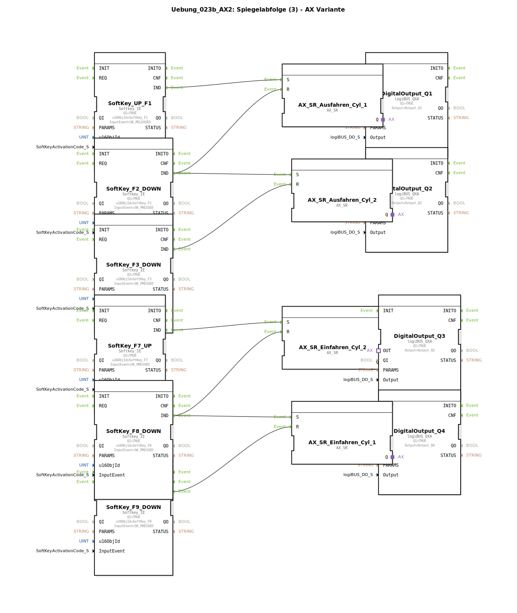

# Uebung_023b_AX2: Spiegelabfolge (3) - AX Variante

* * * * * * * * * *

## Einleitung

Diese Übung realisiert eine **Spiegelabfolge** für zwei doppeltwirkende Zylinder (Zylinder 1 und Zylinder 2) mittels AX-SR-Bausteinen (unidirektionale Adapter).  
Die Steuerung erfolgt über acht Softkeys (F1, F2, F3, F7, F8, F9) in Verbindung mit vier digitalen Ausgängen (Q1…Q4).  
Das Verhalten ist symmetrisch aufgebaut:  

- **Ausfahren** von Zylinder 1 und 2 wird durch Softkeys und AX-SR-Bausteine gesteuert.  
- **Einfahren** von Zylinder 1 und 2 erfolgt analog mit eigenen Softkeys.  

Der SubAppType besitzt keine eigenen Ein-/Ausgangs-Schnittstellen, sondern kommuniziert ausschließlich über die eingebundenen System-Bausteine mit der Hardware.

## Verwendete Funktionsbausteine (FBs)

| Bausteinname | Typ | Beschreibung |
|--------------|-----|--------------|
| SoftKey_UP_F1 | `isobus::UT::io::Softkey::Softkey_IE` | Softkey F1 – ausgelöst bei **Taste loslassen** (SK_RELEASED) |
| SoftKey_F2_DOWN | `isobus::UT::io::Softkey::Softkey_IE` | Softkey F2 – ausgelöst bei **Taste drücken** (SK_PRESSED) |
| SoftKey_F3_DOWN | `isobus::UT::io::Softkey::Softkey_IE` | Softkey F3 – ausgelöst bei **Taste drücken** (SK_PRESSED) |
| SoftKey_F7_UP | `isobus::UT::io::Softkey::Softkey_IE` | Softkey F7 – ausgelöst bei **Taste drücken** (SK_PRESSED) |
| SoftKey_F8_DOWN | `isobus::UT::io::Softkey::Softkey_IE` | Softkey F8 – ausgelöst bei **Taste drücken** (SK_PRESSED) |
| SoftKey_F9_DOWN | `isobus::UT::io::Softkey::Softkey_IE` | Softkey F9 – ausgelöst bei **Taste drücken** (SK_PRESSED) |
| AX_SR_Ausfahren_Cyl_1 | `adapter::events::unidirectional::AX_SR` | Set-Reset-Baustein für Ausfahren von Zylinder 1 (S: Set, R: Reset) |
| AX_SR_Ausfahren_Cyl_2 | `adapter::events::unidirectional::AX_SR` | Set-Reset-Baustein für Ausfahren von Zylinder 2 |
| AX_SR_Einfahren_Cyl_1 | `adapter::events::unidirectional::AX_SR` | Set-Reset-Baustein für Einfahren von Zylinder 1 |
| AX_SR_Einfahren_Cyl_2 | `adapter::events::unidirectional::AX_SR` | Set-Reset-Baustein für Einfahren von Zylinder 2 |
| DigitalOutput_Q1 | `logiBUS::io::DQ::logiBUS_QXA` | Digitaler Ausgang Q1 (aktiv wenn AX_SR_Ausfahren_Cyl_1.Q gesetzt) |
| DigitalOutput_Q2 | `logiBUS::io::DQ::logiBUS_QXA` | Digitaler Ausgang Q2 (aktiv wenn AX_SR_Ausfahren_Cyl_2.Q gesetzt) |
| DigitalOutput_Q3 | `logiBUS::io::DQ::logiBUS_QXA` | Digitaler Ausgang Q3 (aktiv wenn AX_SR_Einfahren_Cyl_2.Q gesetzt) |
| DigitalOutput_Q4 | `logiBUS::io::DQ::logiBUS_QXA` | Digitaler Ausgang Q4 (aktiv wenn AX_SR_Einfahren_Cyl_1.Q gesetzt) |

### Parameter der Bausteine

Alle `Softkey_IE`-Bausteine sind mit folgenden Parametern konfiguriert:
- **QI** = TRUE
- **u16ObjId** = jeweilige Softkey-Konstante (z.B. `SoftKey_F1`)
- **InputEvent** = Auslöser (SK_RELEASED oder SK_PRESSED)

Alle `logiBUS_QXA`-Bausteine sind mit folgenden Parametern konfiguriert:
- **QI** = TRUE
- **Output** = jeweiliger Ausgang (Output_Q1 … Output_Q4)

Die `AX_SR`-Bausteine haben keine Parameter, sie erhalten Ereignisse über die Eingänge `S` (Set) und `R` (Reset) und geben den Zustand über den Adapter-Ausgang `Q` weiter.

## Programmablauf und Verbindungen

Die Steuerung ist in zwei voneinander unabhängige Zyklen gegliedert:

### Ausfahren der Zylinder

1. **Zylinder 1 ausfahren**  
   - Softkey **F1** loslassen → Ereignis am `IND`-Ausgang von `SoftKey_UP_F1` wird an den `S`-Eingang von `AX_SR_Ausfahren_Cyl_1` geleitet.  
   - Softkey **F2** drücken → Ereignis von `SoftKey_F2_DOWN.IND` wird an den `R`-Eingang von `AX_SR_Ausfahren_Cyl_1` geleitet.  
   - Der Zustand `Q` von `AX_SR_Ausfahren_Cyl_1` wird über den Adapter an den OUT-Eingang von `DigitalOutput_Q1` weitergegeben → **Ausgang Q1** schaltet.

2. **Zylinder 2 ausfahren**  
   - Softkey **F2** drücken → Ereignis von `SoftKey_F2_DOWN.IND` wird an den `S`-Eingang von `AX_SR_Ausfahren_Cyl_2` geleitet.  
   - Softkey **F3** drücken → Ereignis von `SoftKey_F3_DOWN.IND` wird an den `R`-Eingang von `AX_SR_Ausfahren_Cyl_2` geleitet.  
   - Der Zustand `Q` von `AX_SR_Ausfahren_Cyl_2` wird an `DigitalOutput_Q2` weitergegeben → **Ausgang Q2** schaltet.

### Einfahren der Zylinder

1. **Zylinder 1 einfahren**  
   - Softkey **F8** drücken → Ereignis von `SoftKey_F8_DOWN.IND` wird an den `S`-Eingang von `AX_SR_Einfahren_Cyl_1` geleitet.  
   - Softkey **F9** drücken → Ereignis von `SoftKey_F9_DOWN.IND` wird an den `R`-Eingang von `AX_SR_Einfahren_Cyl_1` geleitet.  
   - Der Zustand `Q` von `AX_SR_Einfahren_Cyl_1` wird an `DigitalOutput_Q4` weitergegeben → **Ausgang Q4** schaltet.

2. **Zylinder 2 einfahren**  
   - Softkey **F7** drücken → Ereignis von `SoftKey_F7_UP.IND` wird an den `S`-Eingang von `AX_SR_Einfahren_Cyl_2` geleitet.  
   - Softkey **F8** drücken → Ereignis von `SoftKey_F8_DOWN.IND` wird an den `R`-Eingang von `AX_SR_Einfahren_Cyl_2` geleitet.  
   - Der Zustand `Q` von `AX_SR_Einfahren_Cyl_2` wird an `DigitalOutput_Q3` weitergegeben → **Ausgang Q3** schaltet.

### Grafische Anordnung der Kommentare (zur Orientierung)

- **START-Knopf Ausfahren** (nahe F1)  
- **Endlage Ausfahren_Cyl_1** (nahe F2)  
- **Endlage Ausfahren_Cyl_2** (nahe F3)  
- **START-Knopf Einfahren** (nahe F7)  
- **Endlage Einfahren_Cyl_2** (nahe F8)  
- **Endlage Einfahren_Cyl_1** (nahe F9)

## Zusammenfassung

Die Übung *Uebung_023b_AX2* demonstriert die Verwendung von **AX-SR-Adaptern** zur Ansteuerung zweier doppeltwirkender Zylinder über Softkeys.  
Durch die getrennte Set-Reset-Logik für Aus- und Einfahren jedes Zylinders wird eine Spiegelabfolge realisiert, bei der die Richtungswechsel asynchron durch unterschiedliche Tasten ausgelöst werden.  
Die Steuerung ist hardwarenah über die logiBUS-Digitalausgänge angebunden und kann direkt in einer 4diac-IDE-Umgebung getestet werden.  

**Lernziele:**  
- Verständnis von AX-SR-Bausteinen (Set-Reset mit unidirektionalen Adaptern)  
- Ereignisgesteuerte Verknüpfung von Softkeys mit Aktoren  
- Strukturierte Programmierung von Zylindersteuerungen in 4diac  

**Voraussetzungen:**  
- Grundkenntnisse in 4diac und IEC 61499  
- Verfügbarkeit der Bibliotheken `isobus`, `logiBUS` und `adapter::events::unidirectional`