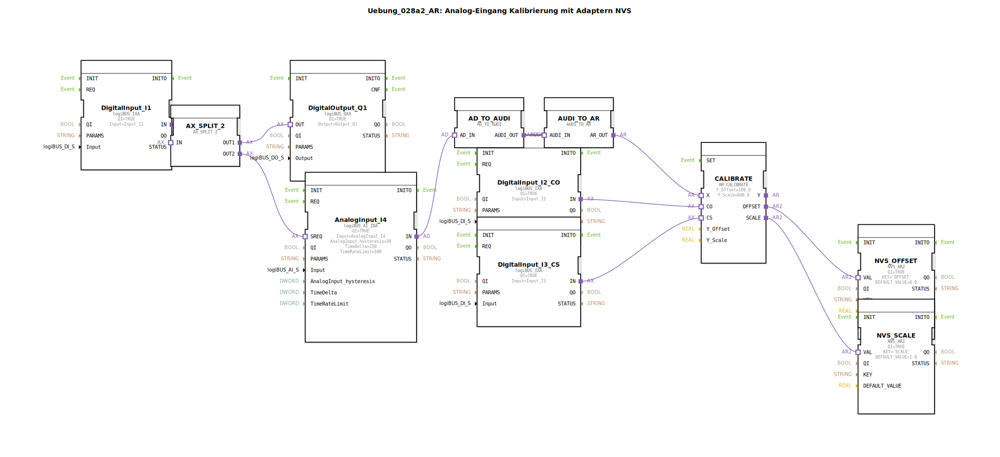

# Uebung_028a2_AR: Analog-Eingang Kalibrierung mit Adaptern NVS

* * * * * * * * * *
## Einleitung
Diese Übung realisiert eine Kalibrierung für einen analogen Eingang. Ein Analogwert wird eingelesen, über zwei Adapterkonvertierungen an einen Kalibrierungsbaustein übergeben und die ermittelten Offset- und Skalierungswerte werden dauerhaft im NVS-Speicher (Non-Volatile Storage) abgelegt. Zwei digitale Eingänge steuern den Kalibriermodus (Offset und Scale). Ein weiterer digitaler Eingang dient als Trigger für die analoge Abtastung und wird gleichzeitig auf einen digitalen Ausgang durchgeschleift.

## Verwendete Funktionsbausteine (FBs)

| Name | Typ | Parameter |
|------|-----|-----------|
| DigitalInput_I1 | `logiBUS::io::DI::logiBUS_IXA` | QI = TRUE, Input = Input_I1 |
| DigitalOutput_Q1 | `logiBUS::io::DQ::logiBUS_QXA` | QI = TRUE, Output = Output_Q1 |
| AnalogInput_I4 | `logiBUS::io::AI::logiBUS_AI_IDA` | QI = TRUE, Input = AnalogInput_I4, AnalogInput_hysteresis = 50, TimeDelta = 250, TimeRateLimit = 100 |
| CALIBRATE | `adapter::Engineering::measurements::AR_CALIBRATE` | Y_Offset = 100.0, Y_Scale = 600.0 |
| NVS_OFFSET | `logiBUS::storage::esp32_nvs::NVS_AR2` | QI = TRUE, KEY = 'OFFSET', DEFAULT_VALUE = 0.0 |
| NVS_SCALE | `logiBUS::storage::esp32_nvs::NVS_AR2` | QI = TRUE, KEY = 'SCALE', DEFAULT_VALUE = 1.0 |
| DigitalInput_I2_CO | `logiBUS::io::DI::logiBUS_IXA` | QI = TRUE, Input = Input_I2 |
| DigitalInput_I3_CS | `logiBUS::io::DI::logiBUS_IXA` | QI = TRUE, Input = Input_I3 |
| AX_SPLIT_2 | `adapter::events::unidirectional::AX_SPLIT_2` | (keine Parameter) |
| AD_TO_AUDI | `adapter::conversion::unidirectional::AD_TO_AUDI` | (keine Parameter) |
| AUDI_TO_AR | `adapter::conversion::unidirectional::AUDI_TO_AR` | (keine Parameter) |

### Kurzbeschreibung der Bausteine
- **DigitalInput_I1**: Liest einen digitalen Eingang (Input_I1) und leitet das Ereignis über den Adapterausgang `IN` weiter.
- **DigitalOutput_Q1**: Gibt ein digitales Signal auf den Ausgang `OUT` (Output_Q1) aus, wenn der Adaptereingang `OUT` angesteuert wird.
- **AnalogInput_I4**: Analoger Eingangsbaustein. Bei einer Anfrage (SREQ) liefert er einen Analogwert. Parametriert mit Hysterese, Zeitdelta und Ratenbegrenzung.
- **CALIBRATE**: Führt die Kalibrierung durch. Empfängt den Rohwert am Adapter `X` und die Steuersignale `CO` (Calibrate Offset) und `CS` (Calibrate Scale). Gibt den berechneten Offset und die Skalierung über die Adapter `OFFSET` und `SCALE` aus.
- **NVS_OFFSET / NVS_SCALE**: Speichern einen Gleitkommawert im nichtflüchtigen Speicher unter den Keys 'OFFSET' bzw. 'SCALE' mit vorgegebenen Defaultwerten.
- **DigitalInput_I2_CO / DigitalInput_I3_CS**: Zusätzliche digitale Eingänge für die Kalibrierungssteuerung (Input_I2 = Offset-Kalibrierung, Input_I3 = Scale-Kalibrierung).
- **AX_SPLIT_2**: Verteilt ein eingehendes Adapterereignis auf zwei Ausgänge (OUT1 und OUT2).
- **AD_TO_AUDI**: Wandelt einen Analogdaten-Adapter (`AD_IN`) in einen universellen Analogwert-Adapter (`AUDI_OUT`) um.
- **AUDI_TO_AR**: Wandelt einen universellen Analogwert-Adapter (`AUDI_IN`) in einen Real-Adapter (`AR_OUT`) um. *Hinweis: Die doppelte Konvertierung ist notwendig – eine direkte AD→AR Konvertierung würde einem „reinterpret_cast“ entsprechen und ist daher zu vermeiden.*

## Programmablauf und Verbindungen

Der Ablauf wird durch den digitalen Eingang `Input_I1` gestartet:

1. **Ereignisverteilung**: Das von `DigitalInput_I1` kommende Ereignis (Adapter `IN`) gelangt zu `AX_SPLIT_2`. Dieses teilt das Ereignis auf:
   - **OUT1** → verbunden mit `DigitalOutput_Q1.OUT` → der digitale Ausgang `Output_Q1` wird gesetzt.
   - **OUT2** → verbunden mit `AnalogInput_I4.SREQ` → löst die analoge Abtastung aus.

2. **Analoger Messwert**: `AnalogInput_I4` liefert nach der Abtastung einen Analogdaten-Adapter über seinen Ausgang `IN`. Dieser wird an `AD_TO_AUDI.AD_IN` übergeben.

3. **Konvertierungskette**:
   - `AD_TO_AUDI` wandelt den Analogdaten-Adapter in einen universellen Analogwert-Adapter (`AUDI_OUT`).
   - `AUDI_TO_AR` wandelt diesen in einen Real-Adapter (`AR_OUT`) um.
   - Der Real-Adapter wird an den Kalibrierungseingang `CALIBRATE.X` weitergeleitet.

4. **Kalibrierung**: Gleichzeitig liegen an `CALIBRATE.CO` der Eingang `Input_I2` (über `DigitalInput_I2_CO`) und an `CALIBRATE.CS` der Eingang `Input_I3` (über `DigitalInput_I3_CS`) an. Je nach aktiviertem Steuersignal berechnet `CALIBRATE` den neuen Offset oder die neue Skalierung. Die Voreinstellungen (Y_Offset = 100.0, Y_Scale = 600.0) dienen als Basis.

5. **Persistente Speicherung**:
   - Der ermittelte Offset (Adapter `OFFSET`) wird an `NVS_OFFSET.VAL` übergeben und unter dem Key 'OFFSET' abgelegt.
   - Der ermittelte Skalierungsfaktor (Adapter `SCALE`) wird an `NVS_SCALE.VAL` übergeben und unter dem Key 'SCALE' abgelegt.

Die Kalibrierungswerte bleiben damit auch nach einem Neustart der Steuerung erhalten.

## Zusammenfassung

Die Übung demonstriert eine vollständige Signalkette von der digitalen Triggerung über die analoge Erfassung, Adapterkonvertierung, Kalibrierung bis zur dauerhaften Speicherung der Korrekturwerte im NVS. Sie verdeutlicht den Umgang mit mehreren Adaptertypen (Ereignis-, Daten- und Real-Adapter) und das Zusammenspiel von Standard-FBs der logiBUS-Bibliothek mit speziellen Engineering-Bausteinen. Die doppelte Adapterkonvertierung zwischen Analogdaten und Real-Werten wird explizit kommentiert, um typische Fehler bei der Verwendung von reinterpret_cast zu vermeiden.