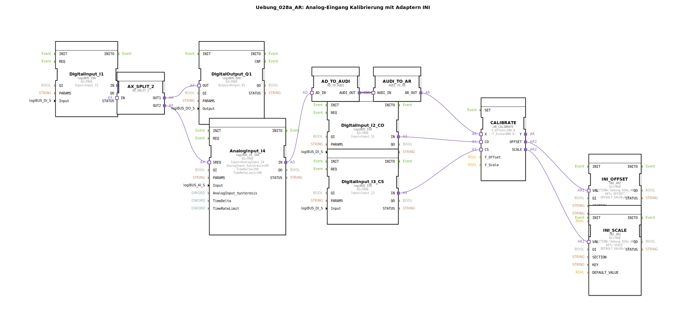

# Uebung_028a_AR: Analog-Eingang Kalibrierung mit Adaptern INI

* * * * * * * * * *
## Einleitung

Diese Übung demonstriert die Kalibrierung eines analogen Eingangssignals mithilfe von Adaptern und der Speicherung von Kalibrierungsparametern (Offset und Skalierung) in einer INI-Datei. Der Funktionsbaustein `AR_CALIBRATE` führt die lineare Kalibrierung durch. Die Parameter werden über zwei digitale Eingänge (`Input_I2`, `Input_I3`) gesteuert und die Ergebnisse in zwei separaten Speicherbausteinen (`INI_AR2`) abgelegt. Die Konvertierung zwischen analogen und stark typisierten Daten erfolgt über spezielle Adapterkonverter.

## Verwendete Funktionsbausteine (FBs)

Die Übung verwendet ausschließlich direkt instanziierte Funktionsbausteine (keine Unter-Applikationen). Nachfolgend sind alle Bausteine mit ihren Parametern und Aufgaben beschrieben.

- **DigitalInput_I1**  
  - **Typ**: `logiBUS::io::DI::logiBUS_IXA`  
  - **Parameter**:  
    - `QI` = TRUE  
    - `Input` = `Input_I1` (physischer digitaler Eingang)  
  - **Funktionsweise**: Liest den Zustand eines digitalen Eingangs (Taster/Schalter) und gibt ihn über den Ausgangsadapter `IN` weiter. Dient als Trigger-Eingang für den Messzyklus.

- **DigitalOutput_Q1**  
  - **Typ**: `logiBUS::io::DQ::logiBUS_QXA`  
  - **Parameter**:  
    - `QI` = TRUE  
    - `Output` = `Output_Q1` (physischer digitaler Ausgang)  
  - **Funktionsweise**: Schaltet einen digitalen Ausgang entsprechend dem empfangenen Signal. Hier wird das Signal von `DigitalInput_I1` über eine Split-Struktur durchgeschleift.

- **AnalogInput_I4**  
  - **Typ**: `logiBUS::io::AI::logiBUS_AI_IDA`  
  - **Parameter**:  
    - `QI` = TRUE  
    - `Input` = `AnalogInput_I4` (physischer analoger Eingang)  
    - `AnalogInput_hysteresis` = 50  
    - `TimeDelta` = 250 ms  
    - `TimeRateLimit` = 100  
  - **Funktionsweise**: Liest einen analogen Strom-/Spannungswert und stellt ihn als Adapterschnittstelle (`IN`) bereit. Die Parameter dienen der Filterung (Hysterese, Abtastrate, Ratenbegrenzung).

- **CALIBRATE**  
  - **Typ**: `adapter::Engineering::measurements::AR_CALIBRATE`  
  - **Parameter**:  
    - `Y_Offset` = 100.0  
    - `Y_Scale` = 600.0  
  - **Funktionsweise**: Führt eine lineare Kalibrierung des analogen Eingangswerts (als `X`) durch. Die Formel lautet `Y = (X * Y_Scale) / 1000 + Y_Offset` (Annahme, da nicht explizit). Über die Adaptereingänge `CO` (Calibrate Offset) und `CS` (Calibrate Scale) kann die Kalibrierung ausgelöst werden. Die berechneten Offset- und Skalierungswerte werden an `OFFSET` und `SCALE` ausgegeben.

- **INI_OFFSET**  
  - **Typ**: `eclipse4diac::storage::INI_AR2`  
  - **Parameter**:  
    - `QI` = TRUE  
    - `SECTION` = `'Uebung_028a_AR'`  
    - `KEY` = `'OFFSET'`  
    - `DEFAULT_VALUE` = 0.0  
  - **Funktionsweise**: Liest oder schreibt den Wert für den Offset in einer INI-Datei (Abschnitt `Uebung_028a_AR`, Schlüssel `OFFSET`). Liefert den aktuellen Wert am Ausgang `VAL` bzw. ermöglicht das Speichern eines neuen Werts über den Eingang `VAL`.

- **INI_SCALE**  
  - **Typ**: `eclipse4diac::storage::INI_AR2`  
  - **Parameter**:  
    - `QI` = TRUE  
    - `SECTION` = `'Uebung_028a_AR'`  
    - `KEY` = `'SCALE'`  
    - `DEFAULT_VALUE` = 1.0  
  - **Funktionsweise**: Analog zu `INI_OFFSET`, jedoch für den Skalierungsfaktor (Schlüssel `SCALE`).

- **DigitalInput_I2_CO**  
  - **Typ**: `logiBUS::io::DI::logiBUS_IXA`  
  - **Parameter**:  
    - `QI` = TRUE  
    - `Input` = `Input_I2`  
  - **Funktionsweise**: Liest den digitalen Eingang für die Offset-Kalibrierung (`CO`).

- **DigitalInput_I3_CS**  
  - **Typ**: `logiBUS::io::DI::logiBUS_IXA`  
  - **Parameter**:  
    - `QI` = TRUE  
    - `Input` = `Input_I3`  
  - **Funktionsweise**: Liest den digitalen Eingang für die Skalierungs-Kalibrierung (`CS`).

- **AX_SPLIT_2**  
  - **Typ**: `adapter::events::unidirectional::AX_SPLIT_2`  
  - **Parameter**: Keine  
  - **Funktionsweise**: Ein Adapter-Splitter, der ein eingehendes (Adapter-)Signal auf zwei Ausgänge verteilt. Hier wird das Signal von `DigitalInput_I1` gleichzeitig zum Ausgang `DigitalOutput_Q1` und zur Trigger-Anforderung (`SREQ`) des Analog-Eingangs geschickt.

- **AD_TO_AUDI**  
  - **Typ**: `adapter::conversion::unidirectional::AD_TO_AUDI`  
  - **Parameter**: Keine  
  - **Funktionsweise**: Konvertiert den analogen Adaptertyp (vermutlich `AnalogData`) in einen universellen `AUDI`-Adapter (allgemeiner Analogwert). Notwendig zur Typpassung zwischen unterschiedlichen Adapterdefinitionen.

- **AUDI_TO_AR**  
  - **Typ**: `adapter::conversion::unidirectional::AUDI_TO_AR`  
  - **Parameter**: Keine  
  - **Funktionsweise**: Konvertiert den `AUDI`-Adapter zurück in den für `AR_CALIBRATE` benötigten Analogeingangsadapter (`AR`). Diese doppelte Konvertierung ist erforderlich, da ein direkter `AD_TO_AR`-Adapter einem „reinterpret_cast“ gleichkäme und die Typinformation verloren ginge.

## Programmablauf und Verbindungen

1. **Digitaler Eingang I1** dient als Start-Impuls für eine Messung. Sein Signal wird über den Splitter `AX_SPLIT_2` auf den Ausgang `DigitalOutput_Q1` (z. B. Status-LED) und auf den `SREQ`-Eingang des analogen Eingangs `AnalogInput_I4` verteilt.
2. **AnalogInput_I4** erfasst daraufhin den analogen Messwert und liefert ihn als Adapterausgang `IN` an den Konverter `AD_TO_AUDI`.
3. Die Konverterkette `AD_TO_AUDI` → `AUDI_TO_AR` passt den Typ an, sodass der Wert an den `X`-Eingang von `CALIBRATE` angeschlossen werden kann.
4. **DigitalInput_I2_CO** (Eingang I2) triggert die Offset-Kalibrierung: Wird dieser Eingang aktiv, führt `CALIBRATE` eine Offset-Korrektur durch und gibt den neuen Offset-Wert an `INI_OFFSET` weiter, der ihn in der INI-Datei speichert.
5. **DigitalInput_I3_CS** (Eingang I3) triggert entsprechend die Skalierungs-Kalibrierung; der neue Skalierungsfaktor wird an `INI_SCALE` übergeben und gespeichert.
6. Die gespeicherten Werte aus `INI_OFFSET` und `INI_SCALE` können bei späteren Starts der Steuerung wieder geladen werden, sodass die Kalibrierung dauerhaft erhalten bleibt.

**Wichtige Anmerkung**: Die doppelte Konvertierung von `AD_TO_AUDI` und `AUDI_TO_AR` ist bewusst so implementiert, um Typkompatibilität zu gewährleisten. Ein direkter Konverter würde die Daten nur uminterpretieren, was in der Praxis zu Fehlfunktionen führen kann.

**Lernziele dieser Übung**:
- Umgang mit analogen Eingangsadaptern und deren Parametrierung.
- Einsatz von Adapterkonvertern zur Typanpassung.
- Verwendung von INI-Speicherbausteinen zum dauerhaften Ablegen von Konfigurationsparametern.
- Verständnis der Kalibrierungslogik in der Automatisierungstechnik.

**Schwierigkeitsgrad**: Mittel (Grundkenntnisse in 4diac/Adapter-Konzepten erforderlich).

## Zusammenfassung

Die Übung `Uebung_028a_AR` implementiert eine vollständige Analog-Eingangs-Kalibrierung, bei der Offset und Skalierung über zwei digitale Eingänge eingelernt und in einer INI-Datei persistiert werden. Der Messablauf wird durch einen weiteren digitalen Eingang gestartet. Die verwendeten Adapterkonverter (`AD_TO_AUDI`, `AUDI_TO_AR`) demonstrieren die typkorrekte Weiterverarbeitung von analogen Signalen in der 4diac-IDE. Das Gesamtsystem bildet eine flexible Grundlage für industrielle Messaufgaben mit Speicherung von Kalibrierparametern.