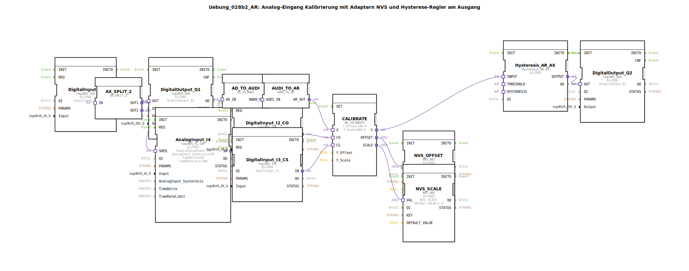

# Uebung_028b2_AR: Analog-Eingang Kalibrierung mit Adaptern NVS und Hysterese-Regler am Ausgang

* * * * * * * * * *

## Einleitung

Diese Übung realisiert eine analoge Eingangskalibrierung mit Offset- und Skalierungsanpassung. Die Kalibrierungsparameter werden persistent im NVS (Non-Volatile Storage) gespeichert. Zusätzlich wird ein Hysterese-Regler verwendet, der auf den kalibrierten Analogwert reagiert. Die Schwellwerte und Hysteresebänder für den Regler werden ebenfalls aus dem NVS geladen. Der gesamte Ablauf wird durch digitale Eingänge gesteuert und über digitale Ausgänge ausgegeben.

## Verwendete Funktionsbausteine (FBs)

- **DigitalInput_I1** (Typ: `logiBUS::io::DI::logiBUS_IXA`): Digitaler Eingang, der den Ausgangsprozess startet.  
  - Parameter: `QI=TRUE`, `Input=Input_I1`
- **DigitalOutput_Q1** (Typ: `logiBUS::io::DQ::logiBUS_QXA`): Digitaler Ausgang zur direkten Weitergabe des Eingangsstatus.  
  - Parameter: `QI=TRUE`, `Output=Output_Q1`
- **AnalogInput_I4** (Typ: `logiBUS::io::AI::logiBUS_AI_IDA`): Analoger Eingang mit konfigurierbarer Hysterese und Ratenbegrenzung.  
  - Parameter: `QI=TRUE`, `Input=AnalogInput_I4`, `AnalogInput_hysteresis=50`, `TimeDelta=250`, `TimeRateLimit=100`
- **AX_SPLIT_2** (Typ: `adapter::events::unidirectional::AX_SPLIT_2`): Verteilt ein Ereignis auf zwei Ausgänge (teilt den INIT-Ereignisstrom).
- **AD_TO_AUDI** (Typ: `adapter::conversion::unidirectional::AD_TO_AUDI`): Konvertiert einen analogen Datenadapter (`AD`) in einen universellen Audit-Adapter (`AUDI`).
- **AUDI_TO_AR** (Typ: `adapter::conversion::unidirectional::AUDI_TO_AR`): Konvertiert den Audit-Adapter (`AUDI`) zurück in einen `AR`-Analogadapter für die Weiterverarbeitung.
- **CALIBRATE** (Typ: `adapter::Engineering::measurements::AR_CALIBRATE`): Führt die Kalibrierung durch – Berechnung von Offset und Skalierung.  
  - Parameter: `Y_Offset=100.0`, `Y_Scale=600.0`
- **NVS_OFFSET** (Typ: `logiBUS::storage::esp32_nvs::NVS_AR2`): Speichert den ermittelten Offset-Wert persistent im NVS.  
  - Parameter: `QI=TRUE`, `KEY='OFFSET'`, `DEFAULT_VALUE=0.0`
- **NVS_SCALE** (Typ: `logiBUS::storage::esp32_nvs::NVS_AR2`): Speichert den ermittelten Skalierungsfaktor persistent im NVS.  
  - Parameter: `QI=TRUE`, `KEY='SCALE'`, `DEFAULT_VALUE=1.0`
- **DigitalInput_I2_CO** (Typ: `logiBUS::io::DI::logiBUS_IXA`): Digitaler Eingang zum Auslösen der Offset-Kalibrierung.  
  - Parameter: `QI=TRUE`, `Input=Input_I2`
- **DigitalInput_I3_CS** (Typ: `logiBUS::io::DI::logiBUS_IXA`): Digitaler Eingang zum Auslösen der Skalierungskalibrierung.  
  - Parameter: `QI=TRUE`, `Input=Input_I3`
- **Hysteresis_AR_AX** (Typ: `logiBUS::signalprocessing::hysteresis::Hysteresis_AR_AX`): Hysterese-Regler mit Analog-Eingang und Ausgang.  
  - Parameter: `QI=TRUE`
- **DigitalOutput_Q2** (Typ: `logiBUS::io::DQ::logiBUS_QXA`): Digitaler Ausgang für das Hysteresesignal.  
  - Parameter: `QI=TRUE`, `Output=Output_Q2`

### Sub-Bausteine: `THRESHOLD`

- **Typ**: `MyLib::sys::NVS_IN_AND_STORE_AR`
- **Verwendete interne FBs**: Die interne Struktur ist nicht in der XML-Datei hinterlegt. Es wird angenommen, dass dieser Sub-Baustein einen Schwellwert aus dem NVS liest (unter dem Key `'THRESHOLD'`) und als analogen Ausgang (`VALUEO`) bereitstellt. Der Parameter `stObj=InputNumber_THRESHOLD` verweist auf ein Strukturobjekt für die Initialisierung.
- **Funktionsweise**: Der Sub-Baustein lädt beim Start oder auf Ereignis den gespeicherten Schwellwert aus dem NVS und gibt ihn am Ausgang `VALUEO` aus. Bei Änderung des Wertes wird er zurückgeschrieben.

### Sub-Bausteine: `HYSTERESIS`

- **Typ**: `MyLib::sys::NVS_IN_AND_STORE_AR`
- **Verwendete interne FBs**: Analog zum `THRESHOLD`-Baustein, jedoch mit dem Key `'HYSTERESIS'` und dem Strukturobjekt `InputNumber_HYSTERESIS`.
- **Funktionsweise**: Liest den Hysteresewert (Bandbreite) aus dem NVS und stellt ihn über den Ausgang `VALUEO` dem Hysterese-Regler zur Verfügung.

## Programmablauf und Verbindungen

1. **Initialisierung**: Der Digitaleingang `DigitalInput_I1` wird über den Adapter `AX_SPLIT_2` auf zwei Wege aufgeteilt:
   - Weg 1 → `DigitalOutput_Q1` (direkte Ausgabe)
   - Weg 2 → `AnalogInput_I4.SREQ` (Ereignis zum Einlesen des Analogwerts)

2. **Analogwertverarbeitung**:  
   - Der analoge Eingang `AnalogInput_I4` wird ausgelesen und der Wert über die Adapterkette `AD_TO_AUDI` → `AUDI_TO_AR` an den Kalibrierbaustein `CALIBRATE.X` übergeben (Anmerkung: Eine doppelte Konvertierung ist notwendig, da ein direkter `AD_TO_AR` wie ein `reinterpret_cast` wirken würde.)

3. **Kalibrierung**:  
   - Über die Digitaleingänge `DigitalInput_I2_CO` (Offset-Kalibrierung) und `DigitalInput_I3_CS` (Skalen-Kalibrierung) wird der Kalibriervorgang gestartet.
   - `CALIBRATE` berechnet Offset und Skalierung auf Basis der Referenzwerte `Y_Offset=100.0` und `Y_Scale=600.0`.
   - Die berechneten Parameter werden an `NVS_OFFSET` und `NVS_SCALE` übergeben und gespeichert.

4. **Hysterese-Regelung**:  
   - Der kalibrierte Wert `CALIBRATE.Y` wird an den Hysterese-Regler `Hysteresis_AR_AX.INPUT` übergeben.
   - Der Schwellwert (`THRESHOLD.VALUEO`) und die Hysterese (`HYSTERESIS.VALUEO`) werden aus dem NVS geladen und dem Regler zugeführt.
   - Der Ausgang `Hysteresis_AR_AX.OUTPUT` steuert den digitalen Ausgang `DigitalOutput_Q2`.

**Lernziele**:  
- Verständnis der Analogwertaufbereitung mit Adaptern und Konvertierungen in 4diac.
- Implementierung einer persistenten Kalibrierung (Offset und Skalierung) im NVS.
- Anwendung eines Hysterese-Reglers mit extern vorgebbaren Parametern.
- Steuerung des Ablaufs durch digitale Eingänge.

**Schwierigkeitsgrad**: Fortgeschritten  
**Vorkenntnisse**: Grundlagen der 4diac-IDE, Umgang mit analogen Ein-/Ausgängen, einfache Adapter und NVS-Speicher.

## Zusammenfassung

Die Übung zeigt eine vollständige analoge Messkette: vom Einlesen des rohen Analogwerts über die Kalibrierung mit persistenter Speicherung bis hin zur regelbasierten Ausgabe über einen Hysterese-Komparator. Die Verwendung von Adaptern zur Typkonvertierung und von Sub-Bausteinen zur Wiederverwendung von NVS-Zugriffen macht den Aufbau modular und erweiterbar. Die Kalibrierung kann jederzeit über digitale Taster angepasst werden, ohne dass der Programmcode geändert werden muss.