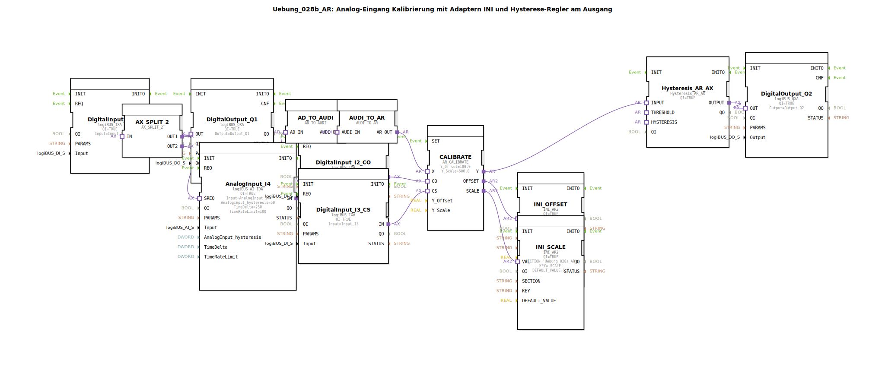

# Uebung_028b_AR: Analog-Eingang Kalibrierung mit Adaptern INI und Hysterese-Regler am Ausgang

* * * * * * * * * *
## Einleitung

Diese Übung demonstriert die Kalibrierung eines analogen Eingangssignals mit Hilfe von Adaptern und einer INI-basierten Speicherung der Kalibrierparameter. Das kalibrierte Signal wird anschließend durch einen Hysterese-Regler geführt, dessen Schwellwerte ebenfalls aus einer INI-Datei gelesen werden. Die Übung zeigt die Verknüpfung von analogen und digitalen Ein-/Ausgängen, Adapter-Konvertierungen sowie die persistente Speicherung von Parametern.

## Verwendete Funktionsbausteine (FBs)

### Haupt-FBs

- **DigitalInput_I1** / **DigitalInput_I2_CO** / **DigitalInput_I3_CS**:  
  Digitaleingänge (Typ `logiBUS::io::DI::logiBUS_IXA`)  
  - Parameter: `QI` = TRUE; `Input` = zugehöriger logiBUS-Eingang (I1, I2, I3)

- **DigitalOutput_Q1** / **DigitalOutput_Q2**:  
  Digitalausgänge (Typ `logiBUS::io::DQ::logiBUS_QXA`)  
  - Parameter: `QI` = TRUE; `Output` = zugehöriger logiBUS-Ausgang (Q1, Q2)

- **AnalogInput_I4**:  
  Analogeingang (Typ `logiBUS::io::AI::logiBUS_AI_IDA`)  
  - Parameter: `QI` = TRUE; `Input` = AnalogInput_I4; `AnalogInput_hysteresis` = 50; `TimeDelta` = 250; `TimeRateLimit` = 100

- **CALIBRATE**:  
  Kalibrierungsadapter (Typ `adapter::Engineering::measurements::AR_CALIBRATE`)  
  - Parameter: `Y_Offset` = 100.0; `Y_Scale` = 600.0  
  - Führt eine lineare Kalibrierung durch (Offset und Skalierung) und gibt die kalibrierten Werte sowie die tatsächlichen Offset-/Skalierungs-Parameter aus.

- **INI_OFFSET** / **INI_SCALE**:  
  INI-Speicherbausteine (Typ `eclipse4diac::storage::INI_AR2`)  
  - Parameter: `QI` = TRUE; `SECTION` = `'Uebung_028a_AR'`; `KEY` = `'OFFSET'` bzw. `'SCALE'`; `DEFAULT_VALUE` = 0.0 bzw. 1.0  
  - Speichern die vom Kalibrierungsadapter berechneten Offset- und Skalierungswerte persistent in einer INI-Datei.

- **AX_SPLIT_2**:  
  Ereignis-Splitter (Typ `adapter::events::unidirectional::AX_SPLIT_2`)  
  - Verteilt ein eingehendes Ereignis (AX) auf zwei Ausgänge.

- **Hysteresis_AR_AX**:  
  Hysterese-Regler (Typ `logiBUS::signalprocessing::hysteresis::Hysteresis_AR_AX`)  
  - Parameter: `QI` = TRUE  
  - Vergleicht den kalibrierten Analogeingang mit einem Schwellwert und einer Hysterese und schaltet den Ausgang entsprechend.

- **AD_TO_AUDI** / **AUDI_TO_AR**:  
  Konvertierungsadapter (Typ `adapter::conversion::unidirectional::AD_TO_AUDI` bzw. `AUDI_TO_AR`)  
  - Wandeln das analoge Signal von der Adapterdarstellung `AD` in `AUDI` und zurück in `AR` um.  
  - **Hinweis**: Eine direkte Konvertierung `AD_TO_AR` würde wie ein `reinterpret_cast` wirken – die separate Nutzung beider Adapter ist hier beabsichtigt.

### Sub-Bausteine

- **THRESHOLD** (Typ `MyLib::sys::INI_IN_AND_STORE_AR`)  
  - **Parameter**:  
    - `KEY` = `'THRESHOLD'`  
    - `SECTION` = `'HYSTERESIS'`  
    - `stObj` = `InputNumber_THRESHOLD`  
  - **Funktionsweise**: Liest den Schwellwert für die Hysterese aus der INI-Datei (Sektion `HYSTERESIS`, Key `THRESHOLD`) und stellt ihn am Ausgang `VALUEO` bereit. Der Wert wird als Struktur vom Typ `InputNumber_THRESHOLD` interpretiert.

- **HYSTERESIS** (Typ `MyLib::sys::INI_IN_AND_STORE_AR`)  
  - **Parameter**:  
    - `KEY` = `'HYSTERESIS'`  
    - `SECTION` = `'HYSTERESIS'`  
    - `stObj` = `InputNumber_HYSTERESIS`  
  - **Funktionsweise**: Analog zu THRESHOLD, jedoch für den Hysteresewert. Gibt den eingelesenen Wert am Ausgang `VALUEO` aus.

## Programmablauf und Verbindungen

1. **Ereignissteuerung**: Der digitale Eingang **DigitalInput_I1** liefert ein Ereignis, das über **AX_SPLIT_2** auf zwei Pfade verteilt wird:  
   - Pfad 1: direkt zum Digitalausgang **DigitalOutput_Q1** (z. B. als Quittierung).  
   - Pfad 2: zum Analogeingang **AnalogInput_I4** (über den `SREQ`-Anschluss), um eine Messung auszulösen.

2. **Analogwertverarbeitung**:  
   - Der Messwert von **AnalogInput_I4** (Adapter `AD`) wird über **AD_TO_AUDI** und **AUDI_TO_AR** in die für den Kalibrierungsadapter passende Darstellung (`AR`) konvertiert.  
   - Der konvertierte Wert gelangt an den Eingang `X` des Kalibrierungsadapters **CALIBRATE**.

3. **Kalibrierung**:  
   - Die digitalen Eingänge **DigitalInput_I2_CO** und **DigitalInput_I3_CS** dienen als Steuersignale für die Kalibrierung (`CO` = Kalibrier-Offset, `CS` = Kalibrier-Skala).  
   - **CALIBRATE** berechnet aus dem Rohwert und den Referenzpunkten die korrigierten Werte und gibt diese als `Y` (kalibrierter Messwert), `OFFSET` und `SCALE` aus.

4. **Persistente Speicherung**:  
   - Die Werte `OFFSET` und `SCALE` werden von **INI_OFFSET** und **INI_SCALE** in der INI-Datei (Sektion `Uebung_028a_AR`) gespeichert.

5. **Hysterese-Funktion**:  
   - Der kalibrierte Messwert `Y` wird an den Eingang `INPUT` des Hysterese-Reglers **Hysteresis_AR_AX** übergeben.  
   - Die Schwellwerte `THRESHOLD` und `HYSTERESIS` werden von den Sub-Bausteinen **THRESHOLD** und **HYSTERESIS** aus der INI-Datei (Sektion `HYSTERESIS`) gelesen und an die entsprechenden Anschlüsse des Reglers angelegt.  
   - Der Ausgang `OUTPUT` des Hysterese-Reglers steuert den digitalen Ausgang **DigitalOutput_Q2**.

**Lernziele**:  
- Verständnis der Adapter-Konvertierung zwischen analogen Signaltypen (`AD`, `AUDI`, `AR`)  
- Umgang mit **INI**-Bausteinen zum persistenten Speichern und Laden von Kalibrierparametern  
- Einsatz eines Kalibrierungsadapters (Offset/Skalierung)  
- Realisierung einer Hysterese-Funktion zur Schwellwertüberwachung

## Zusammenfassung

Die Übung **Uebung_028b_AR** realisiert eine vollständige Kette zur Verarbeitung eines analogen Eingangssignals: Messung, Kalibrierung, Speicherung der Kalibrierdaten und anschließende Hysterese-Auswertung. Durch die Kombination von digitalen Ereignissen, Adapter-Konvertierungen und INI-basierter Parameterverwaltung wird ein praxisnahes Beispiel für industrielle Analogwertverarbeitung in 4diac dargestellt.