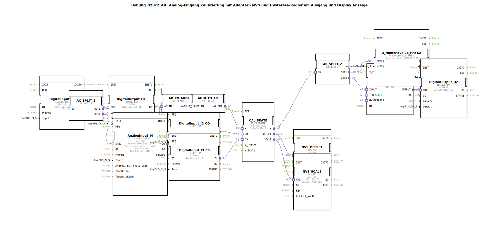

# Uebung_028c2_AR: Analog-Eingang Kalibrierung mit Adaptern NVS und Hysterese-Regler am Ausgang und Display Anzeige

* * * * * * * * * *

## Einleitung

Diese Übung demonstriert die Kalibrierung eines analogen Eingangssignals unter Verwendung von NVS-Speicher (Non-Volatile Storage) für Offset und Skalierung. Das kalibrierte Signal wird auf zwei Wege aufgeteilt: Einerseits zur Anzeige eines physikalischen Werts (z. B. für ein Display), andererseits zu einem Hysterese-Regler, der einen digitalen Ausgang ansteuert. Die Kalibrierung kann über digitale Eingänge (Offset- und Skalierungsbefehle) gestartet werden. Die Schwellwerte für die Hysterese werden aus dem NVS über zwei Sub-Applikationen geladen.

## Verwendete Funktionsbausteine (FBs)

### Sub-Bausteine: `THRESHOLD` und `HYSTERESIS`

- **Typ**: `MyLib::sys::NVS_IN_AND_STORE_AR`
- **Verwendete interne FBs**: Nicht näher spezifiziert, basieren auf dem NVS-Speicherzugriff.
- **Beschreibung**: Beide Sub-Applikationen dienen dem Lesen (und optional Speichern) eines analogen Werts (AR) aus dem NVS. Der Wert wird über den Parameter `KEY` adressiert (z. B. `'THRESHOLD'` oder `'HYSTERESIS'`). Der Ausgang `VALUEO` liefert den gespeicherten Wert. Zusätzlich wird ein Struktur-Objekt (`stObj`) für die Datenübergabe verwendet.

### Übersicht aller verwendeten Funktionsbausteine

| Name | Typ | Parameter (Auswahl) |
|------|-----|----------------------|
| `DigitalInput_I1` | `logiBUS::io::DI::logiBUS_IXA` | `Input = Input_I1` |
| `DigitalOutput_Q1` | `logiBUS::io::DQ::logiBUS_QXA` | `Output = Output_Q1` |
| `AnalogInput_I4` | `logiBUS::io::AI::logiBUS_AI_IDA` | `AnalogInput_hysteresis=50`, `TimeDelta=250`, `TimeRateLimit=100` |
| `CALIBRATE` | `adapter::Engineering::measurements::AR_CALIBRATE` | `Y_Offset=0.0`, `Y_Scale=100.0` |
| `NVS_OFFSET` | `logiBUS::storage::esp32_nvs::NVS_AR2` | `KEY='OFFSET'`, `DEFAULT_VALUE=0.0` |
| `NVS_SCALE` | `logiBUS::storage::esp32_nvs::NVS_AR2` | `KEY='SCALE'`, `DEFAULT_VALUE=1.0` |
| `DigitalInput_I2_CO` | `logiBUS::io::DI::logiBUS_IXA` | `Input = Input_I2` (Kalibrier-Offset-Befehl) |
| `DigitalInput_I3_CS` | `logiBUS::io::DI::logiBUS_IXA` | `Input = Input_I3` (Kalibrier-Skalierungsbefehl) |
| `AX_SPLIT_2` | `adapter::events::unidirectional::AX_SPLIT_2` | – |
| `THRESHOLD` | SubApp `MyLib::sys::NVS_IN_AND_STORE_AR` | `KEY='THRESHOLD'`, `stObj=InputNumber_THRESHOLD` |
| `HYSTERESIS` | SubApp `MyLib::sys::NVS_IN_AND_STORE_AR` | `KEY='HYSTERESIS'`, `stObj=InputNumber_HYSTERESIS` |
| `Hysteresis_AR_AX` | `logiBUS::signalprocessing::hysteresis::Hysteresis_AR_AX` | `QI=TRUE` |
| `AR_SPLIT_2` | `adapter::events::unidirectional::AR_SPLIT_2` | – |
| `Q_NumericValue_PHYSA` | `isobus::UT::Q::Q_NumericValue_PHYSA` | `stObj=InputNumber_PWM_DUTY_OUT` (Anzeige) |
| `AD_TO_AUDI` | `adapter::conversion::unidirectional::AD_TO_AUDI` | – |
| `AUDI_TO_AR` | `adapter::conversion::unidirectional::AUDI_TO_AR` | – |
| `DigitalOutput_Q2` | `logiBUS::io::DQ::logiBUS_QXA` | `Output = Output_Q2` |

### Kurzbeschreibung der wichtigsten Komponenten

- **AnalogInput_I4**: Liest einen analogen Wert (z. B. Spannung) ein und gibt ihn als Adapter-Interface (`AD`) aus.
- **AD_TO_AUDI, AUDI_TO_AR**: Wandeln das analoge Adapter-Interface (AD) über ein generisches `AUDI`-Interface in einen analogen Real-Wert (`AR`) um. Dies entspricht einer Typkonvertierung.
- **CALIBRATE**: Wendet Offset und Skalierung auf den eingehenden analogen Wert an: `Y = (X + Offset) * Scale`. Die Werte für Offset und Skalierung können über die digitalen Eingänge `CO` und `CS` aktualisiert und anschließend in den NVS-Bausteinen gespeichert werden.
- **NVS_OFFSET, NVS_SCALE**: Speichern die Kalibrierwerte dauerhaft im Flash des ESP32. Der Ausgang `VAL` liefert den aktuell gespeicherten Wert.
- **Hysteresis_AR_AX**: Vergleicht den kalibrierten Wert mit einem Schwellwert und einer Hysterese. Der Ausgang `OUTPUT` schaltet, wenn der Wert den Schwellwert überschreitet (bzw. unterschreitet inkl. Hysterese).
- **Q_NumericValue_PHYSA**: Bereitet den kalibrierten Wert zur Anzeige auf einem Display oder einer anderen Ausgabeeinheit auf.
- **AX_SPLIT_2, AR_SPLIT_2**: Verteilen ein Signal (Event bzw. Daten) auf zwei Ausgänge.

## Programmablauf und Verbindungen

1. **Analoger Eingang**: Der Analogbaustein `AnalogInput_I4` (logiBUS AI) liefert einen analogen Messwert als `AD`-Adapter.
2. **Konvertierung**: Über `AD_TO_AUDI` und `AUDI_TO_AR` wird der Wert in einen `AR`-Real-Wert umgewandelt. Ein Kommentar weist darauf hin, dass eine direkte Konvertierung (`AD_TO_AR`) wie ein `reinterpret_cast` wirken würde – die doppelte Umwandlung stellt eine korrekte Werteübertragung sicher.
3. **Kalibrierung**: Der `AR`-Wert wird an `CALIBRATE.X` übergeben. Die digitalen Eingänge `I2` (CO) und `I3` (CS) lösen die Berechnung von Offset (`CO`-Ereignis) und Skalierung (`CS`-Ereignis) aus. Die berechneten Werte werden über die NVS-Bausteine gespeichert.
   - `DigitalInput_I2_CO` → `CALIBRATE.CO` (Offset ermitteln)
   - `DigitalInput_I3_CS` → `CALIBRATE.CS` (Skalierung ermitteln)
4. **Aufteilung des kalibrierten Werts**: Der Ausgang `CALIBRATE.Y` wird über `AR_SPLIT_2` auf zwei Pfade verteilt:
   - Pfad 1: Anzeige → `Q_NumericValue_PHYSA.rPhys` (z. B. `InputNumber_PWM_DUTY_OUT`)
   - Pfad 2: Hysterese → `Hysteresis_AR_AX.INPUT`
5. **Hysterese**: Die Sub-Applikationen `THRESHOLD` und `HYSTERESIS` liefern die Schwellwerte (`THRESHOLD.VALUEO` → `Hysteresis_AR_AX.THRESHOLD` und `HYSTERESIS.VALUEO` → `Hysteresis_AR_AX.HYSTERESIS`). Der Hysterese-Baustein vergleicht den Eingang mit diesen Werten und schaltet seinen Ausgang `OUTPUT`.
6. **Digitale Ausgänge**:
   - `DigitalOutput_Q1` wird durch das Event von `DigitalInput_I1` über `AX_SPLIT_2` gesteuert (dient z. B. als Freigabe oder Status).
   - `Hysteresis_AR_AX.OUTPUT` schaltet den digitalen Ausgang `DigitalOutput_Q2` (z. B. für eine Schaltfunktion).

**Wichtiger Hinweis**: Die doppelte Adapter-Konvertierung (`AD_TO_AUDI` + `AUDI_TO_AR`) ist notwendig, um eine korrekte Werteübertragung zu gewährleisten (siehe Kommentar im Netzwerk).

## Zusammenfassung

Die Übung zeigt, wie ein analoges Eingangssignal mit Offset- und Skalierungskorrektur kalibriert wird. Die Kalibrierparameter werden dauerhaft im NVS gespeichert und können über digitale Taster aktualisiert werden. Der kalibrierte Wert wird sowohl für eine Anzeige als auch für eine Hysterese-Schaltfunktion genutzt. Die Verschaltung verdeutlicht den Umgang mit Adapter-Konvertierungen, NVS-Speicherzugriffen und der Aufteilung von Datenflüssen in der 4diac-IDE.