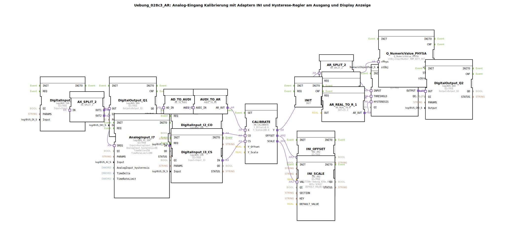

# Uebung_028c3_AR: Analog-Eingang Kalibrierung mit Adaptern INI und Hysterese-Regler am Ausgang und Display Anzeige

* * * * * * * * * *

## Einleitung

Diese Übung demonstriert die Kalibrierung eines analogen Eingangs (AnalogInput_I7) mithilfe eines Kalibrierungsadapters (AR_CALIBRATE), der einen Offset und einen Skalierungsfaktor aus einer INI-Datei lädt. Das kalibrierte Signal wird an einen Hysterese-Regler (Hysteresis_AR_AX) übergeben, der einen digitalen Ausgang (Output_Q2) schaltet. Gleichzeitig wird der kalibrierte Wert auf einem Display (Q_NumericValue_PHYSA) angezeigt. Die Übung nutzt zwei Eingänge (I2, I3) zum Triggern der Kalibrierung und einen weiteren Eingang (I1) als Freigabesignal.

## Verwendete Funktionsbausteine (FBs)

### Sub-Bausteine: Keine (alle FBs sind systemdefiniert)

- **AnalogInput_I7** (Typ: `logiBUS::io::AI::logiBUS_AI_IDA`)
    - **Verwendete interne Parameter**: `AnalogInput_hysteresis = 50`, `TimeDelta = 250`, `TimeRateLimit = 100`
    - **Funktionsweise**: Liest den physikalischen Analogwert (z. B. Spannung) vom Eingang I7 aus. Die Parameter legen eine Hysterese, Abtastzeit und Ratenbegrenzung fest.
- **DigitalInput_I1** (Typ: `logiBUS::io::DI::logiBUS_IXA`)
    - **Funktionsweise**: Liest den digitalen Eingang I1. Wird als Freigabesignal für den Ausgang Q1 verwendet.
- **DigitalInput_I2_CO** (Typ: `logiBUS::io::DI::logiBUS_IXA`)
    - **Funktionsweise**: Liest den digitalen Eingang I2 zur Triggerung des Kalibrier-Commits (CO).
- **DigitalInput_I3_CS** (Typ: `logiBUS::io::DI::logiBUS_IXA`)
    - **Funktionsweise**: Liest den digitalen Eingang I3 zur Triggerung des Kalibrier-Read-Starts (CS).
- **DigitalOutput_Q1** (Typ: `logiBUS::io::DQ::logiBUS_QXA`)
    - **Funktionsweise**: Setzt den digitalen Ausgang Q1 basierend auf dem Eingang I1 (Freigabe).
- **DigitalOutput_Q2** (Typ: `logiBUS::io::DQ::logiBUS_QXA`)
    - **Funktionsweise**: Setzt den digitalen Ausgang Q2 basierend auf dem Hysterese-Regler-Ausgang.
- **CALIBRATE** (Typ: `adapter::Engineering::measurements::AR_CALIBRATE`)
    - **Verwendete interne Parameter**: `Y_Offset = 0.0`, `Y_Scale = 100.0`
    - **Funktionsweise**: Führt eine Kalibrierung des analogen Eingangswertes durch. Berechnet einen Offset- und Skalierungsfaktor, der in die INI-Datei geschrieben wird. Eingänge: X (Rohwert), CO (Commit-Trigger), CS (Read-Trigger). Ausgänge: Y (kalibrierter Wert), OFFSET, SCALE.
- **INI_OFFSET** (Typ: `eclipse4diac::storage::INI_AR2`)
    - **Verwendete interne Parameter**: `SECTION = 'Uebung_028a_AR'`, `KEY = 'OFFSET'`, `DEFAULT_VALUE = 0.0`
    - **Funktionsweise**: Liest den Offset-Wert aus einer INI-Datei und stellt ihn als analogen Wert bereit.
- **INI_SCALE** (Typ: `eclipse4diac::storage::INI_AR2`)
    - **Verwendete interne Parameter**: `SECTION = 'Uebung_028a_AR'`, `KEY = 'SCALE'`, `DEFAULT_VALUE = 1.0`
    - **Funktionsweise**: Liest den Skalierungsfaktor aus einer INI-Datei und stellt ihn als analogen Wert bereit.
- **Hysteresis_AR_AX** (Typ: `logiBUS::signalprocessing::hysteresis::Hysteresis_AR_AX`)
    - **Verwendete interne Parameter**: `QI = TRUE`
    - **Funktionsweise**: Vergleicht den kalibrierten Eingangswert mit einem Schwellwert und einer Hysterese. Der Ausgang wird gesetzt, wenn der Wert den Schwellwert überschreitet und zurückgesetzt, wenn er unter den unteren Schwellwert (Schwellwert – Hysterese) fällt.
- **Q_NumericValue_PHYSA** (Typ: `isobus::UT::Q::Q_NumericValue_PHYSA`)
    - **Verwendete interne Parameter**: `stObj = InputNumber_PWM_DUTY_OUT`
    - **Funktionsweise**: Zeigt einen analogen Wert auf einem Display an (z. B. als numerischen Wert).
- **AX_SPLIT_2** (Typ: `adapter::events::unidirectional::AX_SPLIT_2`)
    - **Funktionsweise**: Verteilt ein digitales Signal (AX) auf zwei Ausgänge (OUT1, OUT2). Hier: Eingang von DigitalInput_I1 wird geteilt an DigitalOutput_Q1 und als Trigger für AnalogInput_I7.
- **AR_SPLIT_2** (Typ: `adapter::events::unidirectional::AR_SPLIT_2`)
    - **Funktionsweise**: Verteilt einen analogen Wert (AR) auf zwei Ausgänge (OUT1, OUT2). Hier: Kalibrierter Wert geht an Display und Hysterese-Regler.
- **AD_TO_AUDI** (Typ: `adapter::conversion::unidirectional::AD_TO_AUDI`)
    - **Funktionsweise**: Konvertiert einen AD-Wert (Analog-Digital) in einen AUDI-Wert. Dient zur Anpassung der Signalrepräsentation.
- **AUDI_TO_AR** (Typ: `adapter::conversion::unidirectional::AUDI_TO_AR`)
    - **Funktionsweise**: Konvertiert einen AUDI-Wert zurück in einen AR-Wert (analoger realer Wert). Hinweis: Zwei Konvertierungen nötig, da ein direkter AD_TO_AR wie ein „reinterpret_cast“ wirken würde.
- **AR_REAL_TO_R** (x2) (Typ: `adapter::conversion::unidirectional::AR_REAL_TO_R`)
    - **Verwendete interne Parameter**: Erstes: `OUT = 50.5`, Zweites: `OUT = 15.3`
    - **Funktionsweise**: Wandelt einen konstanten realen Wert in ein AR-Signal um. Dient als Schwellwert (THRESHOLD = 50.5) und Hysteresebreite (HYSTERESIS = 15.3) für den Hysterese-Regler.
- **INIT** (Typ: `iec61131::bitwiseOperators::INIT`)
    - **Funktionsweise**: Erzeugt ein einmaliges Initialisierungsereignis (INITO) beim Systemstart. Dieses Ereignis triggert die beiden AR_REAL_TO_R-Bausteine, um die konstanten Werte zu setzen.

## Programmablauf und Verbindungen

1. **Initialisierung**: Beim Start triggert der INIT-Baustein die beiden AR_REAL_TO_R-Bausteine, die die konstanten Schwellwerte (50.5 und 15.3) auf den analogen Bus legen.
2. **Analogwerterfassung**: Der AnalogInput_I7 liest den Rohwert vom Eingang I7. Dieser Rohwert wird über die Konvertierungskette AD_TO_AUDI und AUDI_TO_AR an den Kalibrierungsbaustein CALIBRATE übergeben.
3. **Kalibrierung**: Die digitalen Eingänge I2 (CO) und I3 (CS) steuern die Kalibrierung:
   - Bei CS (I3 = TRUE) wird ein neuer Kalibrierdurchlauf gestartet: Der aktuelle Rohwert (X) wird gemessen, und der Offset sowie die Skalierung werden berechnet.
   - Bei CO (I2 = TRUE) werden die berechneten Werte in die INI-Datei geschrieben (über INI_OFFSET und INI_SCALE).
   - Der kalibrierte Ausgang Y wird an den Splitter AR_SPLIT_2 weitergeleitet.
4. **Signalverteilung**:
   - AR_SPLIT_2.OUT1 leitet den kalibrierten Wert an das Display (Q_NumericValue_PHYSA) zur Anzeige.
   - AR_SPLIT_2.OUT2 leitet den kalibrierten Wert an den Hysterese-Regler (Hysteresis_AR_AX).
5. **Hysterese-Regelung**: Der Hysterese-Regler vergleicht den kalibrierten Eingangswert mit dem Schwellwert (50.5) und der Hysterese (15.3). Der Ausgang wird aktiv, wenn der Wert über 50.5 + 15.3/2 ? (je nach Implementierung; typisch: Ansprechen bei > 50.5, Rücksetzen bei < 50.5 - 15.3), und schaltet den digitalen Ausgang Q2.
6. **Freigabesignal**: Der digitale Eingang I1 gelangt über den Splitter AX_SPLIT_2 an den Ausgang Q1 (direkt weitergeleitet) und gleichzeitig an den AnalogInput_I7 (als Trigger für die Messung). Somit kann nur bei aktivem I1 der Analogwert eingelesen werden.

**Anmerkung**: Die Kommentare im Netzwerk weisen darauf hin, dass die doppelte Konvertierung (AD_TO_AUDI → AUDI_TO_AR) notwendig ist, um eine korrekte Signalrepräsentation zu gewährleisten. Ein direkter AD_TO_AR würde die Bitinterpretation des Analog-Digital-Wandlers ohne Umweg über den Audi-Bus durchführen, was zu falschen Werten führen kann.

## Zusammenfassung

Die Übung "Uebung_028c3_AR" realisiert eine vollständige Analog-Eingangskalibrierung mit persistenter Speicherung von Offset und Skalierung in einer INI-Datei. Der kalibrierte Wert wird auf einem Display visualisiert und gleichzeitig einem Hysterese-Regler zugeführt, der einen digitalen Ausgang schaltet. Die Steuerung erfolgt über drei digitale Eingänge: Freigabe (I1), Commit (I2) und Start (I3). Die Übung vermittelt den Umgang mit Adaptern, Signalumwandlungen und der Anbindung von INI-Speicherbausteinen in 4diac.