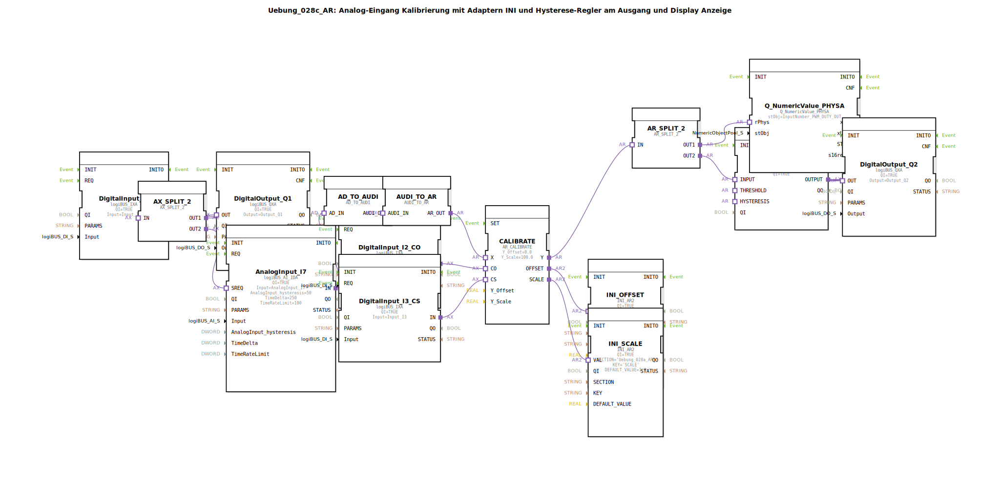

# Uebung_028c_AR: Analog-Eingang Kalibrierung mit Adaptern INI und Hysterese-Regler am Ausgang und Display Anzeige

*Bild der Übung folgt*

---

## Einleitung

Diese Übung demonstriert die Kalibrierung eines analogen Eingangs (AnalogInput_I7) mithilfe von Offset- und Skalierungsadaptern (AR_CALIBRATE). Die Kalibrierungswerte werden über INI-Funktionsbausteine (INI_AR2) persistent gespeichert. Zusätzlich wird ein Hysterese-Regler auf das kalibrierte Analogsignal angewendet, wobei Schwellwert und Hysterese ebenfalls über INI geladen werden (SubApp THRESHOLD und HYSTERESIS). Das Ergebnis der Hysterese wird auf einen digitalen Ausgang (Output_Q2) gegeben, während der kalibrierte Wert gleichzeitig auf einem Display (Q_NumericValue_PHYSA) ausgegeben wird. Digitale Eingänge steuern die Kalibrierung (Calibrate On/Off und Calibrate Set) sowie einen weiteren digitalen Ausgang (Output_Q1).

## Verwendete Funktionsbausteine (FBs)

### Sub-Bausteine: `THRESHOLD` und `HYSTERESIS`

- **Typ**: `MyLib::sys::INI_IN_AND_STORE_AR`
- **Parameter**:
  - `SECTION`: Abschnittsname in der INI-Konfiguration (`'HYSTERESIS'`)
  - `KEY`: Schlüsselname (`'THRESHOLD'` bzw. `'HYSTERESIS'`)
  - `stObj`: Verweis auf ein Pool-Objekt zur Wertanzeige (z.B. `InputNumber_THRESHOLD`)
- **Funktionsweise**:  
  Liest zur Initialisierung den unter `SECTION`/`KEY` gespeicherten Wert aus der INI-Datei (oder einer persistenten Speicherstruktur) und stellt ihn als Ausgangswert (`VALUO`) zur Verfügung. Der Wert kann während der Laufzeit durch andere Bausteine (z.B. HMI) aktualisiert werden. Bei Änderungen wird der neue Wert zurückgespeichert.

### Weitere Funktionsbausteine

| Bausteinname | Typ | Parameter | Beschreibung |
|--------------|-----|-----------|--------------|
| `AnalogInput_I7` | `logiBUS::io::AI::logiBUS_AI_IDA` | QI=TRUE, Input="AnalogInput_I7", AnalogInput_hysteresis=50, TimeDelta=250, TimeRateLimit=100 | Analoger Eingang, liefert einen Adapter `AD_IN` (Analog-/Digitalwert). |
| `DigitalInput_I1` | `logiBUS::io::DI::logiBUS_IXA` | QI=TRUE, Input="Input_I1" | Digitaler Eingang I1, steuert über Adapter `AX_SPLIT_2` zwei Ausgänge (Q1 und SREQ am AnalogInput). |
| `DigitalInput_I2_CO` | `logiBUS::io::DI::logiBUS_IXA` | QI=TRUE, Input="Input_I2" | Digitaler Eingang I2 (Calibrate On/Off). |
| `DigitalInput_I3_CS` | `logiBUS::io::DI::logiBUS_IXA` | QI=TRUE, Input="Input_I3" | Digitaler Eingang I3 (Calibrate Set). |
| `DigitalOutput_Q1` | `logiBUS::io::DQ::logiBUS_QXA` | QI=TRUE, Output="Output_Q1" | Digitaler Ausgang Q1 (z.B. Quittung für I1). |
| `DigitalOutput_Q2` | `logiBUS::io::DQ::logiBUS_QXA` | QI=TRUE, Output="Output_Q2" | Digitaler Ausgang Q2 (Hysterese-Ergebnis). |
| `CALIBRATE` | `adapter::Engineering::measurements::AR_CALIBRATE` | Y_Offset=0.0, Y_Scale=100.0 | Kalibrieradapter: berechnet `Y = (X * Y_Scale) + Y_Offset`. Eingänge: X (Analogwert), CO (Calibrate On), CS (Calibrate Set). Ausgänge: Y (kalibrierter Wert), OFFSET, SCALE. |
| `INI_OFFSET` | `eclipse4diac::storage::INI_AR2` | QI=TRUE, SECTION="'Uebung_028a_AR'", KEY="'OFFSET'", DEFAULT_VALUE=0.0 | Liest/speichert den Offset-Wert (vom CALIBRATE-Adapter). |
| `INI_SCALE` | `eclipse4diac::storage::INI_AR2` | QI=TRUE, SECTION="'Uebung_028a_AR'", KEY="'SCALE'", DEFAULT_VALUE=1.0 | Liest/speichert den Skalierungsfaktor. |
| `AX_SPLIT_2` | `adapter::events::unidirectional::AX_SPLIT_2` | - | Verteilt einen digitalen Adapter (AX) auf zwei Ausgänge. |
| `AR_SPLIT_2` | `adapter::events::unidirectional::AR_SPLIT_2` | - | Verteilt einen analogen Adapter (AR) auf zwei Ausgänge. |
| `AD_TO_AUDI` | `adapter::conversion::unidirectional::AD_TO_AUDI` | - | Wandelt einen AD-Adapter (Analog/Digital) in einen AUDI-Adapter (universelles Datenformat). |
| `AUDI_TO_AR` | `adapter::conversion::unidirectional::AUDI_TO_AR` | - | Wandelt einen AUDI-Adapter zurück in einen AR-Adapter (analoger Realwert). Die doppelte Konvertierung ist notwendig, da direkte Typumwandlung nicht möglich (ähnlich zu `reinterpret_cast`). |
| `Hysteresis_AR_AX` | `logiBUS::signalprocessing::hysteresis::Hysteresis_AR_AX` | QI=TRUE | Hysterese-Funktion auf analogen Werten. Eingänge: `INPUT` (AR), `THRESHOLD` (AR), `HYSTERESIS` (AR). Ausgang: `OUTPUT` (AX, digital). |
| `Q_NumericValue_PHYSA` | `isobus::UT::Q::Q_NumericValue_PHYSA` | stObj=InputNumber_PWM_DUTY_OUT | Zeigt einen analogen Wert auf einem Display oder einer numerischen Anzeige an. |

## Programmablauf und Verbindungen

1. **Analoger Eingang**:  
   `AnalogInput_I7` liefert kontinuierlich den Rohwert des analogen Eingangs am Adapter `IN`. Dieser Rohwert wird über `AD_TO_AUDI` und `AUDI_TO_AR` in einen AR-Adapter (Realwert) konvertiert und an den Eingang `X` des Kalibrieradapters `CALIBRATE` übergeben.

2. **Kalibrierung**:  
   Die digitalen Eingänge `Input_I2` (CO = Calibrate On) und `Input_I3` (CS = Calibrate Set) steuern den Kalibriervorgang. Drücken von CS bei aktiver CO übernimmt den aktuellen Messwert und berechnet Offset und Skalierung, sodass der Ausgangswert `Y` dem gewünschten Sollwert entspricht. Die ermittelten Werte `OFFSET` und `SCALE` werden über die INI-Bausteine `INI_OFFSET` und `INI_SCALE` gespeichert.  
   *Hinweis*: Die INI-Bausteine sind mit `SECTION` = `'Uebung_028a_AR'` konfiguriert.

3. **Wertverteilung**:  
   Der kalibrierte Wert `Y` wird über `AR_SPLIT_2` auf zwei Pfade verteilt:
   - Pfad 1 zu `Q_NumericValue_PHYSA` (Display-Anzeige)
   - Pfad 2 zum Hysterese-Block `Hysteresis_AR_AX` (Eingang `INPUT`)

4. **Hysterese**:  
   Die SubApps `THRESHOLD` und `HYSTERESIS` lesen die Parameter (Schwellwert und Hystereseband) aus der INI-Konfiguration (Abschnitt `'HYSTERESIS'`). Diese Werte werden an den Hysterese-Block übergeben. Der Hysterese-Block vergleicht den kalibrierten Wert mit dem Schwellwert unter Berücksichtigung des Hysteresebandes und gibt ein digitales Signal (`OUTPUT`) aus.

5. **Digitale Ausgänge**:  
   - `DigitalInput_I1` wird über `AX_SPLIT_2` aufgeteilt: Ein Zweig steuert `DigitalOutput_Q1`, der andere Zweig triggert den analogen Eingang (`SREQ`), um eine Abtastung auszulösen.  
   - Das Ergebnis der Hysterese (`Hysteresis_AR_AX.OUTPUT`) wird direkt auf `DigitalOutput_Q2` gegeben.

6. **Besonderheit**:  
   Die doppelte Konvertierung (`AD_TO_AUDI` → `AUDI_TO_AR`) ist erforderlich, da der Analogwert (AD) nicht direkt in einen AR-Adapter umgewandelt werden kann. Der AUDI-Adapter dient als Zwischenformat.

## Zusammenfassung

In dieser Übung wird ein analoger Eingang kalibriert, die Kalibrierungswerte werden persistent in INI-Dateien gespeichert und bei Wiederinbetriebnahme wieder geladen. Ein Hysterese-Regler wertet den kalibrierten Wert aus und schaltet einen digitalen Ausgang. Gleichzeitig wird der Wert auf einem Display angezeigt.

**Lernziele**:
- Kalibrierung eines analogen Sensors mittels Offset und Skalierung
- Persistente Speicherung von Konfigurationswerten mit INI-Bausteinen
- Anwendung eines Hysterese-Reglers
- Signalaufteilung mit Adaptern und korrekte Konvertierung zwischen verschiedenen Datentypen
- Zusammenspiel von analogen und digitalen Ein-/Ausgängen in 4diac

**Schwierigkeitsgrad**: Fortgeschritten  
**Vorkenntnisse**: Grundlagen der 4diac-IDE, Umgang mit Adaptern und logiBUS-Modulen, Verständnis von Signalverarbeitung und INI-Konfiguration.

**Hinweis**: Vor dem Start müssen die INI-Bereiche `'Uebung_028a_AR'` und `'HYSTERESIS'` in der Konfigurationsdatei vorhanden sein. Die numerischen Pool-Objekte (z.B. `InputNumber_THRESHOLD`) müssen im Projekt entsprechend definiert sein.