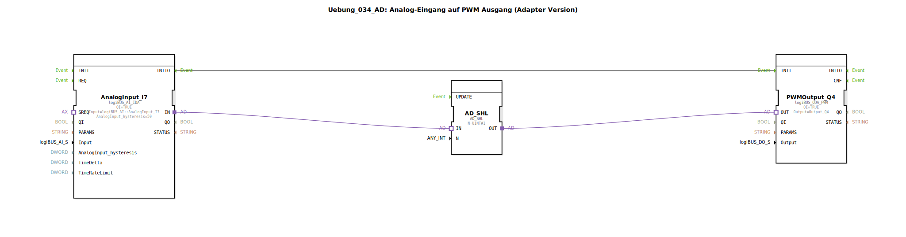

# Uebung_034_AD: Analog-Eingang auf PWM Ausgang (Adapter Version)

Analog-Eingang auf PWM Ausgang (Adapter Version)

* * * * * * * * * *
## Einleitung
Diese Übung demonstriert die Verwendung eines analogen Eingangs zur Ansteuerung eines PWM-Ausgangs über eine Adapterverbindung. Das Signal des analogen Eingangs wird zuerst durch eine Bitverschiebung (Shift Left) verarbeitet, bevor es an den PWM-Ausgang weitergegeben wird. Die Initialisierung des PWM-Ausgangs erfolgt über ein Ereignis, das vom analogen Eingang ausgelöst wird.

## Verwendete Funktionsbausteine (FBs)

### Sub-Bausteine: AnalogInput\_I7
- **Typ**: `logiBUS::io::AI::logiBUS_AI_IDA`
- **Verwendete interne FBs**: Keine (Hardwaretreiberbaustein)
  - **Parameter**:
    - `QI` = `TRUE`
    - `Input` = `logiBUS_AI::AnalogInput_I7`
    - `AnalogInput_hysteresis` = `50`
  - **Ereignisausgang/-eingang**:
    - Ereignisausgang `INITO` (wird beim erfolgreichen Initialisieren ausgelöst)
  - **Datenausgang/-eingang**:
    - Adapterausgang `IN` (stellt den gelesenen Analogwert als Adapter bereit)
- **Funktionsweise**: Liest den analogen Eingangswert des angeschlossenen logiBUS-Moduls ein. Der Parameter `AnalogInput_hysteresis` reduziert Signalrauschen. Bei erfolgreicher Initialisierung wird das Ereignis `INITO` gesendet.

### Sub-Bausteine: PWMOutput\_Q4
- **Typ**: `logiBUS::io::DQ::logiBUS_QDA_PWM`
- **Verwendete interne FBs**: Keine (Hardwaretreiberbaustein)
  - **Parameter**:
    - `QI` = `TRUE`
    - `Output` = `Output_Q4`
  - **Ereignisausgang/-eingang**:
    - Ereigniseingang `INIT` (löst die Initialisierung und Übernahme des PWM-Werts aus)
  - **Datenausgang/-eingang**:
    - Adaptereingang `OUT` (empfängt den Adapter mit dem PWM-Sollwert)
- **Funktionsweise**: Steuert den digitalen Ausgangskanal Q4 als PWM-Ausgang. Der über den Adaptereingang `OUT` erhaltene Wert bestimmt das Tastverhältnis (Pulsweite). Der Ausgang wird mit dem Ereignis `INIT` aktiviert.

### Sub-Bausteine: AD\_SHL
- **Typ**: `adapter::iec61131::bitwise::AD_SHL`
- **Verwendete interne FBs**: Keine (reine Logik)
  - **Parameter**:
    - `N` = `UINT#1` (Schiebeweite um 1 Bit nach links)
  - **Ereignisausgang/-eingang**: Keine (statische Verarbeitung ohne Ereignisse)
  - **Datenausgang/-eingang**:
    - Adaptereingang `IN` (empfängt den Analogwert als Adapter)
    - Adapterausgang `OUT` (gibt den verschobenen Wert als Adapter aus)
- **Funktionsweise**: Führt eine bitweise Linksverschiebung (Shift Left) um die angegebene Anzahl von Bits (hier 1) auf dem empfangenen Datenwert durch. Dies entspricht einer Multiplikation mit 2. Der verschobene Wert wird über den Adapterausgang bereitgestellt.

## Programmablauf und Verbindungen

Der Ablauf beginnt mit der Initialisierung des analogen Eingangs (`AnalogInput_I7`). Sobald dieser erfolgreich initialisiert ist (Ereignis `INITO`), wird das Initialisierungsereignis des PWM-Ausgangs (`PWMOutput_Q4`) über die Ereignisverbindung ausgelöst:

- `AnalogInput_I7.INITO` → `PWMOutput_Q4.INIT`

Parallel dazu werden die Daten über Adapterverbindungen übertragen:
1. Der Analogwert wird vom Adapterausgang `AnalogInput_I7.IN` an den Adaptereingang `AD_SHL.IN` weitergeleitet.
2. Der aus `AD_SHL.OUT` resultierende verschobene Wert wird an den Adaptereingang `PWMOutput_Q4.OUT` übergeben.

Somit erfolgt die gesamte Datenübertragung adaptierbar und bidirektional über Adapterschnittstellen, ohne separate Datenleitungen. Die Bitverschiebung verstärkt den analogen Eingangswert um den Faktor 2 (entspricht einer Verdopplung), bevor er als PWM-Tastverhältnis ausgegeben wird.

**Lernziele**:
- Verständnis der Adapterkommunikation in 4diac-IDE
- Einbindung von Analog-Eingängen (logiBUS) und PWM-Ausgängen
- Anwendung bitweiser Operationen (Shift Left) in der Signalverarbeitung
- Verknüpfung von Initialisierungsereignissen zwischen Hardwaretreibern

**Schwierigkeitsgrad**: Einfach
**Benötigte Vorkenntnisse**: Grundlegende Kenntnisse der 4diac-IDE und der logiBUS-Hardware

## Zusammenfassung
Die Übung "Uebung_034_AD" zeigt eine einfache, aber praxisrelevante Anwendung: die Umsetzung eines analogen Messwerts in ein PWM-Signal unter Verwendung von Adapterverbindungen. Der Analogwert wird durch eine Linksverschiebung verstärkt und direkt an den PWM-Ausgang weitergeleitet. Die Adaptertechnik ermöglicht eine flexible und typsichere Datenübertragung ohne separate Datenverbindungen. Dieses Beispiel eignet sich für Anwendungen wie Helligkeitssteuerung, Drehzahlregelung oder Signalumformung in der Automatisierungstechnik.