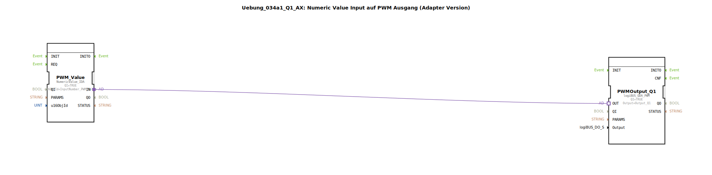

# Uebung_034a1_Q1_AX: Numeric Value Input auf PWM Ausgang (Adapter Version)




* * * * * * * * * *
## Einleitung

Diese Übung demonstriert die einfache Verbindung einer **Numerischen Werteingabe** (ISOBUS-NumericValue) mit einem **PWM-Ausgang** über eine direkte Adapterverbindung. Der eingegebene Zahlenwert wird nach Bestätigung der Eingabe (OK-Taste) auf den PWM-Ausgang des logiBUS-Moduls (Kanal Q1) ausgegeben.

Die Übung ist als **SubAppType** realisiert und verwendet ausschließlich Adapter für die Signalübergabe, wodurch auf separate Daten- und Ereignisverbindungen verzichtet wird.

## Verwendete Funktionsbausteine (FBs)

### Sub-Bausteine: `Uebung_034a1_Q1_AX`
- **Typ**: SubAppType (zusammengesetzter Baustein)
- **Verwendete interne FBs**:

    - **`PWM_Value`**: `isobus::UT::io::NumericValue::NumericValue_IDA`
        - Parameter:
            - `QI` = `TRUE` (Baustein aktiviert)
            - `u16ObjId` = `InputNumber_PWM_Value` (ISOBUS-Objekt-ID für die numerische Eingabe)
        - **Funktionsweise**: Liest einen vom Benutzer eingegebenen Zahlenwert von einem ISOBUS-Objekt (z. B. Terminal) und stellt diesen über den Adapterausgang `OUT` bereit. Die Daten werden erst nach Drücken der OK-Taste am Terminal aktualisiert.

    - **`PWMOutput_Q1`**: `logiBUS::io::DQ::logiBUS_QDA_PWM`
        - Parameter:
            - `QI` = `TRUE` (Baustein aktiviert)
            - `Output` = `Output_Q1` (logiBUS-Ausgangskanal Q1)
        - **Funktionsweise**: Wandelt den über den Adaptereingang `IN` erhaltenen numerischen Wert in ein PWM-Signal auf dem angegebenen logiBUS-Ausgang (`Output_Q1`) um. Der Wert bestimmt das Tastverhältnis der PWM.

## Programmablauf und Verbindungen

1. Der Benutzer gibt an einem ISOBUS-Terminal einen Zahlenwert über das Objekt `InputNumber_PWM_Value` ein.
2. Nach Betätigen der OK-Taste wird der Wert vom FB `PWM_Value` übernommen und an seinem Adapterausgang `IN` bereitgestellt.
3. Der Adapterausgang ist direkt mit dem Adaptereingang `OUT` des FB `PWMOutput_Q1` verbunden:
   ```
   Verbindung: PWM_Value.IN → PWMOutput_Q1.OUT
   ```
4. `PWMOutput_Q1` setzt den empfangenen Wert als PWM-Tastverhältnis auf dem logiBUS-Ausgang `Output_Q1` um.

**Hinweis**: Wie im Kommentar im Netzwerk vermerkt, wird der aktualisierte Wert **nicht** bei jeder Tastatureingabe (z. B. beim Drehen eines Encoders) übertragen, sondern erst nach drücken der OK-Taste. Dieses Verhalten ist durch den FB `NumericValue_IDA` vorgegeben.

## Zusammenfassung

Die Übung zeigt eine **minimale Konfiguration zur Ansteuerung eines PWM-Ausgangs** mittels einer eingegebenen Zahl. Sie verdeutlicht die Verwendung von **Adapterverbindungen** zur Datenübertragung zwischen ISOBUS-Eingabe und Aktor. Der Aufbau ist einfach, erfordert jedoch das Verständnis der ISOBUS-Kommunikation und der PWM-Parametrierung. Die Übung eignet sich für Einsteiger in die 4diac-IDE und die logiBUS-Hardware.