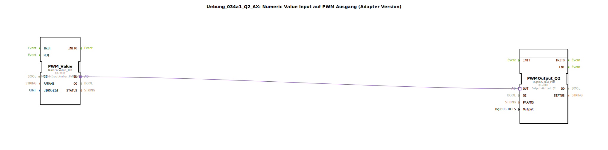

# Uebung_034a1_Q2_AX: Numeric Value Input auf PWM Ausgang (Adapter Version)

* * * * * * * * * *
## Einleitung
Diese Übung demonstriert die Kopplung eines numerischen Eingabewerts (über einen iSoBUS-Numeric-Value-Dienst) mit einem PWM‑Ausgang (logiBUS). Der vom Anwender eingegebene Zahlenwert wird direkt in ein PWM‑Signal umgesetzt und am Ausgang `Output_Q2` ausgegeben. Die Kommunikation zwischen den beiden Funktionsbausteinen erfolgt über eine Adapterverbindung, was eine modulare und flexible Verschaltung ermöglicht.

## Verwendete Funktionsbausteine (FBs)

Im Netzwerk der Subapplikation werden zwei Funktionsbausteine eingesetzt:

- **PWM_Value**  
  *Typ*: `isobus::UT::io::NumericValue::NumericValue_IDA`  
  *Aufgabe*: Empfängt einen numerischen Wert aus dem iSoBUS‑Netzwerk über die Objekt-ID `InputNumber_PWM_Value`. Die Daten stehen nach Bestätigung durch den Benutzer (z. B. Drücken der OK‑Taste) am Ausgang zur Verfügung.  
  *Parameter*:  
  - `QI` (Einschaltsignal) = `TRUE` (dauerhaft aktiv)  
  - `u16ObjId` = `InputNumber_PWM_Value` (iSoBUS‑Objekt‑ID des Eingabewerts)

- **PWMOutput_Q2**  
  *Typ*: `logiBUS::io::DQ::logiBUS_QDA_PWM`  
  *Aufgabe*: Wandelt den eingehenden Zahlenwert in ein PWM‑Signal um und gibt es über den logiBUS‑Ausgang `Output_Q2` aus.  
  *Parameter*:  
  - `QI` (Einschaltsignal) = `TRUE` (dauerhaft aktiv)  
  - `Output` = `Output_Q2` (logiBUS‑Ausgangsadresse)

**Wichtiger Hinweis:**  
Das Ereignis zur Datenübergabe wird erst ausgelöst, wenn der eingegebene Zahlenwert mit der OK‑Taste bestätigt wird – nicht bereits bei jeder Tastenbetätigung. Siehe Kommentar im Netzwerk:

> ACHTUNG !!  
> Ereignis erscheint erst im Adapter,  
> wenn man die Numeric Value mit OK bestätigt.  
> nicht bei Button Druck.

## Programmablauf und Verbindungen

1. Der Funktionsbaustein `PWM_Value` wartet auf einen gültigen Zahlenwert vom iSoBUS‑Eingabefeld.
2. Nach Benutzerbestätigung (OK‑Taste) wird über den **Adapterausgang** `IN` ein Datenevent mit dem Zahlenwert gesendet.
3. Die Adapterverbindung leitet dieses Signal an den **Adaptereingang** `OUT` des Funktionsbausteins `PWMOutput_Q2` weiter.
4. `PWMOutput_Q2` setzt den empfangenen Wert in ein PWM‑Signal mit entsprechender Pulsweite um und steuert den angeschlossenen logiBUS‑Ausgang `Output_Q2`.

**Wichtige Vorbedingungen:**  
- Die beiden Funktionsbausteine sind über ihre Adapterschnittstellen starr verbunden (keine dynamischen Verbindungen).  
- Das zugrundeliegende iSoBUS‑Objekt (`InputNumber_PWM_Value`) muss im System konfiguriert sein.  
- Das logiBUS‑Ausgangsmodul (`Output_Q2`) muss vorhanden und adressiert sein.

## Zusammenfassung

Die Übung zeigt, wie eine numerische Benutzereingabe aus einem iSoBUS‑Dienst über eine Adapterverbindung direkt in ein PWM‑Ausgangssignal umgesetzt wird. Die Verwendung von Adaptern vereinfacht die Verschaltung und erhöht die Wiederverwendbarkeit der Bausteine. Nach der Übung ist der Lernende in der Lage, iSoBUS‑Eingabefelder mit logiBUS‑PWM‑Ausgängen zu kombinieren und die Besonderheit der Ereignisauslösung (Bestätigung statt Tastendruck) zu berücksichtigen.