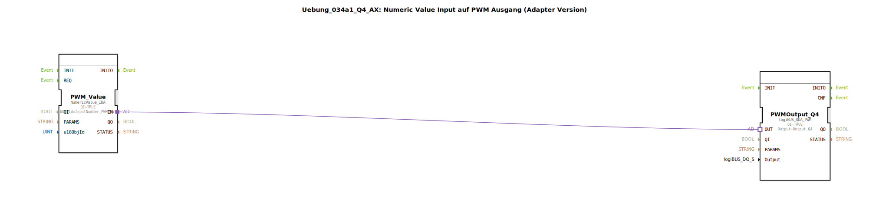

# Uebung_034a1_Q4_AX: Numeric Value Input auf PWM Ausgang (Adapter Version)

* * * * * * * * * *
## Einleitung

Diese Übung demonstriert die Steuerung eines PWM-Ausgangs (logiBUS Output Q4) durch einen numerischen Eingabewert. Die Kommunikation zwischen dem Eingabebaustein und dem Ausgabebaustein erfolgt über Adapter-Verbindungen („Adapter Version“). Ein integrierter Kommentar weist darauf hin, dass das Ereignis für die Wertübernahme erst ausgelöst wird, wenn der eingegebene numerische Wert mit „OK“ bestätigt wird – nicht bereits bei einem Tastendruck.

## Verwendete Funktionsbausteine (FBs)

### Sub-Bausteine: `PWM_Value`

- **Typ**: `isobus::UT::io::NumericValue::NumericValue_IDA`
- **Verwendete interne FBs**: (Keine weiteren internen FBs, da es sich um einen atomaren FB handelt. Der FB selbst ist Teil der Bibliothek `isobus`.)
- **Parameter**:
  - `QI` = `TRUE`
  - `u16ObjId` = `InputNumber_PWM_Value` (verweist auf eine im Projekt definierte Numeric-Value-Instanz)
- **Funktionsweise**:  
  Der FB liest den vom Benutzer eingegebenen numerischen Wert (z. B. aus einem HMI-Eingabefeld) und stellt diesen über seine Adapter-Schnittstelle (`IN`) bereit. Die Ausgabe erfolgt erst, nachdem die Eingabe mit „OK“ bestätigt wurde. Die Ereignissteuerung wird implizit über den Adapter abgewickelt.

### Sub-Bausteine: `PWMOutput_Q4`

- **Typ**: `logiBUS::io::DQ::logiBUS_QDA_PWM`
- **Verwendete interne FBs**: (Keine weiteren internen FBs, atomarer FB aus logiBUS-Bibliothek)
- **Parameter**:
  - `QI` = `TRUE`
  - `Output` = `Output_Q4` (logischer Name des physikalischen PWM-Ausgangs am logiBUS-Modul)
- **Funktionsweise**:  
  Der FB empfängt über seinen Adapter-Eingang (`OUT`) den aktuellen Sollwert (z. B. eine Zahl von 0 bis 1000 o. ä.) und stellt diesen als PWM-Signal am spezifizierten Kanal `Output_Q4` zur Verfügung. Der Wert entspricht dem Tastverhältnis der PWM.

## Programmablauf und Verbindungen

Der Netzwerkablauf besteht aus zwei Funktionsbausteinen, die ausschließlich über eine Adapter-Verbindung kommunizieren:

- **Quelle**: `PWM_Value.IN` (Ausgangsseite des Adapters)
- **Ziel**: `PWMOutput_Q4.OUT` (Eingangsseite des Adapters)

Die Adapter-Verbindung überträgt den numerischen Wert einschließlich der zugehörigen Ereignissteuerung. Sobald der Benutzer im HMI den Wert bestätigt, wird das Ereignis über den Adapter an den PWM-Ausgangsbaustein weitergeleitet, der daraufhin das PWM-Signal aktualisiert.

**Hinweis** (aus dem Kommentar im Netzwerk):  
Das Ereignis wird erst dann über den Adapter gesendet, wenn die numerische Eingabe mit „OK“ quittiert wird – nicht bereits bei einem Tastendruck oder einer Änderung des Eingabefeldes. Dies ist bei der Planung der Bedienoberfläche zu berücksichtigen.

| Verbindung | Von | Nach |
|------------|-----|------|
| Adapter    | `PWM_Value.IN` | `PWMOutput_Q4.OUT` |

## Zusammenfassung

Die Übung `Uebung_034a1_Q4_AX` verbindet einen numerischen Eingabe-FB (`NumericValue_IDA`) mit einem PWM-Ausgangs-FB (`logiBUS_QDA_PWM`) über Adapter. Dadurch wird ein einfaches Zusammenspiel von Bedieneingabe und Hardware-Ausgabe realisiert. Die Besonderheit liegt in der ereignisgesteuerten Übernahme des Wertes erst nach Bestätigung, was eine saubere Trennung von Eingabeänderung und Aktualisierung des Ausgangs ermöglicht.