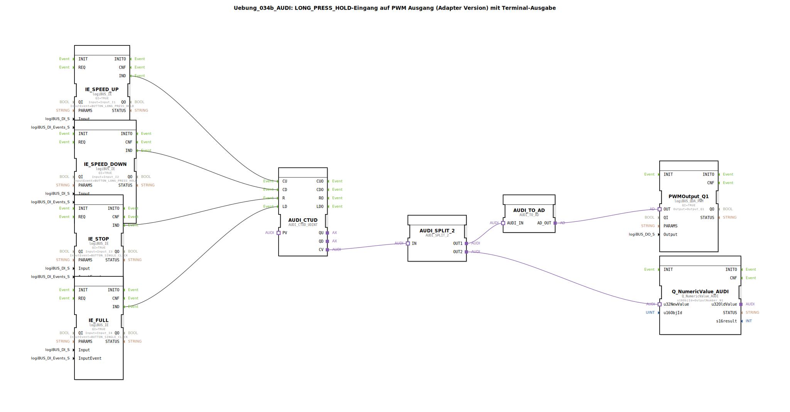

# Uebung_034b_AUDI: LONG_PRESS_HOLD-Eingang auf PWM Ausgang (Adapter Version) mit Terminal-Ausgabe

* * * * * * * * * *

## Einleitung

Diese Übung demonstriert die Verwendung von **LONG_PRESS_HOLD**-Eingängen zur Steuerung eines PWM-Ausgangs.  
Über vier Taster kann der PWM-Wert erhöht, verringert, zurückgesetzt oder auf einen Maximalwert gesetzt werden.  
Der aktuelle Zählerstand wird zusätzlich auf einem Terminal ausgegeben.  
Die gesamte Schaltung ist als **SubApp** mit Adapter-basierter Datenwandlung realisiert.

## Verwendete Funktionsbausteine (FBs)

Die SubApp enthält folgende Funktionsbausteine:

### Sub-Baustein: IE_SPEED_UP
- **Typ**: `logiBUS::io::DI::logiBUS_IE`
- **Parameter**:  
  - `QI` = TRUE  
  - `Input` = Input_I1 (physischer Eingang)  
  - `InputEvent` = `BUTTON_LONG_PRESS_HOLD`
- **Ereignisausgang**: `IND` (wird bei Langdruck ausgelöst)
- **Funktionsweise**: Erfasst ein Long-Press-Hold-Ereignis am ersten digitalen Eingang und gibt ein IND-Ereignis aus, um den Zähler zu erhöhen.

### Sub-Baustein: IE_SPEED_DOWN
- **Typ**: `logiBUS::io::DI::logiBUS_IE`
- **Parameter**:  
  - `QI` = TRUE  
  - `Input` = Input_I2  
  - `InputEvent` = `BUTTON_LONG_PRESS_HOLD`
- **Ereignisausgang**: `IND`
- **Funktionsweise**: Erfasst Long-Press-Hold am zweiten Eingang und löst das Herunterzählen aus.

### Sub-Baustein: IE_STOP
- **Typ**: `logiBUS::io::DI::logiBUS_IE`
- **Parameter**:  
  - `QI` = TRUE  
  - `Input` = Input_I3  
  - `InputEvent` = `BUTTON_SINGLE_CLICK`
- **Ereignisausgang**: `IND`
- **Funktionsweise**: Erfasst einen Single-Click am dritten Eingang und setzt den Zähler zurück (Reset).

### Sub-Baustein: IE_FULL
- **Typ**: `logiBUS::io::DI::logiBUS_IE`
- **Parameter**:  
  - `QI` = TRUE  
  - `Input` = Input_I4  
  - `InputEvent` = `BUTTON_SINGLE_CLICK`
- **Ereignisausgang**: `IND`
- **Funktionsweise**: Erfasst einen Single-Click am vierten Eingang und lädt einen voreingestellten Maximalwert in den Zähler (Load).

### Sub-Baustein: AUDI_CTUD
- **Typ**: `adapter::events::unidirectional::AUDI_CTUD_UDINT` (Aufwärts/Abwärtszähler)
- **Parameter**: Keine (Standardkonfiguration)
- **Ereigniseingänge**:  
  - `CU` (Count Up)  
  - `CD` (Count Down)  
  - `R` (Reset)  
  - `LD` (Load)
- **Datenausgang**: `CV` (aktueller Zählerwert, Typ UDINT)
- **Funktionsweise**: Zählt bei jedem `CU`-Ereignis hoch und bei jedem `CD`-Ereignis herunter. Bei `R` wird der Zähler auf 0 gesetzt, bei `LD` auf einen internen Standardwert (z. B. 10000).

### Sub-Baustein: AUDI_SPLIT_2
- **Typ**: `adapter::events::unidirectional::AUDI_SPLIT_2` (Signalverteiler)
- **Parameter**: Keine
- **Adaptereingang**: `IN` (Daten)
- **Adapterausgänge**: `OUT1`, `OUT2` (gleicher Wert auf beiden Ausgängen)
- **Funktionsweise**: Verteilt den eingehenden Zählerwert auf zwei parallele Pfade – einen für die PWM-Wandlung und einen für die Terminalausgabe.

### Sub-Baustein: AUDI_TO_AD
- **Typ**: `adapter::conversion::unidirectional::AUDI_TO_AD` (Wandler)
- **Parameter**: Keine
- **Adaptereingang**: `AUDI_IN`
- **Adapterausgang**: `AD_OUT` (analoger Wert, z. B. 0–10000)
- **Funktionsweise**: Wandelt den Zählerwert (AUDI-Format) in einen analogen Wert um, der für die PWM-Stufe geeignet ist.

### Sub-Baustein: PWMOutput_Q1
- **Typ**: `logiBUS::io::DQ::logiBUS_QDA_PWM`
- **Parameter**:  
  - `QI` = TRUE (aktiviert)  
  - `Output` = `Output_Q1` (physischer Ausgang)
- **Dateneingang**: `OUT` (vom Wandler)
- **Funktionsweise**: Gibt ein PWM-Signal proportional zum analogen Eingangswert am Ausgang `Q1` aus.

### Sub-Baustein: Q_NumericValue_AUDI
- **Typ**: `isobus::UT::Q::Q_NumericValue_AUDI`
- **Parameter**:  
  - `u16ObjId` = `OutputNumber_N1` (Zieladresse für das Terminal)
- **Dateneingang**: `u32NewValue` (aktueller Zählerwert)
- **Funktionsweise**: Sendet den Zählerwert an die konfigurierte Ausgabenummer des Terminals zur numerischen Anzeige.

## Programmablauf und Verbindungen

Die Ereignis- und Datenflüsse sind wie folgt verknüpft:

- **Ereignisverbindungen** (von den `IE`-Bausteinen zum Zähler):  
  - `IE_SPEED_UP.IND` → `AUDI_CTUD.CU` (hochzählen)  
  - `IE_SPEED_DOWN.IND` → `AUDI_CTUD.CD` (herunterzählen)  
  - `IE_STOP.IND` → `AUDI_CTUD.R` (Reset)  
  - `IE_FULL.IND` → `AUDI_CTUD.LD` (Maximalwert laden)

- **Datenverbindungen** (Adapter):  
  - `AUDI_CTUD.CV` → `AUDI_SPLIT_2.IN`  
  - `AUDI_SPLIT_2.OUT1` → `AUDI_TO_AD.AUDI_IN`  
  - `AUDI_TO_AD.AD_OUT` → `PWMOutput_Q1.OUT`  
  - `AUDI_SPLIT_2.OUT2` → `Q_NumericValue_AUDI.u32NewValue`

**Ablauf**:  
Durch Long-Press-Hold an den Tastern für Geschwindigkeit hoch/runter wird der Aufwärts-/Abwärtszähler inkrementiert bzw. dekrementiert. Ein Single-Click auf *Stop* setzt den Zähler zurück, *Full* lädt einen vollen Wert. Der Zählerstand wird über einen Splitter zum einen in ein PWM-Signal umgewandelt und ausgegeben, zum anderen auf dem Terminal angezeigt.

**Lernziele**:  
- Verständnis für die Kopplung von Ereignis- und Datenflüssen in 4diac  
- Nutzung von Long-Press-Hold- und Single-Click-Ereignissen  
- Adapterbasierte Datenwandlung und Signalverteilung  
- Einbindung von Terminalausgaben zur Wertanzeige

**Schwierigkeitsgrad**: Mittel  
**Vorkenntnisse**: Grundlegende Bedienung der 4diac-IDE, Umgang mit logiBUS-Funktionsbausteinen

## Zusammenfassung

Die Übung **Uebung_034b_AUDI** realisiert eine Geschwindigkeitssteuerung über vier Taster.  
Long-Press-Hold erhöht oder verringert das PWM-Signal, Single-Click setzt zurück oder auf Maximum.  
Die Architektur verwendet Adapter zur Aufteilung und Wandlung des Zählerwerts.  
Die Terminalausgabe ermöglicht eine einfache Überwachung des aktuellen Werts – ideal für das Erlernen von Adapter-basierten Datenflüssen und der Kombination von Ereignis- und Datenverarbeitung.