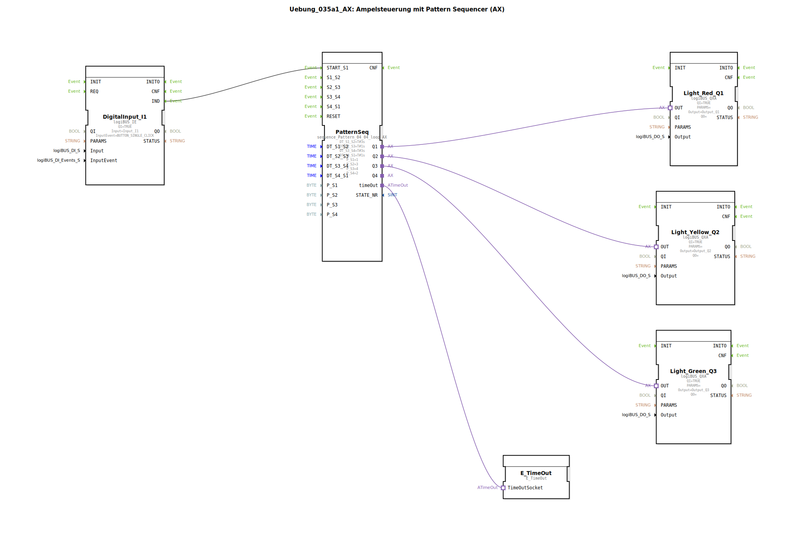

Hier ist die Dokumentation für die Übung `Uebung_035a1_AX` basierend auf den bereitgestellten Daten.

# Uebung_035a1_AX: Ampelsteuerung mit Pattern Sequencer (AX)

* * * * * * * * * *

## Einleitung
Diese Übung implementiert eine **Ampelsteuerung** unter Verwendung eines **Pattern Sequencers** (Muster-Ablaufsteuerung). Das Ziel ist es, eine klassische Verkehrsampel-Sequenz (Rot -> Rot/Gelb -> Grün -> Gelb -> Rot) durch definierte Zeitintervalle und Bitmuster zu steuern. Die Übung nutzt die Adapter-Technologie (AX) für die Anbindung der Ausgänge und des Timings.

## Verwendete Funktionsbausteine (FBs)

In dieser Übung werden verschiedene Bausteine innerhalb des `SubAppNetwork` verschaltet. Nachfolgend sind die wichtigsten Komponenten detailliert beschrieben.

### Sub-Bausteine: PatternSeq
Dieser Baustein ist das Herzstück der Steuerung und regelt den zeitlichen Ablauf sowie die Ausgabemuster der Ampelphasen.

- **Typ**: `logiBUS::utils::sequence::pattern::sequence_Pattern_04_04_loop_AX`
- **Verwendete interne Parameter**:
    - **DT_S1_S2** = `T#3s` (Dauer der Phase 1: Rot)
    - **DT_S2_S3** = `T#1s` (Dauer der Phase 2: Rot-Gelb)
    - **DT_S3_S4** = `T#3s` (Dauer der Phase 3: Grün)
    - **DT_S4_S1** = `T#1s` (Dauer der Phase 4: Gelb)
    - **P_S1** = `1` (Muster Phase 1: 001 -> Q1 aktiv)
    - **P_S2** = `3` (Muster Phase 2: 011 -> Q1 & Q2 aktiv)
    - **P_S3** = `4` (Muster Phase 3: 100 -> Q3 aktiv)
    - **P_S4** = `2` (Muster Phase 4: 010 -> Q2 aktiv)
- **Ereignis-/Adapteranschlüsse**:
    - **START_S1**: Startet die Sequenz bei Schritt 1.
    - **Q1, Q2, Q3**: Adapter-Ausgänge zur Steuerung der Lampen.
    - **timeOut**: Adapter für die Verbindung zum Timer-Service.
- **Funktionsweise**: Der Baustein durchläuft zyklisch 4 Schritte. Für jeden Schritt wird ein Bitmuster (`P_SX`) an den Ausgängen angelegt und für die definierte Zeit (`DT_SX_SY`) gehalten.

### Sub-Bausteine: DigitalInput_I1
Dieser Baustein verarbeitet das Eingangssignal zum Starten der Ampelsequenz.

- **Typ**: `logiBUS::io::DI::logiBUS_IE`
- **Konfiguration**:
    - **Parameter**: `Input` = `Input_I1`
    - **Parameter**: `InputEvent` = `BUTTON_SINGLE_CLICK`
- **Funktionsweise**: Erfasst einen Einzelklick auf dem Eingang I1 und löst ein Event (`IND`) aus.

### Sub-Bausteine: Ausgänge (Light_Red, Light_Yellow, Light_Green)
Diese Bausteine stellen die physischen Ausgänge der Ampel dar.

- **Typ**: `logiBUS::io::DQ::logiBUS_QXA`
- **Instanzen**:
    - **Light_Red_Q1**: Verbunden mit `Output_Q1` (Rot)
    - **Light_Yellow_Q2**: Verbunden mit `Output_Q2` (Gelb)
    - **Light_Green_Q3**: Verbunden mit `Output_Q3` (Grün)
- **Funktionsweise**: Sie empfangen Signale über Adapterverbindungen und schalten die entsprechenden Hardware-Ausgänge.

### Sub-Bausteine: E_TimeOut
Stellt die Timer-Funktionalität für den Sequenzer bereit.

- **Typ**: `iec61499::events::E_TimeOut`
- **Funktionsweise**: Dient als Service-Interface, um die Zeitverzögerungen der Sequenzschritte zu realisieren.

## Programmablauf und Verbindungen

Der Ablauf der Ampelsteuerung gestaltet sich wie folgt:

1.  **Startbedingung**: Das Programm wartet auf ein Signal vom Baustein `DigitalInput_I1`. Wenn der Taster an `Input_I1` einfach geklickt wird (`BUTTON_SINGLE_CLICK`), sendet der Ausgang `IND` ein Event an den Eingang `START_S1` des `PatternSeq`-Bausteins.

2.  **Sequenzablauf (Pattern Sequencer)**:
    Der `PatternSeq` Baustein steuert die Ampelphasen basierend auf den konfigurierten Parametern. Die Ausgänge werden binär kodiert angesteuert (Q3, Q2, Q1):
    *   **Phase 1 (Rot)**: Dauer 3s (`DT_S1_S2`). Parameter `P_S1 = 1` (Binär `001`) aktiviert Adapter-Ausgang `Q1` -> **Rote Lampe**.
    *   **Phase 2 (Rot-Gelb)**: Dauer 1s (`DT_S2_S3`). Parameter `P_S2 = 3` (Binär `011`) aktiviert `Q1` und `Q2` -> **Rote und Gelbe Lampen**.
    *   **Phase 3 (Grün)**: Dauer 3s (`DT_S3_S4`). Parameter `P_S3 = 4` (Binär `100`) aktiviert `Q3` -> **Grüne Lampe**.
    *   **Phase 4 (Gelb)**: Dauer 1s (`DT_S4_S1`). Parameter `P_S4 = 2` (Binär `010`) aktiviert `Q2` -> **Gelbe Lampe**.

3.  **Verbindungen**:
    *   Die Logik verwendet **Adapter-Connections** (erkennbar am `logiBUS_QXA` Typ und den verschachtelten Verbindungen), was die Verdrahtung im Diagramm übersichtlicher macht, da Daten und Events gebündelt übertragen werden.
    *   Der `E_TimeOut` Baustein ist über den Adapter `timeOut` mit dem Sequenzer verbunden, um die Timer-Events (`T#3s`, `T#1s` etc.) intern zu verarbeiten.

## Zusammenfassung
Die Übung `Uebung_035a1_AX` demonstriert effizient, wie komplexe Zustandsautomaten wie eine Ampelsteuerung mit Hilfe eines **Pattern Sequencers** vereinfacht werden können. Anstatt jeden Zustandsübergang einzeln zu programmieren, werden Phasenzeiten und Ausgabemuster parametriert. Die Verwendung von `logiBUS` Adaptern (AX/QXA) zeigt zudem eine moderne Art der Baustein-Kommunikation in 4diac.