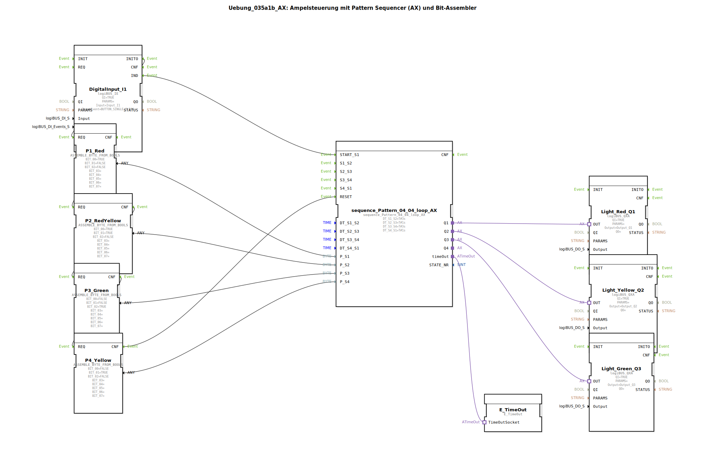

Hier ist die Dokumentation für die Übung basierend auf den bereitgestellten XML-Daten.

# Uebung_035a1b_AX: Ampelsteuerung mit Pattern Sequencer (AX) und Bit-Assembler

* * * * * * * * * *

## Einleitung

Die Übung **Uebung_035a1b_AX** implementiert eine klassische Ampelsteuerung. Hierbei wird ein **Pattern Sequencer** (Muster-Ablaufsteuerung) im "Loop"-Modus (Schleifenbetrieb) verwendet. Die Besonderheit dieser Übung liegt in der Definition der Ampelphasen: Anstatt die Ausgänge direkt im Sequencer hart zu kodieren, werden die Bitmuster für die einzelnen Phasen (Rot, Rot-Gelb, Grün, Gelb) mithilfe von **Bit-Assemblern** (`ASSEMBLE_BYTE_FROM_BOOLS`) dynamisch erzeugt und dem Sequencer als Parameter übergeben.

## Verwendete Funktionsbausteine (FBs)

In dieser SubApplikation werden verschiedene Bausteine verschaltet, um die Steuerungslogik zu realisieren.

### Haupt-Steuerungsbaustein: `sequence_Pattern_04_04_loop_AX`
Dieser Baustein ist der Kern der Steuerung. Er durchläuft 4 Schritte in einer Endlosschleife.
- **Typ**: `logiBUS::utils::sequence::pattern::sequence_Pattern_04_04_loop_AX`
- **Funktion**: Er schaltet die Ausgänge basierend auf Byte-Mustern (`P_S1` bis `P_S4`) und hält jeden Schritt für eine definierte Zeit.
- **Konfiguration**:
    - `DT_S1_S2` = `T#3s` (Dauer Rotphase)
    - `DT_S2_S3` = `T#1s` (Dauer Rot-Gelb-Phase)
    - `DT_S3_S4` = `T#3s` (Dauer Grünphase)
    - `DT_S4_S1` = `T#1s` (Dauer Gelbphase)

### Muster-Erzeugung: `ASSEMBLE_BYTE_FROM_BOOLS`
Es werden vier Instanzen dieses Bausteins verwendet, um die Lichtmuster für die vier Ampelphasen zu definieren. Jeder Baustein wandelt einzelne Boolesche Signale in ein Byte um, das vom Sequencer interpretiert wird.

1.  **Instanz `P1_Red`**:
    - **Zweck**: Definiert die Rot-Phase.
    - **Parameter**: `BIT_00` = `TRUE` (Rot aktiv).
2.  **Instanz `P2_RedYellow`**:
    - **Zweck**: Definiert die Rot-Gelb-Phase.
    - **Parameter**: `BIT_00` = `TRUE` (Rot), `BIT_01` = `TRUE` (Gelb).
3.  **Instanz `P3_Green`**:
    - **Zweck**: Definiert die Grün-Phase.
    - **Parameter**: `BIT_02` = `TRUE` (Grün).
4.  **Instanz `P4_Yellow`**:
    - **Zweck**: Definiert die Gelb-Phase.
    - **Parameter**: `BIT_01` = `TRUE` (Gelb).

### Ein-/Ausgabe-Bausteine
- **`DigitalInput_I1`** (`logiBUS::io::DI::logiBUS_IE`):
    - Repräsentiert den Taster zum Starten der Sequenz.
    - Reagiert auf das Ereignis `BUTTON_SINGLE_CLICK`.
- **`Light_Red_Q1`**, **`Light_Yellow_Q2`**, **`Light_Green_Q3`** (`logiBUS::io::DQ::logiBUS_QXA`):
    - Repräsentieren die physischen Ampelleuchten.
    - Werden über Adapter-Verbindungen (`OUT`) vom Sequencer angesteuert.

## Programmablauf und Verbindungen

Der Ablauf der Steuerung gliedert sich in die Initialisierung der Muster und den eigentlichen Zyklus der Ampel.

### 1. Initialisierung
Damit der Sequencer weiß, welche Lampen in welchem Schritt leuchten sollen, müssen die Bitmuster (`P1` bis `P4`) zunächst berechnet und übergeben werden.
- Das Initialisierungs-Signal (`INITO`) vom Eingangsbaustein `DigitalInput_I1` startet eine Kette.
- Es triggert nacheinander die `REQ`-Eingänge der Assembler-Bausteine: `P1_Red` -> `P2_RedYellow` -> `P3_Green` -> `P4_Yellow`.
- Am Ende dieser Kette wird der `RESET`-Eingang des Sequencers (`sequence_Pattern_04_04_loop_AX`) ausgelöst. Dadurch werden die erzeugten Byte-Muster an die Eingänge `P_S1` bis `P_S4` des Sequencers übernommen.

### 2. Start und Zyklus
- Ein einfacher Klick (`BUTTON_SINGLE_CLICK`) auf den Eingang `DigitalInput_I1` sendet ein Event an `START_S1` des Sequencers.
- Der Sequencer beginnt nun seinen Ablauf:
    1.  **Schritt 1**: Muster von `P1_Red` wird ausgegeben (Lampe Rot an). Wartezeit 3 Sekunden.
    2.  **Schritt 2**: Muster von `P2_RedYellow` wird ausgegeben (Rot und Gelb an). Wartezeit 1 Sekunde.
    3.  **Schritt 3**: Muster von `P3_Green` wird ausgegeben (Grün an). Wartezeit 3 Sekunden.
    4.  **Schritt 4**: Muster von `P4_Yellow` wird ausgegeben (Gelb an). Wartezeit 1 Sekunde.
- Da es sich um einen Loop-Baustein handelt, beginnt der Zyklus nach Schritt 4 wieder automatisch bei Schritt 1.

### 3. Ausgänge
Die Ausgänge des Sequencers (`Q1`, `Q2`, `Q3`) sind als Adapter ausgeführt und direkt mit den Ausgangsbausteinen für die Lampen verbunden. Das Byte-Muster wird intern im Sequencer auf diese Adapter abgebildet (Bit 0 -> Q1, Bit 1 -> Q2, Bit 2 -> Q3).

## Zusammenfassung

Diese Übung demonstriert eine fortgeschrittene Methode der Ablaufsteuerung. Durch die Trennung von **Zeitablauf** (Sequencer) und **Zustandsdefinition** (Bit-Assembler) wird der Code modularer. Änderungen an den Ampelphasen (z.B. welche Lampen leuchten) können einfach in den `ASSEMBLE_BYTE_FROM_BOOLS` Bausteinen vorgenommen werden, ohne die Logik des Sequencers selbst ändern zu müssen. Die Steuerung bildet den typischen deutschen Ampelzyklus ab.