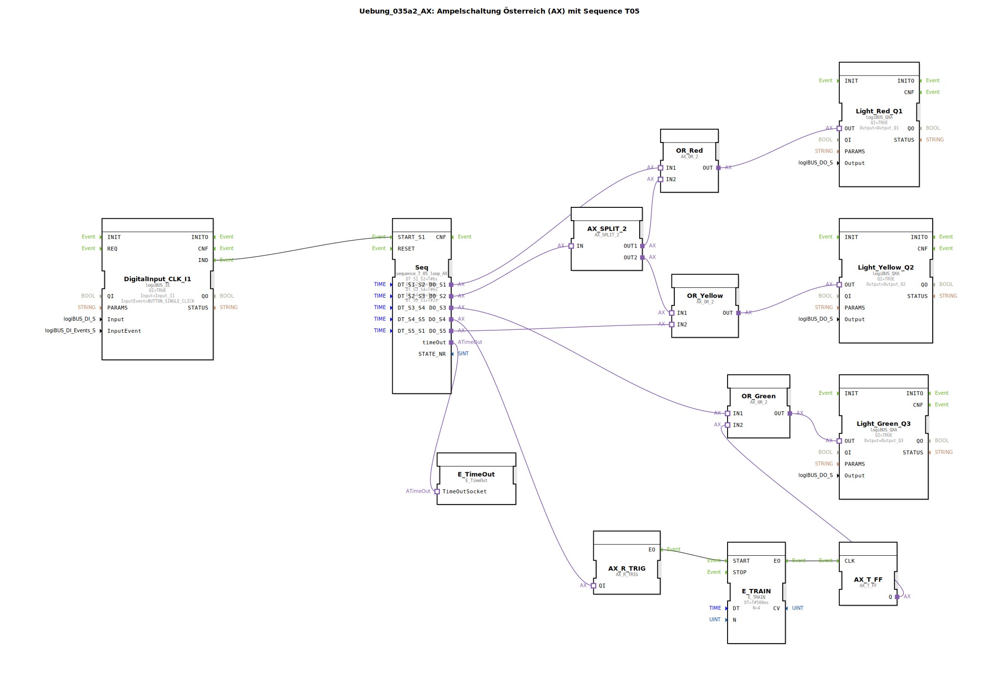

Hier ist die Dokumentation für die Übung `Uebung_035a2_AX` basierend auf den bereitgestellten Daten.

# Uebung_035a2_AX: Ampelschaltung Österreich (AX) mit Sequence T05

* * * * * * * * * *

## Einleitung

Diese Übung implementiert eine **Ampelschaltung nach österreichischem Vorbild (AX)** unter Verwendung des Standards IEC 61499. Im Gegensatz zur deutschen Ampelschaltung (Rot -> Rot/Gelb -> Grün -> Gelb -> Rot) beinhaltet die österreichische Sequenz eine **Grün-Blinken-Phase** vor dem Umschalten auf Gelb.

Die Steuerung erfolgt über eine zeitgesteuerte Sequenz mit 5 Schritten (`sequence_T_05_loop_AX`), wobei die verschiedenen Phasen logisch mit den Ausgängen für Rot, Gelb und Grün verknüpft sind.

## Verwendete Funktionsbausteine (FBs)

### Haupt-Steuerungsbaustein: `Seq`
Dieser Baustein steuert den zeitlichen Ablauf der Ampelphasen.
- **Typ**: `logiBUS::utils::sequence::timed::sequence_T_05_loop_AX`
- **Funktionsweise**: Er schaltet nacheinander durch 5 Zustände (S1 bis S5). Die Dauer der Zustände wird über Parameter definiert.
- **Konfigurierte Parameter**:
    - `DT_S1_S2` = `T#6s` (Dauer Phase 1: Rot)
    - `DT_S2_S3` = `T#2s` (Dauer Phase 2: Rot + Gelb)
    - `DT_S3_S4` = `T#6s` (Dauer Phase 3: Grün)
    - `DT_S4_S5` = `T#4s` (Dauer Phase 4: Grün Blinken)
    - `DT_S5_S1` = `T#2s` (Dauer Phase 5: Gelb)

### Ein- und Ausgabebausteine
- **`DigitalInput_CLK_I1`** (`logiBUS::io::DI::logiBUS_IE`):
    - Dient als Startsignal für die Sequenz.
    - Parameter: Reagiert auf `BUTTON_SINGLE_CLICK` an Eingang `Input_I1`.
- **`Light_Red_Q1`, `Light_Yellow_Q2`, `Light_Green_Q3`** (`logiBUS::io::DQ::logiBUS_QXA`):
    - Repräsentieren die physischen Ampelleuchten (Rot, Gelb, Grün).
    - Verknüpft mit `Output_Q1`, `Output_Q2`, `Output_Q3`.

### Logik- und Hilfsbausteine
- **`OR_Red`, `OR_Yellow`, `OR_Green`** (`adapter::booleanOperators::AX_OR_2`):
    - ODER-Gatter, die Signale aus verschiedenen Sequenzschritten zusammenführen (z.B. leuchtet Gelb allein in Phase 5, aber auch zusammen mit Rot in Phase 2).
- **`AX_SPLIT_2`** (`adapter::events::unidirectional::AX_SPLIT_2`):
    - Teilt ein Signal auf zwei Pfade auf. Wird verwendet, um in Phase 2 gleichzeitig Rot und Gelb anzusteuern.
- **`E_TimeOut`** (`iec61499::events::E_TimeOut`):
    - Behandelt das Timing für die Sequenz.
- **Blink-Logik für Grün**:
    - **`AX_R_TRIG`** (`adapter::events::unidirectional::AX_R_TRIG`): Erkennt die steigende Flanke (Start der Blink-Phase).
    - **`E_TRAIN`** (`iec61499::events::E_TRAIN`): Erzeugt eine Serie von Ereignissen (Impulsen).
        - Parameter `DT` = `T#500ms` (Intervall).
        - Parameter `N` = `4` (Anzahl der Impulse).
    - **`AX_T_FF`** (`adapter::events::unidirectional::AX_T_FF`): Toggle-Flip-Flop, das durch die Impulse von `E_TRAIN` den Ausgang umschaltet (Blinken).

## Programmablauf und Verbindungen

Das Programm wird durch einen Klick auf den Taster (`Input_I1`) gestartet, der das Event `START_S1` im Sequenz-FB `Seq` auslöst. Der Ablauf ist wie folgt:

1.  **Phase 1 (Rot - 6s):**
    - `Seq` aktiviert Ausgang `DO_S1`.
    - Signal geht an `OR_Red` -> `Light_Red_Q1` leuchtet.

2.  **Phase 2 (Rot & Gelb - 2s):**
    - `Seq` aktiviert Ausgang `DO_S2`.
    - Signal geht an `AX_SPLIT_2`.
    - `AX_SPLIT_2` sendet Signal an `OR_Red` (Rot bleibt an) und `OR_Yellow` (Gelb geht an).

3.  **Phase 3 (Grün - 6s):**
    - `Seq` aktiviert Ausgang `DO_S3`.
    - Signal geht an `OR_Green` -> `Light_Green_Q3` leuchtet konstant.

4.  **Phase 4 (Grün Blinken - 4s):**
    - `Seq` aktiviert Ausgang `DO_S4`.
    - Das Signal triggert `AX_R_TRIG`, welcher den `E_TRAIN` Baustein startet.
    - `E_TRAIN` sendet Impulse an das Toggle-Flip-Flop `AX_T_FF`.
    - Der Ausgang `Q` des Flip-Flops wechselt im 500ms Takt seinen Zustand und ist mit `OR_Green` verbunden.
    - Ergebnis: Die grüne Lampe blinkt 4-mal (gesteuert durch Parameter N=4).

5.  **Phase 5 (Gelb - 2s):**
    - `Seq` aktiviert Ausgang `DO_S5`.
    - Signal geht an `OR_Yellow` -> `Light_Yellow_Q2` leuchtet.

Nach Ablauf von Phase 5 ist ein Zyklus beendet. Je nach interner Implementierung des `sequence_T_05_loop_AX` Bausteins startet die Sequenz neu oder wartet auf ein erneutes Eingangssignal.

## Zusammenfassung

Die Übung `Uebung_035a2_AX` demonstriert eine komplexe Ampelsteuerung mit spezifischer Ländervariante (Österreich). Besonderes Augenmerk liegt auf der Verwendung von Adapter-Bausteinen (`AX_SPLIT`, `AX_OR`) zur Signalverteilung sowie der Konstruktion eines Blinkgebers mithilfe von `E_TRAIN` und `AX_T_FF`, um das "Grünblinken" vor der Gelbphase zu realisieren.