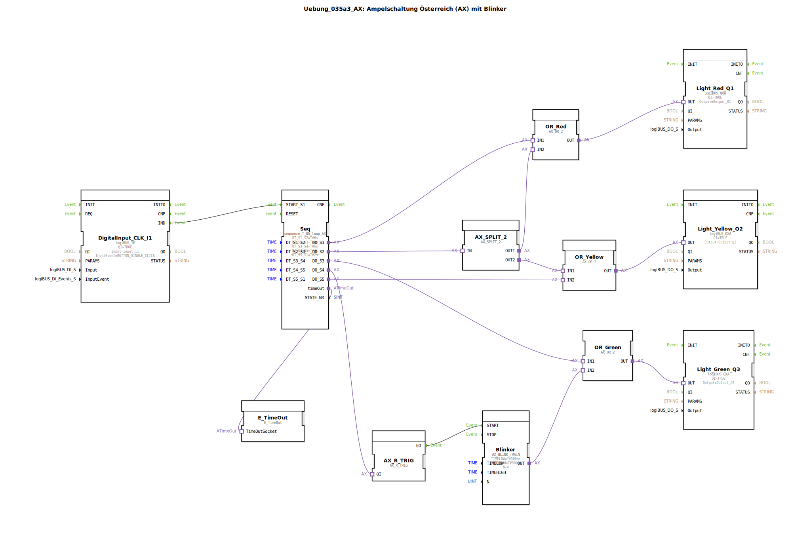

Hier ist die Dokumentation für die Übung `Uebung_035a3_AX` basierend auf den bereitgestellten Daten.

# Uebung_035a3_AX: Ampelschaltung Österreich (AX) mit Blinker

* * * * * * * * * *

## Einleitung

Diese Übung implementiert eine Ampelschaltung nach österreichischem Vorbild („Ampelschaltung Österreich (AX) mit Blinker“). Im Gegensatz zu Standard-Ampelschaltungen beinhaltet diese Sequenz die Phase „Grün-Blinken“ vor dem Wechsel auf Gelb sowie die Phase Rot-Gelb vor dem Wechsel auf Grün. Die Steuerung erfolgt über einen sequenziellen Ablaufbaustein, der durch einen Taster gestartet wird.

## Verwendete Funktionsbausteine (FBs)

In dieser SubApplikation werden verschiedene logische Bausteine, Zeitglieder und I/O-Treiber verwendet, um die Ampelphasen zu steuern.

### Haupt-Steuerbausteine

#### **Seq** (`logiBUS::utils::sequence::timed::sequence_T_05_loop_AX`)
Dieser Baustein ist der Kern der Ablaufsteuerung. Er definiert 5 zeitgesteuerte Zustände (S1 bis S5), die in einer Schleife durchlaufen werden.
- **Typ**: Sequenz-Controller (Timed Loop)
- **Parameter**:
    - `DT_S1_S2` = `T#6s` (Dauer Phase 1: Rot)
    - `DT_S2_S3` = `T#2s` (Dauer Phase 2: Rot-Gelb)
    - `DT_S3_S4` = `T#6s` (Dauer Phase 3: Grün)
    - `DT_S4_S5` = `T#4s` (Dauer Phase 4: Grün-Blinken)
    - `DT_S5_S1` = `T#2s` (Dauer Phase 5: Gelb)
- **Funktionsweise**: Nach Aktivierung durch `START_S1` werden die Ausgänge `DO_S1` bis `DO_S5` nacheinander für die definierte Zeitdauer aktiv geschaltet.

#### **Blinker** (`adapter::events::unidirectional::signals::AX_BLINK_TRAIN`)
Dieser Baustein erzeugt das Blinksignal für die Grün-Phase.
- **Typ**: Signalgenerator / Blinker
- **Parameter**:
    - `TIMELOW` = `T#500ms` (Aus-Zeit)
    - `TIMEHIGH` = `T#500ms` (Ein-Zeit)
    - `N` = `4` (Anzahl der Blinkimpulse)
- **Funktionsweise**: Sobald der Baustein getriggert wird, sendet er 4 Impulse (je 500ms an/aus) an den Ausgang. Dies realisiert das für Österreich typische 4-malige Blinken am Ende der Grünphase.

### Logik- und Hilfsbausteine

*   **OR_Red, OR_Yellow, OR_Green** (`adapter::booleanOperators::AX_OR_2`): ODER-Verknüpfungen, um verschiedene Sequenzschritte auf dieselbe Lampe zu leiten (z.B. Rot leuchtet allein in S1, aber auch zusammen mit Gelb in S2).
*   **AX_SPLIT_2** (`adapter::events::unidirectional::AX_SPLIT_2`): Ein Signalverteiler, der ein Eingangssignal auf zwei Pfade aufteilt.
*   **AX_R_TRIG** (`adapter::events::unidirectional::AX_R_TRIG`): Flankenerkennung (Rising Trigger), um den Blinker präzise zu starten.
*   **E_TimeOut** (`iec61499::events::E_TimeOut`): Behandelt Timeouts der Sequenz.

### Ein-/Ausgabe Bausteine

*   **DigitalInput_CLK_I1** (`logiBUS::io::DI::logiBUS_IE`): Liest den Taster `Input_I1` (Event: `BUTTON_SINGLE_CLICK`).
*   **Light_Red_Q1** (`logiBUS::io::DQ::logiBUS_QXA`): Steuert die rote Lampe (`Output_Q1`).
*   **Light_Yellow_Q2** (`logiBUS::io::DQ::logiBUS_QXA`): Steuert die gelbe Lampe (`Output_Q2`).
*   **Light_Green_Q3** (`logiBUS::io::DQ::logiBUS_QXA`): Steuert die grüne Lampe (`Output_Q3`).

## Programmablauf und Verbindungen

Der Ablauf wird durch einen Einzelklick auf den Taster (`Input_I1`) gestartet, welcher das Event `START_S1` am Sequenzbaustein **Seq** auslöst. Daraufhin läuft folgende Schleife ab:

1.  **Phase Rot (S1 - 6s)**:
    - Ausgang `DO_S1` ist aktiv.
    - Signal geht an `OR_Red` -> `Light_Red_Q1` (Rot an).

2.  **Phase Rot-Gelb (S2 - 2s)**:
    - Ausgang `DO_S2` ist aktiv.
    - Signal geht an `AX_SPLIT_2`.
    - Von dort wird es aufgeteilt auf:
        - `OR_Red` -> `Light_Red_Q1` (Rot bleibt an).
        - `OR_Yellow` -> `Light_Yellow_Q2` (Gelb geht an).

3.  **Phase Grün (S3 - 6s)**:
    - Ausgang `DO_S3` ist aktiv.
    - Signal geht an `OR_Green` -> `Light_Green_Q3` (Grün an).

4.  **Phase Grün-Blinken (S4 - 4s)**:
    - Ausgang `DO_S4` ist aktiv.
    - Signal triggert über `AX_R_TRIG` den Baustein **Blinker**.
    - Der Blinker sendet eine Impulsfolge an `OR_Green`.
    - Ergebnis: Die grüne Lampe (`Light_Green_Q3`) blinkt 4-mal (insgesamt 4 Sekunden).

5.  **Phase Gelb (S5 - 2s)**:
    - Ausgang `DO_S5` ist aktiv.
    - Signal geht an `OR_Yellow` -> `Light_Yellow_Q2` (Gelb an).

Nach Phase 5 beginnt der Zyklus wieder bei Phase 1 (Rot).

## Zusammenfassung

Diese Übung demonstriert die Erstellung einer komplexeren Verkehrsampelsteuerung unter Verwendung von logiBUS-Adaptern. Besonderes Augenmerk liegt auf der korrekten Abbildung der österreichischen Signalfolge (inklusive Grün-Blinken und Rot-Gelb-Phase). Lernziele sind der Umgang mit zeitgesteuerten Sequenzbausteinen (`sequence_T_05_loop_AX`), die Verwendung von Signal-Splittern und logischen ODER-Verknüpfungen zur Ansteuerung von Ausgängen aus mehreren Zuständen heraus sowie die Integration eines Blink-Generators.