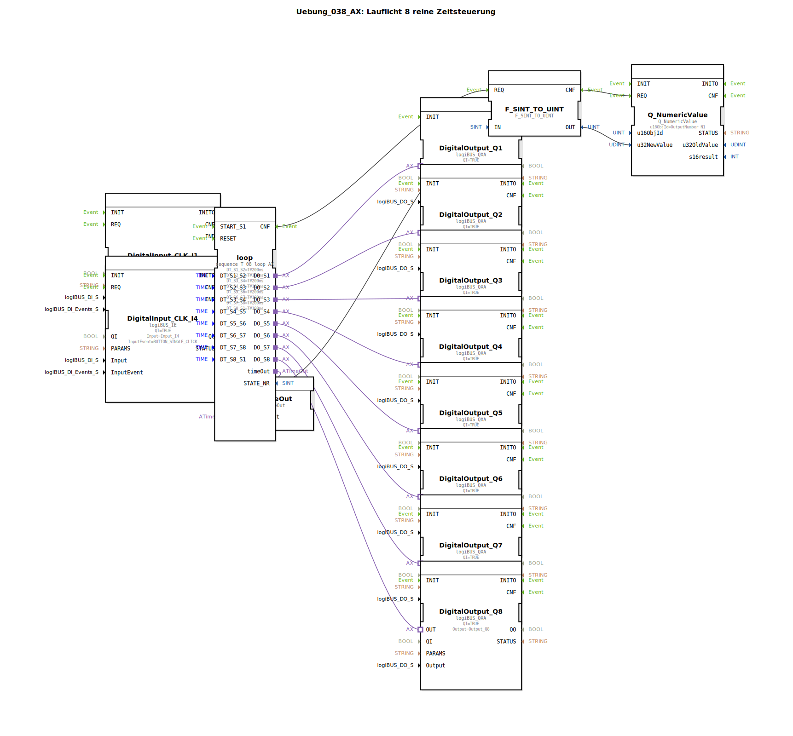

# Uebung_038_AX: Lauflicht 8 reine Zeitsteuerung

Dieser Artikel beschreibt die logiBUS®-Übung `Uebung_038_AX`. Wir bauen eine klassische Schrittkette (Sequencer).

----

## Ziel der Übung

Realisierung einer automatischen Abfolge von 8 Schritten.

-----

## Beschreibung und Komponenten

[cite_start]Die Subapplikation `Uebung_038_AX.SUB` verwendet einen Sequenzer-Baustein, um 8 Ausgänge nacheinander zu schalten[cite: 1].

### Funktionsbausteine (FBs)

  * **`sequence_T_08_loop_AX`**: Ein komplexer Baustein, der 8 Zustände (`S1` bis `S8`) verwaltet. Der Übergang zwischen den Zuständen erfolgt zeitgesteuert.
  * **Parameter `DT_S1_S2` etc.**: Definieren die Verweildauer in jedem Schritt (z.B. 200ms oder 100ms).
  * **`Q_NumericValue`**: Zeigt die aktuelle Schrittnummer auf dem ISOBUS-Terminal an.
  * **`E_TimeOut`**: Überwacht die Sequenz (Watchdog).

-----

## Funktionsweise

1.  Start durch Taster `I1` -> Sequenz springt zu `S1`.
2.  Ausgang `DO_S1` wird aktiv -> `Q1` leuchtet.
3.  Nach `T#200ms` wechselt die Sequenz automatisch zu `S2`.
4.  `DO_S1` geht aus, `DO_S2` geht an -> `Q2` leuchtet.
5.  ... das geht so weiter bis `S8`.
6.  Nach `S8` springt sie wieder zu `S1` (Loop).
7.  Reset durch Taster `I4` -> Alles aus.

-----

## Anwendungsbeispiel

**Werbe-Beleuchtung** oder **Prozess-Steuerung**: Zuerst Wasser einlassen, dann heizen, dann waschen, dann abpumpen.