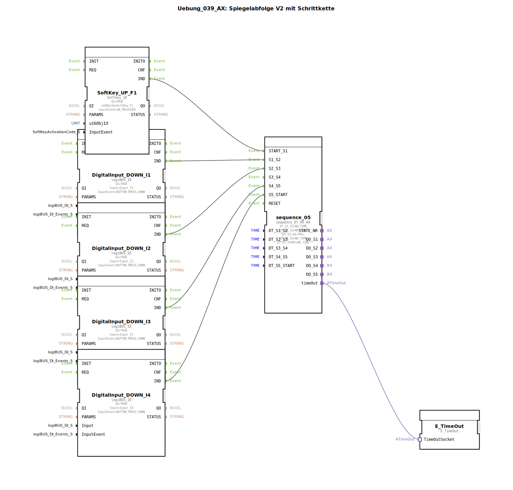

# Uebung_039_AX: Spiegelabfolge V2 mit Schrittkette

Dieser Artikel beschreibt die logiBUS®-Übung `Uebung_039_AX`. Diese Übung ist speziell auf die Ansteuerung von hydraulischen oder pneumatischen Wegeventilen zugeschnitten und nutzt durchgängig die AX-Adaptertechnologie.

----

## Ziel der Übung

Realisierung einer komplexen Spiegelabfolge. Im Gegensatz zu einfachen Zylindern müssen bei Wegeventilen oft Zustände gehalten werden (Mittelstellung gesperrt), was eine präzise zeitliche und ereignisbasierte Steuerung der Spulen erfordert.

-----

## Beschreibung und Komponenten

Die Subapplikation `Uebung_039_AX.SUB` nutzt einen AX-optimierten 5-Schritt-Sequenzer (`sequence_ET_05_AX`).
Die Ansteuerung der Hardware erfolgt über typisierte AX-Sub-Applikationen (`Uebung_039_sub_Outputs_AX`), die den jeweiligen Ventilzustand auch visuell auf dem ISOBUS-Terminal durch Farbumschlag der zugehörigen Softkeys rückmelden.

-----

## Funktionsweise

Die Kette wird manuell durch physische Taster (`I1` bis `I4`) gesteuert, wobei ein zentraler Zeitschritt (5s bei `DT_S3_S4`) eine automatische Sicherheits- oder Wartephase einfügt. Dies zeigt die Kombination aus freier Bedienbarkeit und erzwungenen Prozesszeiten.

Der Einsatz von **AX-Adaptern** zwischen dem Sequenzer und den Ausgangs-Sub-Apps vereinfacht die Verdrahtung erheblich, da Status-Events und Schaltzustände in einer einzigen Verbindung übertragen werden.

## 🛠️ Zugehörige Übungen

* [Uebung_039_sub_Outputs_AX](Uebung_039_sub_Outputs_AX.md)
* [Uebung_039_sub_NumbAnzeig_AX](Uebung_039_sub_NumbAnzeig_AX.md)
