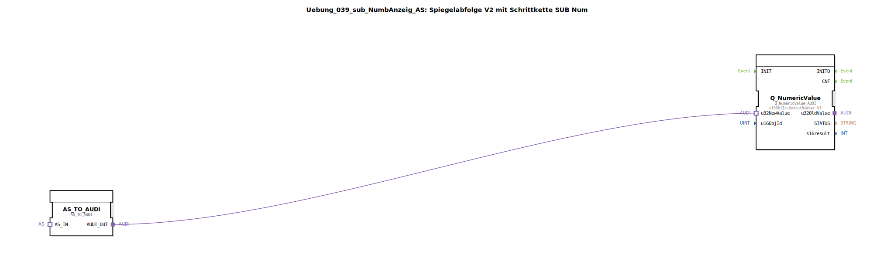

# Uebung_039_sub_NumbAnzeig_AS: Spiegelabfolge V2 mit Schrittkette SUB Num

* * * * * * * * * *

## Einleitung

Diese Übung stellt eine SubApplikation (SubApp) für die 4diac-IDE dar, die einen über einen Adapter (AS-Schnittstelle) ankommenden Datenwert auf einem ISOBUS-kompatiblen Terminal als numerischen Wert anzeigt. Die SubApp ist als „Spiegelabfolge V2 mit Schrittkette SUB Num“ bezeichnet und dient zur einfachen Darstellung eines Zahlenwerts in einem landwirtschaftlichen Steuerungssystem.

Die SubApp empfängt eine Adapterverbindung vom Typ `STATE_NR` (unidirektional) und wandelt diese in eine für die Anzeige geeignete ISOBUS-Nachricht um. Der darzustellende Wert wird über einen Standardobjektbezeichner (`OutputNumber_N1`) referenziert.

## Verwendete Funktionsbausteine (FBs)

Innerhalb der SubApp sind zwei Funktionsbausteine enthalten, die die Signalverarbeitung und Terminalkommunikation übernehmen.

### FB: `Q_NumericValue`
- **Typ**: `isobus::UT::Q::Q_NumericValue_AUDI`
- **Parameter**:
  - `u16ObjId` = `OutputNumber_N1` (vordefinierter Objektbezeichner aus dem `UT::DefaultPool`)
- **Funktion**: Stellt einen numerischen Wert auf einem ISOBUS-Terminal dar. Der Eingang `u32NewValue` erwartet den aktuellen Zahlenwert als 32-Bit Unsigned Integer. Die Darstellung erfolgt unter der durch `u16ObjId` spezifizierten Objekt-ID.

### FB: `AS_TO_AUDI`
- **Typ**: `adapter::conversion::unidirectional::AS_TO_AUDI`
- **Parameter**: keine
- **Funktion**: Konvertiert die Daten und das Ereignis eines unidirektionalen AS-Adapters in ein für AUDI-kompatible FBs (wie `Q_NumericValue_AUDI`) nutzbares Format. Der Ausgang `AUDI_OUT` liefert das konvertierte Signal zur weiteren Verarbeitung.

## Programmablauf und Verbindungen

Die SubApp verfügt über einen Adapter-Socket `STATE_NR` vom Typ `unidirectional::AS`. Dieser Socket wird mit einem übergeordneten Steuerungsnetzwerk verbunden, das die aktuellen Zustandsinformationen (z. B. einen Zahlenwert aus einer Schrittkette) bereitstellt.

1. Der über `STATE_NR` eingehende AS-Adaptersignal wird an den FB `AS_TO_AUDI` weitergeleitet.  
2. `AS_TO_AUDI` konvertiert die Daten (z. B. einen Zahlenwert) in eine AUDI-konforme Repräsentation und gibt diese über den Ausgang `AUDI_OUT` aus.  
3. Der Ausgang `AUDI_OUT` wird mit dem Eingang `u32NewValue` des FBs `Q_NumericValue` verbunden.  
4. `Q_NumericValue` aktualisiert daraufhin die Anzeige auf dem ISOBUS-Terminal unter der vordefinierten Objekt-ID `OutputNumber_N1`.

Die gesamte Verarbeitung erfolgt ereignisgesteuert: Sobald sich der AS-Adatper-Eingang ändert, wird der Wert konvertiert und die Terminalanzeige aktualisiert.

## Zusammenfassung

Die SubApp `Uebung_039_sub_NumbAnzeig_AS` realisiert eine standardisierte Schnittstelle zur Anzeige eines numerischen Werts auf einem ISOBUS-Terminal. Durch die Verwendung der Adapterkonvertierung `AS_TO_AUDI` und des Anzeigebausteins `Q_NumericValue_AUDI` kann sie in übergeordnete Steuerungen eingebunden werden, die einen AS-Schnittstellenstandard nutzen.

**Lernziele dieser Übung:**
- Verständnis der Adapter-Konvertierung zwischen AS und AUDI.
- Einbindung von vordefinierten ISOBUS-Objekten (`OutputNumber_N1`) in eigene SubApplikationen.
- Aufbau einer einfachen Signalverarbeitungskette zur Terminalanzeige.

**Benötigte Vorkenntnisse:**
- Grundlagen der 4diac-IDE und der IEC 61499-Modellierung.
- Basiswissen zu ISOBUS und dessen Objektpool-Konzept.

Die Übung kann direkt in der 4diac-IDE geladen und mit einem entsprechenden übergeordneten Netzwerk (z. B. einer Schrittkette) getestet werden.