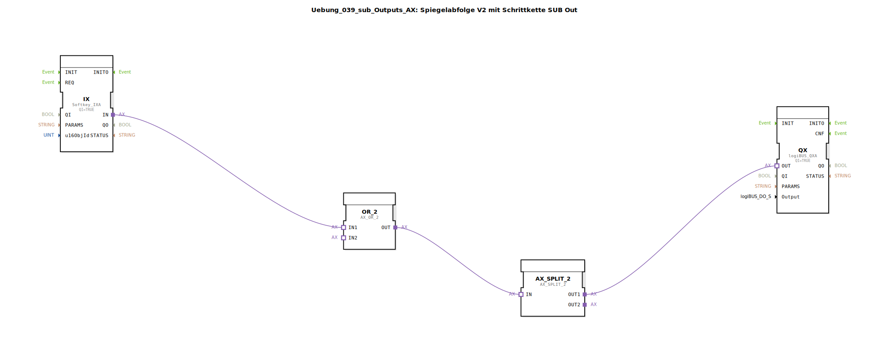

# Uebung_039_sub_Outputs_AX: Spiegelabfolge V2 mit Schrittkette SUB Out

* * * * * * * * * *

## Einleitung

Diese Dokumentation beschreibt die Sub-Applikation `Uebung_039_sub_Outputs_AX`. Dieser Baustein ist Teil einer komplexeren Steuerung (vermutlich "Spiegelabfolge V2 mit Schrittkette") und dient als Schnittstelle zwischen der Steuerungslogik, der Hardware und der Benutzeroberfläche (ISOBUS VT). 

Der Hauptzweck dieses Moduls ist die Ansteuerung eines digitalen Ausgangs, wobei zwei Quellen das Signal aktivieren können: ein automatisches Signal aus dem Programm (via AX-Adapter) oder eine manuelle Betätigung über einen Softkey auf dem Terminal. Zusätzlich wird der Status visuell zurückgemeldet.

## Verwendete Funktionsbausteine (FBs)

In dieser Sub-Applikation werden verschiedene Funktionsbausteine verschaltet, um die Eingabe-, Logik- und Ausgabefunktionen zu realisieren.

### Sub-Bausteine: Uebung_039_sub_Outputs_AX

Dieser Baustein kapselt die Logik für einen einzelnen Aktor/Ausgang unter Verwendung der AX-Adaptertechnologie.

- **Typ**: SubAppType
- **Verwendete interne FBs**:

    - **QX**: `logiBUS::io::DQ::logiBUS_QXA`
        - **Beschreibung**: Treiberbaustein für einen physikalischen digitalen Ausgang am logiBUS.
        - **Parameter**: `QI` = `TRUE` (Baustein ist aktiviert).
        - **Dateneingang**: 
            - `Output`: Verbunden mit dem externen Eingang `Output` (definiert die Hardware-Adresse).
        - **Adapteranschluss**:
            - `OUT`: Erhält das Schaltsignal (Event + Daten) vom `AX_OR`-Baustein.

    - **IX**: `isobus::UT::io::Softkey::Softkey_IX`
        - **Beschreibung**: Eingangsbaustein zum Lesen eines Softkeys (Taste) auf einem ISOBUS-Terminal.
        - **Parameter**: `QI` = `TRUE`.
        - **Dateneingang**: `u16ObjId` (Objekt-ID des Softkeys).
        - **Adapteranschluss**:
            - `IN`: Aktueller Status der Taste als AX-Adapter.

    - **AX_OR**: `adapter::logic::unidirectional::AX_OR_2`
        - **Beschreibung**: Logisches ODER-Gatter für AX-Adapter.
        - **Adapteranschlüsse**: 
            - `IN1`: Verbunden mit `IX.IN` (Softkey-Status).
            - `IN2`: Verbunden mit dem externen Adapter-Eingang `OUT` (Steuersignal).
        - **Funktionsweise**: Der Ausgang wird aktiv, wenn entweder der Softkey gedrückt wird ODER das externe Steuersignal anliegt.

    - **GreenWhiteBackground**: `MyLib::sys::GreenWhiteBackground_AX`
        - **Beschreibung**: Eine weitere Sub-Applikation zur Visualisierung, die den Hintergrund des Softkeys steuert.
        - **Parameter**:
            - `u16ObjId`: Die ID des zu färbenden Objekts.
        - **Adapteranschluss**:
            - `DI1`: Verbunden mit dem Ergebnis der ODER-Logik (`AX_OR.OUT`).

- **Funktionsweise**:
    Der Baustein nutzt konsequent **AX-Adapter**, um Ereignis- und Datenfluss zu bündeln. Er prüft, ob eine Anforderung vorliegt, den Ausgang zu setzen (manuell via Softkey `IX` oder automatisch via Adapter `OUT`). Das Ergebnis der ODER-Verknüpfung steuert den Hardware-Ausgang `QXA` und aktualisiert gleichzeitig die Visualisierung `GreenWhiteBackground_AX`.

## Programmablauf und Verbindungen

Der Fluss innerhalb der Sub-Applikation ist durch die AX-Adapterverbindungen stark vereinfacht:

1.  **Initialisierung**:
    *   Die Objekt-ID für den Softkey (`u16ObjId`) und die Hardware-Adresse (`Output`) werden an die entsprechenden Bausteine durchgereicht.

2.  **Logische Verknüpfung (AX_OR)**:
    *   Der Baustein `AX_OR` bündelt die Logik:
        *   `IN1`: Status des Softkeys.
        *   `IN2`: Externer Adapter-Eingang `OUT` (z.B. von einer Schrittkette).
    *   Ein `REQ`-Ereignis von außen kann zusätzlich die Logik triggern.

3.  **Ausgabe und Feedback**:
    *   Der Ausgang des `AX_OR` ist direkt mit dem Hardware-Ausgang `QX` verbunden.
    *   Parallel dazu steuert er den Hintergrund des Softkeys über `GreenWhiteBackground`.

## Zusammenfassung

`Uebung_039_sub_Outputs_AX` ist die AX-optimierte Version der Ausgangsansteuerung. Durch den Einsatz von Adaptern wird die interne Komplexität reduziert und die Wiederverwendbarkeit in Systemen erhöht, die durchgängig auf AX-Adapter setzen.

## 🛠️ Zugehörige Übungen

* [Uebung_039_AX](Uebung_039_AX.md)
