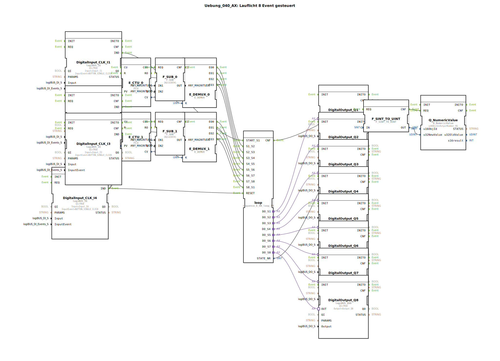

# Uebung_040_AX: Lauflicht 8 Event gesteuert

Dieser Artikel beschreibt die logiBUS®-Übung `Uebung_040_AX`. Im Gegensatz zu Übung 038 schaltet diese Schrittkette nicht automatisch weiter, sondern wartet auf Ereignisse.

----

## Ziel der Übung

Manuelles Weiterschalten einer Schrittkette.

-----

## Beschreibung und Komponenten

[cite_start]Die Subapplikation `Uebung_040_AX.SUB` nutzt `sequence_E_08_loop_AX`. Hier sind die Eingänge für die Transitionen (`S1_S2`, `S2_S3`, ...) als Event-Inputs herausgeführt[cite: 1].

### Logik zum Weiterschalten

Um nicht 8 Taster zu benötigen, wurde eine Logik mit Zählern (`E_CTU`) und Demultiplexern (`E_DEMUX`) gebaut:

*   **Taster `I2`**: Steuert die Schritte 1-4. Jeder Klick erhöht den Zähler `E_CTU_0`. Der Demultiplexer leitet das Event dann an den korrekten Transitions-Eingang (`S1_S2`, `S2_S3`...).
*   **Taster `I3`**: Steuert analog die Schritte 5-8.

-----

## Funktionsweise

1.  Start mit `I1` -> Schritt 1 aktiv.
2.  Druck auf `I2` -> Zählerstand 1 -> Demux Ausgang 0 -> Event an `S1_S2` -> Wechsel zu Schritt 2.
3.  Druck auf `I2` -> Zählerstand 2 -> Demux Ausgang 1 -> Event an `S2_S3` -> Wechsel zu Schritt 3.
4.  ...

Dies simuliert eine Maschine, bei der der Bediener jeden Schritt manuell freigeben muss ("Schrittbetrieb").

-----

## Anwendungsbeispiel

**Inbetriebnahme oder Wartung**: Der Techniker schaltet die Maschine Schritt für Schritt weiter, um zu prüfen, ob jeder Teilprozess korrekt funktioniert, bevor er auf Automatik umschaltet.