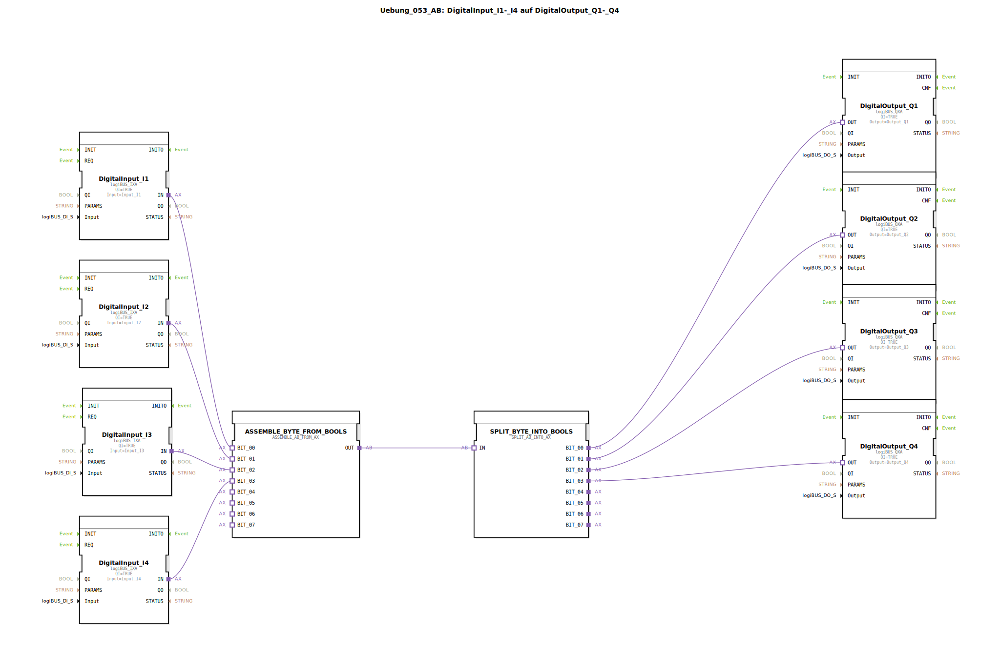

# Uebung_053_AB: DigitalInput_I1-_I4 auf DigitalOutput_Q1-_Q4

* * * * * * * * * *

## Einleitung

Diese Übung zeigt, wie vier digitale Eingänge (I1 bis I4) über einen Adapter zu einem Byte zusammengefasst und anschließend wieder auf vier digitale Ausgänge (Q1 bis Q4) aufgeteilt werden. Es wird demonstriert, wie mit Hilfe der Bausteine `ASSEMBLE_AB_FROM_AX` und `SPLIT_AB_INTO_AX` parallele Binärsignale in einen Datenbus umgewandelt und zurückgewonnen werden können.

## Verwendete Funktionsbausteine (FBs)

- **DigitalInput_I1 .. DigitalInput_I4** (Typ `logiBUS::io::DI::logiBUS_IXA`)  
  Lesen der physikalischen Eingänge **Input_I1** bis **Input_I4**. Jeder dieser Bausteine ist mit `QI=TRUE` aktiviert.

- **DigitalOutput_Q1 .. DigitalOutput_Q4** (Typ `logiBUS::io::DQ::logiBUS_QXA`)  
  Schreiben der physikalischen Ausgänge **Output_Q1** bis **Output_Q4**. Auch hier ist `QI=TRUE` gesetzt.

- **ASSEMBLE_BYTE_FROM_BOOLS** (Typ `adapter::assembling::ASSEMBLE_AB_FROM_AX`)  
  Setzt aus den vier booleschen Werten an den Adapter-Sockets `BIT_00` bis `BIT_03` ein Byte zusammen und gibt es am Socket `OUT` aus.

  - **Parameter**: Keine  
  - **Eingänge (Adapter)**: `BIT_00`, `BIT_01`, `BIT_02`, `BIT_03` (je ein Boolean)  
  - **Ausgang (Adapter)**: `OUT` (Byte)

- **SPLIT_BYTE_INTO_BOOLS** (Typ `adapter::splitting::SPLIT_AB_INTO_AX`)  
  Nimmt ein Byte am Adapter-Socket `IN` entgegen und trennt die Bits einzeln an den Sockets `BIT_00` bis `BIT_03` wieder auf.

  - **Parameter**: Keine  
  - **Eingang (Adapter)**: `IN` (Byte)  
  - **Ausgänge (Adapter)**: `BIT_00`, `BIT_01`, `BIT_02`, `BIT_03` (je ein Boolean)

### Sub-Bausteine: (keine)

Die Übung verwendet ausschließlich die oben genannten Standard-FBs. Es sind keine weiteren Sub-Applikationen eingebettet.

## Programmablauf und Verbindungen

1. Die **digitalen Eingänge** I1 bis I4 werden über die Bausteine `DigitalInput_I1` bis `DigitalInput_I4` eingelesen. Ihre Ausgänge (`IN`) liefern die booleschen Zustände der angeschlossenen Sensoren.

2. Diese vier Bool-Werte werden über Adapter-Verbindungen zu den Sockets `BIT_00` bis `BIT_03` des Bausteins **`ASSEMBLE_BYTE_FROM_BOOLS`** geleitet.  
   - `DigitalInput_I1.IN` → `ASSEMBLE_BYTE_FROM_BOOLS.BIT_00`  
   - `DigitalInput_I2.IN` → `ASSEMBLE_BYTE_FROM_BOOLS.BIT_01`  
   - `DigitalInput_I3.IN` → `ASSEMBLE_BYTE_FROM_BOOLS.BIT_02`  
   - `DigitalInput_I4.IN` → `ASSEMBLE_BYTE_FROM_BOOLS.BIT_03`

3. Der **Assemble-Baustein** packt die vier Bits in ein Byte (niederwertigstes Bit = BIT_00) und gibt dieses Byte an seinem Ausgang `OUT` aus.

4. Dieser Ausgang ist direkt mit dem Eingang `IN` des Bausteins **`SPLIT_BYTE_INTO_BOOLS`** verbunden.  
   - `ASSEMBLE_BYTE_FROM_BOOLS.OUT` → `SPLIT_BYTE_INTO_BOOLS.IN`

5. Der **Split-Baustein** zerlegt das Byte wieder in vier einzelne boolesche Werte an seinen Ausgangs-Sockets `BIT_00` bis `BIT_03`.

6. Diese Werte werden schließlich auf die **digitalen Ausgänge** Q1 bis Q4 geschaltet:  
   - `SPLIT_BYTE_INTO_BOOLS.BIT_00` → `DigitalOutput_Q1.OUT`  
   - `SPLIT_BYTE_INTO_BOOLS.BIT_01` → `DigitalOutput_Q2.OUT`  
   - `SPLIT_BYTE_INTO_BOOLS.BIT_02` → `DigitalOutput_Q3.OUT`  
   - `SPLIT_BYTE_INTO_BOOLS.BIT_03` → `DigitalOutput_Q4.OUT`

Damit werden die Zustände der Eingänge direkt auf die gleichnamigen Ausgänge übertragen. Die Verwendung der Adapter dient dem Verständnis von Byte-Zusammenführung und -Aufteilung in der 4diac-IDE.

## Zusammenfassung

In dieser Übung wird der Datenfluss von vier digitalen Eingängen zu vier digitalen Ausgängen über eine Byte-Adapternetzwerk realisiert. Es werden die Bausteine `ASSEMBLE_AB_FROM_AX` und `SPLIT_AB_INTO_AX` verwendet, um mehrere Bool-Signale zu einem Byte zusammenzufassen und wieder aufzutrennen. Die Übung vermittelt grundlegende Kenntnisse im Umgang mit Adapter-Bausteinen und Datenbus-Strukturen in der IEC 61499-Programmierung.