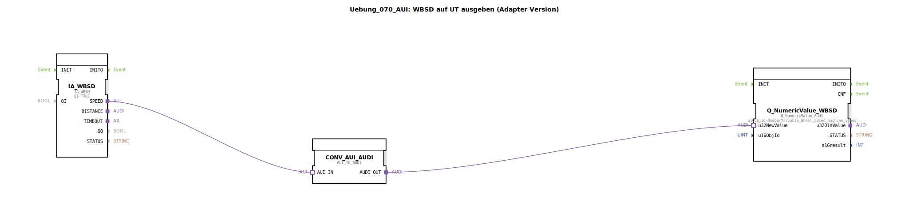

# Uebung_070_AUI: WBSD auf UT ausgeben (Adapter Version)

* * * * * * * * * *
## Einleitung

Diese Übung demonstriert die Ausgabe der radbasierten Maschinengeschwindigkeit (Wheel‑Based Machine Speed – WBSD) auf einem Universal Terminal (UT) unter Verwendung von Adaptern. Im Gegensatz zur Basisübung (Uebung_070) kommt hier eine Adapter‑basierte Verbindung zwischen dem Sensor‑Interface und dem Ausgabebaustein zum Einsatz. Die Kommunikation erfolgt über das proprietäre AUI‑Protokoll, welches für die Anbindung an den UT‑Baustein in ein AUDI‑Protokoll konvertiert werden muss.

## Verwendete Funktionsbausteine (FBs)

Die Übung besteht aus drei vordefinierten Funktionsbausteinen, die im SubApp‑Netzwerk miteinander verbunden sind:

- **IA_WBSD** – Eingangsadapter für die radbasierte Maschinengeschwindigkeit  
- **Q_NumericValue_WBSD** – Ausgabebaustein zur Darstellung des numerischen Werts auf dem UT  
- **CONV_AUI_AUDI** – Adapter‑Konvertierer von AUI nach AUDI

### IA_WBSD
- **Typ**: `isobus::tecu::IA_WBSD`  
- **Parameter**:  
  - `QI` = `TRUE` (Baustein ist aktiv)  
- **Funktionsweise**:  
  Der Baustein stellt die aktuellen Geschwindigkeitsdaten (wheel‑based machine speed) über einen **Adapter‑Ausgang** (`SPEED`) zur Verfügung. Er dient als Schnittstelle zur Fahrzeug‑Sensorik.

### Q_NumericValue_WBSD
- **Typ**: `isobus::UT::Q::Q_NumericValue_AUDI`  
- **Parameter**:  
  - `u16ObjId` = `NumberVariable_Wheel_based_machine_speed` (Verweis auf die Objekt‑ID des numerischen Variablen‑Eintrags im UT)  
- **Funktionsweise**:  
  Über diesen Baustein wird ein numerischer Wert an das Universal Terminal gesendet. Die Objekt‑ID legt fest, welche Variable (hier die Radgeschwindigkeit) auf dem UT visualisiert wird.

### CONV_AUI_AUDI
- **Typ**: `adapter::conversion::unidirectional::AUI_TO_AUDI`  
- **Parameter**: keine  
- **Funktionsweise**:  
  Dieser Baustein konvertiert die AUI‑Adapter‑Schnittstelle (`AUI_IN`) in eine AUDI‑Adapter‑Schnittstelle (`AUDI_OUT`). Er ermöglicht so die Kommunikation zwischen dem IA_WBSD (AUI‑basiert) und dem Q_NumericValue_WBSD (AUDI‑basiert).

## Programmablauf und Verbindungen

Der Datenfluss in der Übung ist wie folgt:

1. Der Baustein **IA_WBSD** erfasst die radbasierte Maschinengeschwindigkeit und stellt sie über den Adapter‑Ausgang `SPEED` bereit.
2. Die Verbindung `IA_WBSD.SPEED → CONV_AUI_AUDI.AUI_IN` überträgt das AUI‑Signal an den Konvertierungsbaustein.
3. **CONV_AUI_AUDI** wandelt das AUI‑Protokoll in das AUDI‑Protokoll um und gibt das Ergebnis am Ausgang `AUDI_OUT` aus.
4. Die Verbindung `CONV_AUI_AUDI.AUDI_OUT → Q_NumericValue_WBSD.u32NewValue` liefert den konvertierten Datenwert an den Ausgabebaustein.
5. **Q_NumericValue_WBSD** sendet den Wert unter der zugewiesenen Objekt‑ID (`NumberVariable_Wheel_based_machine_speed`) an das UT, wo die Geschwindigkeit angezeigt wird.

Die gesamte Kommunikation erfolgt rein über Adapterverbindungen – es werden weder Ereignis‑ noch Datenleitungen im herkömmlichen Sinne verwendet.

## Zusammenfassung

Die Übung **Uebung_070_AUI** vermittelt folgende Lerninhalte:

- Nutzung von **Adapter‑Verbindungen** in IEC 61499‑Anwendungen
- **Protokollkonvertierung** zwischen AUI und AUDI mittels spezialisierter Konvertierungsbausteine
- **Ausgabe numerischer Variablen** auf einem Universal Terminal über vordefinierte Objekt‑IDs
- Verständnis des **Datenflusses** zwischen Sensor‑Interface (IA) und UT‑Ausgabe (Q)

Der Schwierigkeitsgrad ist als **fortgeschritten** einzustufen, da grundlegende Kenntnisse über Adapter‑Schnittstellen und das UT‑System vorausgesetzt werden. Die Übung kann direkt in der 4diac‑IDE geladen und simuliert werden.