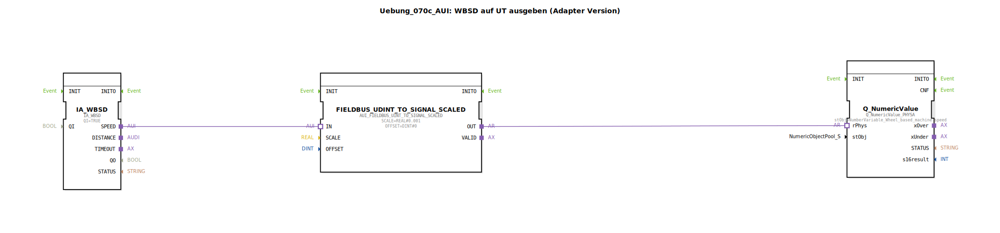

# Uebung_070c_AUI: WBSD auf UT ausgeben (Adapter Version)

*Kein Bild vorhanden.*

* * * * * * * * * *
## Einleitung

Diese Übung zeigt, wie eine radbasierte Maschinengeschwindigkeit (WBSD – Wheel Based Speed) über den ISOBUS erfasst und auf ein UT (Universal Terminal) ausgegeben wird. Die Implementierung erfolgt als Subapplikation (SubApp) und nutzt Adapterverbindungen zur Kommunikation zwischen den Funktionsbausteinen. Ziel ist es, den Eingangswert mittels eines Adapters zu skalieren und als numerischen Wert auf das UT zu bringen.

## Verwendete Funktionsbausteine (FBs)

Die SubApp enthält drei Funktionsbausteine, die über Adapter verbunden sind. Es gibt keine weiteren Sub-Bausteine (SubApp-Typ ist selbst bereits die oberste Ebene).

### IA_WBSD

- **Typ**: `isobus::tecu::IA_WBSD`
- **Beschreibung**: Dieser Funktionsbaustein stellt den Adapter für die radbasierte Geschwindigkeit (WBSD) bereit. Er liefert einen Geschwindigkeitswert über den Ausgangsadapter `SPEED`.
- **Parameter**:
  - `QI` = `TRUE` (Qualifier für die Aktivierung)

### FIELDBUS_UDINT_TO_SIGNAL_SCALED

- **Typ**: `logiBUS::signalprocessing::fieldbus::AUI_FIELDBUS_UINT_TO_SIGNAL_SCALED`
- **Beschreibung**: Dieser Baustein skaliert den eingehenden Ganzzahlwert (UDINT) in einen physikalischen Signalwert. Er wird verwendet, um den von `IA_WBSD` gelieferten Geschwindigkeitswert in eine für das UT verständliche Einheit umzurechnen.
- **Parameter**:
  - `SCALE` = `REAL#0.001` (Skalierungsfaktor)
  - `OFFSET` = `DINT#0` (Offset)

### Q_NumericValue

- **Typ**: `isobus::UT::Q::Q_NumericValue_PHYSA`
- **Beschreibung**: Dieser Funktionsbaustein stellt einen numerischen Wert (z. B. die Geschwindigkeit) auf dem Universal Terminal dar. Er referenziert eine UT-Variable aus dem ISOBUS-Pool.
- **Parameter**:
  - `stObj` = `NumberVariable_Wheel_based_machine_speed` (Referenz auf die entsprechende Variable im UT‑Pool; importiert aus `Uebungen::const::UT::TECU::DefaultPool_TECU_Numeric`)

## Programmablauf und Verbindungen

Die SubApp besitzt keine eigenen Ein-/Ausgangsschnittstellen (SubAppInterfaceList ist leer). Die gesamte Datenverarbeitung erfolgt intern über Adapterverbindungen:

1. Der Block `IA_WBSD` empfängt die radbasierte Geschwindigkeit (vermutlich vom ISOBUS‑Netzwerk) und gibt sie über seinen Adapterausgang `SPEED` aus.
2. Über eine Adapterverbindung wird `SPEED` an den Eingang `IN` des Skalierungsbausteins `FIELDBUS_UDINT_TO_SIGNAL_SCALED` weitergeleitet.
3. Der Skalierungsbaustein multipliziert den Wert mit `0.001` und addiert kein Offset (0). Das Ergebnis steht am Ausgang `OUT` bereit.
4. Über eine weitere Adapterverbindung gelangt das skalierte Signal an den `rPhys`-Eingang des Bausteins `Q_NumericValue`.
5. Der Baustein `Q_NumericValue` setzt den empfangenen physikalischen Wert auf die UT-Variable `NumberVariable_Wheel_based_machine_speed`, sodass die Geschwindigkeit am Terminal angezeigt wird.

**Besonderheiten**:
- Die Übung arbeitet **ohne externe Events** – die Blöcke sind rein datengetrieben (keine sichtbaren Ereignisverbindungen).
- Die verwendeten Adapter erlauben eine flexible Kopplung der Funktionen, ohne dass alle Bausteine im selben Netzwerk liegen müssen.
- Die UT‑Variable muss im Zielsystem als `NumberVariable_Wheel_based_machine_speed` vorhanden sein (Import aus dem Pool `DefaultPool_TECU_Numeric`).

## Zusammenfassung

Die Übung `Uebung_070c_AUI` demonstriert die skalierte Ausgabe einer radbasierten Maschinengeschwindigkeit auf ein Universal Terminal mittels Adaptertechnik. Der Wert wird zunächst über den ISOBUS‑Adapter erfasst, mit einem Faktor von 0.001 skaliert und anschließend als numerische Variable auf dem UT dargestellt. Dieses Vorgehen ist typisch für die Anbindung von Sensordaten an eine Bedienoberfläche in landwirtschaftlichen Maschinen nach ISOBUS‑Standard.