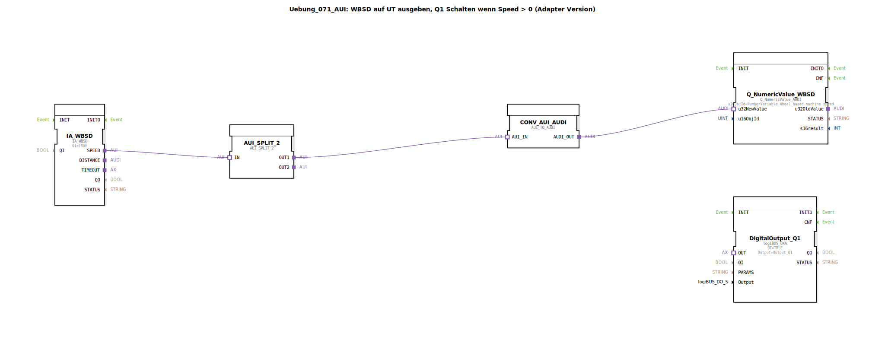

# Uebung_071_AUI: WBSD auf UT ausgeben, Q1 Schalten wenn Speed &gt; 0 (Adapter Version)

* * * * * * * * * *
## Einleitung
Diese Übung demonstriert die Verwendung von Adaptern und einer benutzerdefinierten SubApp, um die **Wheel Based Machine Speed (WBSD)** von einem ISOBUS-IA-WBSD-Baustein über den **Universal Task (UT)** auszugeben und gleichzeitig einen digitalen Ausgang Q1 zu schalten, sobald die Geschwindigkeit größer als 0 ist. Die gesamte Kommunikation erfolgt über Adapter-Schnittstellen, was eine modulare und typsichere Verbindung der Funktionsbausteine ermöglicht.

## Verwendete Funktionsbausteine (FBs)

### Haupt-FBs (auf oberster Ebene)
- **IA_WBSD**: `isobus::tecu::IA_WBSD`  
  ISOBUS-Adapter-Baustein für die Wheel Based Machine Speed. Parameter: `QI` = TRUE (aktiviert).
- **Q_NumericValue_WBSD**: `isobus::UT::Q::Q_NumericValue_AUDI`  
  Baustein zum Senden eines numerischen Werts (Speed) an den UT. Parameter: `u16ObjId` = `NumberVariable_Wheel_based_machine_speed` (Objektreferenz aus konstantem Pool).
- **DigitalOutput_Q1**: `logiBUS::io::DQ::logiBUS_QXA`  
  Digitalausgangsbaustein für den logiBUS. Parameter: `QI` = TRUE, `Output` = `Output_Q1` (definierte Konstante für den Ausgang).
- **CONV_AUI_AUDI**: `adapter::conversion::unidirectional::AUI_TO_AUDI`  
  Konvertiert einen AUI-Adapter (unidirektional) in einen AUDI-Adapter (unidirektional) – vermutlich zur Anpassung der Schnittstelle.
- **AUI_SPLIT_2**: `adapter::events::unidirectional::AUI_SPLIT_2`  
  Verteilt ein eingehendes AUI-Ereignis auf zwei Ausgänge (OUT1, OUT2) – hier für parallele Weiterleitung der Geschwindigkeitsdaten.

### Sub-Bausteine: `AX_GT_0_UINT`
- **Typ**: `MyLib::sys::AX_GT_0_UINT` (benutzerdefinierte SubApp)
- **Verwendete interne FBs**: (Details liegen nicht vor, da die SubApp extern definiert ist. Sie enthält vermutlich einen Vergleichsbaustein für unsigned integer.)
- **Funktionsweise**:  
  Diese SubApp prüft, ob der eingehende Wert (vom Typ UINT) größer als 0 ist. Trifft dies zu, wird der Ausgangsadapter `AX_OUT` aktiviert. Dieser Ausgang steuert anschließend den digitalen Ausgang Q1 (über den Adapterverbund mit `DigitalOutput_Q1.OUT`).

## Programmablauf und Verbindungen
1. Der Adapter `IA_WBSD` liefert kontinuierlich die aktuelle Radgeschwindigkeit über den Adapterausgang `SPEED` (AUI-Format).
2. Der Split-Baustein `AUI_SPLIT_2` empfängt die Geschwindigkeit und leitet sie an zwei Pfade weiter:
   - **OUT1** → `CONV_AUI_AUDI` → `Q_NumericValue_WBSD`: Die Geschwindigkeit wird über den UT als numerischer Wert ausgegeben (Objektreferenz `NumberVariable_Wheel_based_machine_speed`).
   - **OUT2** → `AX_GT_0_UINT`: Die Geschwindigkeit wird auf > 0 geprüft.
3. Der SubApp `AX_GT_0_UINT` aktiviert bei positiver Prüfung den Ausgangsadapter `AX_OUT`.
4. Der Adapterausgang `AX_OUT` speist den Eingang `OUT` des Digitalausgangsbausteins `DigitalOutput_Q1`, sodass Q1 (z. B. ein Relais oder eine Lampe) eingeschaltet wird, solange die Geschwindigkeit größer als 0 ist.

**Lernziele**:  
- Verwendung von ISOBUS- und logiBUS-Bausteinen in 4diac.  
- Arbeiten mit Adaptern (AUI/AUDI) und Adapter-Splittern.  
- Einbindung einer selbst erstellten SubApp (AX_GT_0_UINT) in ein größeres Netzwerk.  
- Praxisnahe Automatisierungsaufgabe: Geschwindigkeitsausgabe und Schwellwertüberwachung.

**Schwierigkeitsgrad**: Fortgeschritten (Grundkenntnisse in IEC 61499 und Adapterkonzepten erforderlich).

**Hinweis**: Die Übung liegt als **Adapter-Version** der Grundübung `Uebung_071` vor. Voraussetzung ist ein funktionierender ISOBUS-UT-sowie logiBUS-Ausgang in der Zielumgebung.

## Zusammenfassung
Die Übung `Uebung_071_AUI` zeigt eine typische landwirtschaftliche Automatisierungsaufgabe: die Ausgabe einer Maschinengeschwindigkeit auf einem Universal Terminal und die gleichzeitige Aktivierung eines digitalen Ausgangs bei Bewegung. Alle Kommunikationsverbindungen wurden durch Adaptertypen realisiert, was die Wiederverwendbarkeit und Austauschbarkeit der Bausteine erhöht. Der Einsatz der SubApp `AX_GT_0_UINT` verdeutlicht, wie eigene kleine Logikbausteine dezentral in das Gesamtsystem integriert werden.