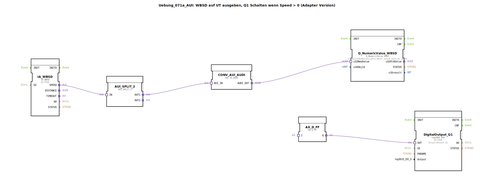

# Uebung_071a_AUI: WBSD auf UT ausgeben, Q1 Schalten wenn Speed &gt; 0 (Adapter Version)

(WBSD auf UT ausgeben, Q1 Schalten wenn Speed > 0 – Adapter Version)

* * * * * * * * * *

## Einleitung

Diese Übung demonstriert die Verwendung von Adapter-Interfaces (AUI/AUDI) in 4diac, um eine radbasierte Maschinengeschwindigkeit (WBSD) auszulesen, auf einem Universal Terminal (UT) darzustellen und einen digitalen Ausgang (Q1) zu schalten, sobald die Geschwindigkeit größer als Null ist. Die gesamte Logik ist als SubApp mit Adapterverbindungen realisiert.

## Verwendete Funktionsbausteine (FBs)

### Sub-Baustein: `AX_GT_0`
- **Typ**: `MyLib::sys::AX_GT_0_UINT` (SubApp)
- **Verwendete interne FBs**: Nicht näher spezifiziert (gehört zur Bibliothek `MyLib::sys`)
- **Funktionsweise**: Dieser Baustein nimmt über einen Adapter-Eingang (AUI) einen ganzzahligen Wert entgegen und prüft, ob dieser größer als Null ist. Am Ausgang `AX_OUT` wird ein boolesches Signal (TRUE/FALSE) bereitgestellt, das das Ergebnis des Vergleichs darstellt.

### Weitere verwendete Funktionsbausteine

| Bausteinname | Typ | Parameter | Kurzbeschreibung |
|--------------|-----|-----------|------------------|
| `IA_WBSD` | `isobus::tecu::IA_WBSD` | `QI` = TRUE | Liefert die radbasierte Maschinengeschwindigkeit über ein AUI-Interface. |
| `AUI_SPLIT_2` | `adapter::events::unidirectional::AUI_SPLIT_2` | – | Verteilt ein eingehendes AUI-Signal auf zwei identische Ausgänge. |
| `CONV_AUI_AUDI` | `adapter::conversion::unidirectional::AUI_TO_AUDI` | – | Konvertiert ein AUI-Signal in das AUDI-Format, das von UT-Anzeigebausteinen erwartet wird. |
| `Q_NumericValue_WBSD` | `isobus::UT::Q::Q_NumericValue_AUDI` | `u16ObjId` = `NumberVariable_Wheel_based_machine_speed` | Zeigt den numerischen Wert der Geschwindigkeit auf dem UT an (Object-ID aus der Pool-Konfiguration). |
| `AX_GT_0` | `MyLib::sys::AX_GT_0_UINT` | – (SubApp) | Prüft, ob der eingehende Wert > 0 ist (siehe oben). |
| `AX_D_FF` | `adapter::events::unidirectional::AX_D_FF` | – | Setzt ein Flip-Flop, das den booleschen Zustand hält und an den Ausgang weitergibt. |
| `DigitalOutput_Q1` | `logiBUS::io::DQ::logiBUS_QXA` | `QI` = TRUE, `Output` = `Output_Q1` | Schaltet den digitalen Ausgang Q1 des logiBUS-Moduls entsprechend des anliegenden Signals. |

## Programmablauf und Verbindungen

1. Der Baustein `IA_WBSD` liefert die aktuelle Maschinengeschwindigkeit als AUI-Datensignal.
2. Dieses Signal wird über eine Adapterverbindung an `AUI_SPLIT_2` weitergeleitet, das es auf zwei parallele Pfade aufteilt:
   - **Pfad 1 (Anzeige)**: Über `CONV_AUI_AUDI` wird das AUI-Signal in ein AUDI-Signal umgewandelt. Dieses wird an `Q_NumericValue_WBSD` übergeben, das den Zahlenwert auf dem Universal Terminal (UT) anzeigt. Die Object-ID `NumberVariable_Wheel_based_machine_speed` legt fest, welcher Parameter der Pool-Konfiguration dargestellt wird.
   - **Pfad 2 (Schwellwertprüfung)**: Das AUI-Signal wird direkt an den Sub-Baustein `AX_GT_0` angeschlossen. Dieser prüft, ob der Wert größer als Null ist.
3. Das Ergebnis der Prüfung (`AX_OUT`) wird an den Flip-Flop-Baustein `AX_D_FF` übergeben. Dieser stabilisiert das Signal und verhindert kurzzeitiges Flattern.
4. Der Ausgang von `AX_D_FF` wird über eine Adapterverbindung an `DigitalOutput_Q1` geführt. Wenn die Geschwindigkeit > 0 ist, schaltet `DigitalOutput_Q1` den logiBUS-Ausgang Q1 ein; andernfalls bleibt Q1 aus.

**Abhängigkeiten**:  
- Die Konstanten `NumberVariable_Wheel_based_machine_speed` und `Output_Q1` müssen im Projekt als `Uebungen::const::UT::TECU::DefaultPool_TECU` bzw. `logiBUS::io::DQ::logiBUS_DO` definiert sein.  
- Der Baustein `logiBUS_QXA` benötigt eine gültige logiBUS-Hardwarekonfiguration.

## Zusammenfassung

Die Übung **Uebung_071a_AUI** zeigt eine typische Anwendung von Adapter-Interfaces in der Automatisierungstechnik mit 4diac. Der Lernende wird mit folgenden Konzepten vertraut gemacht:
- **Adapter-Split, Konvertierung und Weiterleitung** (AUI, AUDI)
- **Auslesen eines ISOBUS-Sensors** (WBSD) und Darstellung auf einem UT
- **Schwellwertvergleich** und **Flip-Flop-Logik** für eine zuverlässige Ausgangsschaltung
- **Integration von logiBUS-Ausgängen** in ein Steuerungsprogramm

Nach erfolgreicher Bearbeitung versteht der Teilnehmer die Datenflussstruktur mit Adaptern und kann ähnliche Aufgaben selbstständig umsetzen.