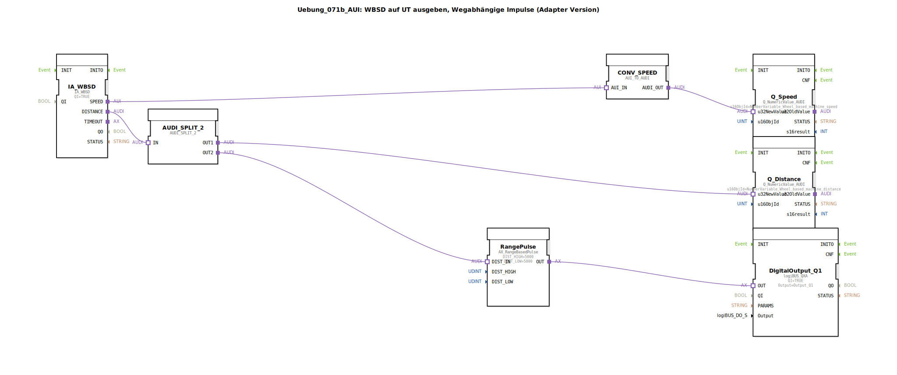

# Uebung_071b_AUI: WBSD auf UT ausgeben, Wegabhängige Impulse (Adapter Version)

* * * * * * * * * *
## Einleitung

Diese Übung demonstriert die Ausgabe von Wheel‑Based Speed (WBSD) und Wheel‑Based Distance (WBD) auf einem Universal Terminal (UT). Zusätzlich wird ein wegabhängiger Impuls erzeugt: Alle 10 Meter (5 Meter HIGH, 5 Meter LOW) schaltet ein digitaler Ausgang um. Die Realisierung erfolgt über Adapter‑Schnittstellen und zeigt die typische Datenverarbeitungskette von der ISOBUS‑Sensorerfassung bis zur UT‑Anzeige und logiBUS‑Ausgabe.

## Verwendete Funktionsbausteine (FBs)

- **IA_WBSD** (`isobus::tecu::IA_WBSD`)  
  - Parameter: `QI` = `TRUE`  
  - Liest die fahrzeugseitige radbasierte Geschwindigkeit und Distanz (ISOBUS‑TECU‑Schnittstelle).

- **AUDI_SPLIT_2** (`adapter::events::unidirectional::AUDI_SPLIT_2`)  
  - Verteilt ein eingehendes AUDI‑Signal auf zwei identische Ausgänge (OUT1, OUT2).

- **CONV_SPEED** (`adapter::conversion::unidirectional::AUI_TO_AUDI`)  
  - Wandelt das AUI‑Signal von der WBSD‑Schnittstelle in ein AUDI‑Signal um, das von den UT‑ und logiBUS‑Bausteinen verarbeitet werden kann.

- **Q_Speed** (`isobus::UT::Q::Q_NumericValue_AUDI`)  
  - Parameter: `u16ObjId` = `NumberVariable_Wheel_based_machine_speed`  
  - Zeigt die aktuelle Geschwindigkeit auf dem Universal Terminal an.

- **Q_Distance** (`isobus::UT::Q::Q_NumericValue_AUDI`)  
  - Parameter: `u16ObjId` = `NumberVariable_Wheel_based_machine_distance`  
  - Zeigt die aktuelle Distanz auf dem Universal Terminal an.

- **RangePulse** (`logiBUS::signalprocessing::distance::AX_RangeBasedPulse`)  
  - Parameter: `DIST_HIGH` = `5000`, `DIST_LOW` = `5000`  
  - Erzeugt ein pulsierendes Signal (HIGH/LOW) bei jeder Distanzänderung von insgesamt 10 Meter (5 Meter HIGH, 5 Meter LOW).

- **DigitalOutput_Q1** (`logiBUS::io::DQ::logiBUS_QXA`)  
  - Parameter: `QI` = `TRUE`, `Output` = `Output_Q1`  
  - Schaltet den logiBUS‑Digitalausgang Q1 entsprechend dem empfangenen Signal.

## Programmablauf und Verbindungen

1. **Geschwindigkeit**  
   `IA_WBSD.SPEED` → `CONV_SPEED.AUI_IN` → `CONV_SPEED.AUDI_OUT` → `Q_Speed.u32NewValue`  
   Die radbasierte Geschwindigkeit wird über einen Adapter‑Konverter in ein AUDI‑Signal umgewandelt und direkt auf dem UT (Numerische Anzeige) dargestellt.

2. **Distanz**  
   `IA_WBSD.DISTANCE` → `AUDI_SPLIT_2.IN`  
   Die Distanzinformation wird in zwei parallele Pfade aufgeteilt:
   - **Pfad 1 (UT‑Anzeige)**: `AUDI_SPLIT_2.OUT1` → `Q_Distance.u32NewValue`  
     Die Distanz wird ebenfalls auf dem UT angezeigt.
   - **Pfad 2 (Impulserzeugung)**: `AUDI_SPLIT_2.OUT2` → `RangePulse.DIST_IN` → `RangePulse.OUT` → `DigitalOutput_Q1.OUT`  
     Der `RangePulse`‑Baustein überwacht die Distanzänderung und erzeugt bei Erreichen von 5 m HIGH‑ und 5 m LOW‑Schwellen einen Impuls. Dieser wird an den digitalen Ausgang Q1 weitergegeben, sodass Q1 periodisch mit 10 m‑Zyklus schaltet.

**Lernziele**  
- Adapter‑basierte Signalverarbeitung zwischen ISOBUS, UT und logiBUS verstehen.  
- Aufteilung eines Datensignals auf zwei getrennte Verarbeitungspfade anwenden.  
- Wegabhängige Impulse mittels eines Distanz‑Pulsgebers realisieren.  

**Schwierigkeitsgrad**: Mittel  
**Voraussetzungen**: Grundkenntnisse in 4diac‑IDE, ISOBUS‑ und logiBUS‑Funktionsbausteinen.  
**Start**: Das SubApp‑Template kann direkt in ein 4diac‑Projekt importiert und mit einer gültigen Hardware‑Konfiguration (z. B. TECU‑Steuergerät) ausgeführt werden.

## Zusammenfassung

Die Übung zeigt eine vollständige Kette von der ISOBUS‑Sensordatenaufnahme über Adapter‑Konvertierung und Signalaufteilung bis hin zur UT‑Anzeige und einer wegabhängigen digitalen Ausgabe. Die radbasierte Distanz wird genutzt, um alle 10 Meter einen Impuls auf einem logiBUS‑Ausgang zu erzeugen. Damit wird die typische Anwendung „WBSD auf UT ausgeben mit Wegimpulsen“ in einer adapter‑basierten Variante umgesetzt.