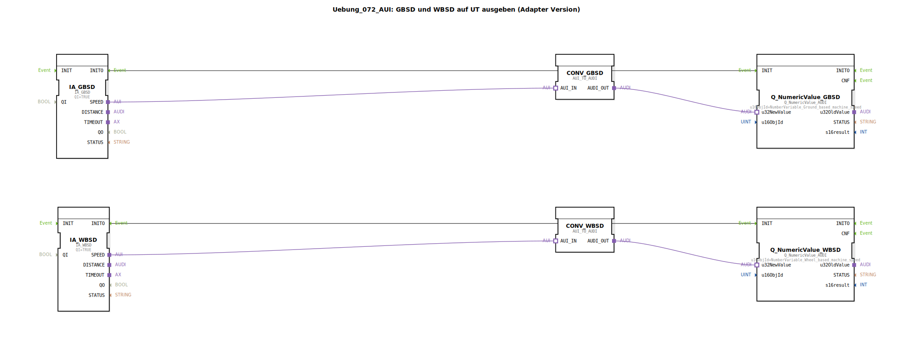

# Uebung_072_AUI: GBSD und WBSD auf UT ausgeben (Adapter Version)

* * * * * * * * * *

## Einleitung

Diese Übung zeigt, wie die fahrzeugbasierte Geschwindigkeit (Ground‑Based Machine Speed – GBSD) und die radbasierte Geschwindigkeit (Wheel‑Based Machine Speed – WBSD) eines ISOBUS‑TECU (Tractor Electronic Control Unit) über einen Interface‑Adapter (AUI) ausgelesen und auf einem Universal Terminal (UT) dargestellt werden.  
Die von den Adaptern bereitgestellten Geschwindigkeitsdaten werden zunächst mit einem unidirektionalen Konverter in ein numerisches AUDI‑Interface umgewandelt und anschließend über entsprechende UT‑Anzeigebausteine ausgegeben. Die dabei verwendeten Objekt‑IDs stammen aus einem vordefinierten Konstantenpool.

## Verwendete Funktionsbausteine (FBs)

### Sub‑Bausteine: `IA_GBSD`

- **Typ**: `isobus::tecu::IA_GBSD`  
- **Parameter**:  
  - `QI` = `TRUE`  
- **Ereignisausgang**: `INITO`  
- **Adapterausgang**: `SPEED` (AUI‑Interface)  
- **Funktionsweise**:  
  Dieser Baustein liest die aktuelle fahrzeugbasierte Geschwindigkeit (GBSD) von der TECU aus und stellt sie über den Adapterausgang `SPEED` als AUI‑Objekt bereit. Der Parameter `QI` muss auf `TRUE` gesetzt sein, um die Datenabfrage zu aktivieren.

### Sub‑Bausteine: `IA_WBSD`

- **Typ**: `isobus::tecu::IA_WBSD`  
- **Parameter**:  
  - `QI` = `TRUE`  
- **Ereignisausgang**: `INITO`  
- **Adapterausgang**: `SPEED` (AUI‑Interface)  
- **Funktionsweise**:  
  Analog zu `IA_GBSD` stellt dieser Baustein die radbasierte Geschwindigkeit (WBSD) der TECU über den Adapterausgang `SPEED` als AUI‑Objekt bereit.

### Sub‑Bausteine: `CONV_GBSD`

- **Typ**: `adapter::conversion::unidirectional::AUI_TO_AUDI`  
- **Adaptereingang**: `AUI_IN`  
- **Adapterausgang**: `AUDI_OUT`  
- **Funktionsweise**:  
  Der Konverter wandelt das eingehende AUI‑Interface (z. B. ein Geschwindigkeitswert) in ein numerisches AUDI‑Interface um. Dieses AUDI‑Signal wird von den UT‑Anzeigebausteinen als 32‑Bit‑Wert erwartet.

### Sub‑Bausteine: `CONV_WBSD`

- **Typ**: `adapter::conversion::unidirectional::AUI_TO_AUDI`  
- **Adaptereingang**: `AUI_IN`  
- **Adapterausgang**: `AUDI_OUT`  
- **Funktionsweise**:  
  Identisch zu `CONV_GBSD`. Wandelt das AUI‑Signal der radbasierten Geschwindigkeit in ein AUDI‑Signal.

### Sub‑Bausteine: `Q_NumericValue_GBSD`

- **Typ**: `isobus::UT::Q::Q_NumericValue_AUDI`  
- **Parameter**:  
  - `u16ObjId` = `Uebungen::const::UT::TECU::DefaultPool_TECU::NumberVariable_Ground_based_machine_speed`  
- **Ereigniseingang**: `INIT`  
- **Dateneingang**: `u32NewValue` (AUDI‑Interface)  
- **Funktionsweise**:  
  Dieser Baustein zeigt einen numerischen Wert auf dem Universal Terminal an. Die Variable, die den Wert darstellt, wird durch die übergebene Objekt‑ID (`u16ObjId`) bestimmt. Nach einem INIT‑Ereignis wird der am Dateneingang anliegende Wert auf dem UT aktualisiert.

### Sub‑Bausteine: `Q_NumericValue_WBSD`

- **Typ**: `isobus::UT::Q::Q_NumericValue_AUDI`  
- **Parameter**:  
  - `u16ObjId` = `Uebungen::const::UT::TECU::DefaultPool_TECU::NumberVariable_Wheel_based_machine_speed`  
- **Ereigniseingang**: `INIT`  
- **Dateneingang**: `u32NewValue` (AUDI‑Interface)  
- **Funktionsweise**:  
  Gleiche Funktionalität wie `Q_NumericValue_GBSD`, jedoch für die radbasierte Geschwindigkeit.

## Programmablauf und Verbindungen

1. **Initialisierung**:  
   Beide Interface‑Adapter (`IA_GBSD` und `IA_WBSD`) werden mit `QI = TRUE` parametriert. Nach Systemstart generieren sie am Ausgang `INITO` ein Ereignis.

2. **Ereignisverkettung**:  
   Das Ereignis `INITO` von `IA_GBSD` wird direkt mit dem Eingang `INIT` von `Q_NumericValue_GBSD` verbunden.  
   Entsprechend wird `INITO` von `IA_WBSD` mit `INIT` von `Q_NumericValue_WBSD` verbunden. Dadurch werden die UT‑Anzeigebausteine nach dem Auslesen der Daten initialisiert.

3. **Datenfluss (Adapter‑Verbindungen)**:  
   - Der Adapterausgang `SPEED` von `IA_GBSD` (AUI‑Interface) wird mit dem Adaptereingang `AUI_IN` des Konverters `CONV_GBSD` verbunden.  
   - Der Konverter `CONV_GBSD` wandelt das AUI‑Interface in ein AUDI‑Interface und gibt es an seinem Adapterausgang `AUDI_OUT` aus.  
   - Dieser Ausgang wird mit dem Dateneingang `u32NewValue` von `Q_NumericValue_GBSD` verbunden.  
   - Gleiches gilt für die radbasierte Geschwindigkeit (`IA_WBSD` → `CONV_WBSD` → `Q_NumericValue_WBSD`).

4. **Ergebnis**:  
   Auf dem UT erscheinen zwei numerische Werte: die fahrzeugbasierte Geschwindigkeit (GBSD) und die radbasierte Geschwindigkeit (WBSD). Die Werte werden über die konfigurierten Objekt‑IDs im Variablenpool des TECU bereitgestellt.

**Lernziele**:
- Verständnis des AUI‑ und AUDI‑Interfacekonzepts in ISOBUS‑Applikationen.
- Einsatz von unidirektionalen Adaptern zur Interface‑Konvertierung.
- Verbindung von TECU‑Ausgängen mit UT‑Anzeigebausteinen.

## Zusammenfassung

Die Übung demonstriert die vollständige Signalkette vom Auslesen zweier Geschwindigkeitsgrößen aus einem ISOBUS‑TECU über eine adapterbasierte Konvertierung bis hin zur Anzeige auf einem Universal Terminal. Durch die klare Trennung von Adapter‑ und Daten‑Interfaces wird die Wiederverwendbarkeit der Funktionsbausteine unterstützt und eine flexible Anbindung an unterschiedliche UT‑Konfigurationen ermöglicht.