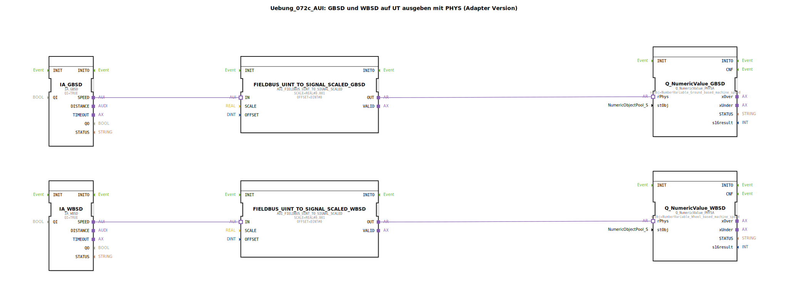

# Uebung_072c_AUI: GBSD und WBSD auf UT ausgeben mit PHYS (Adapter Version)

* * * * * * * * * *

## Einleitung

In dieser Übung wird das Verhalten der Funktionsbausteine `IA_GBSD` (Ground Based Machine Speed) und `IA_WBSD` (Wheel Based Machine Speed) auf einem ISOBUS Universal Terminal (UT) ausgegeben. Die von den jeweiligen ISOBUS-Applizierungen gelieferten digitalen Geschwindigkeitswerte (UINT) werden mittels eines Skalierungsfunktionsbausteins in physikalische Werte umgerechnet und anschließend über einen UT‑Adapter (`Q_NumericValue_PHYSA`) auf dem Terminal dargestellt. Die Skalierung erfolgt mit einer Nachkommastellengenauigkeit von 0.001 (z. B. Umrechnung von mm/s in m/s).

## Verwendete Funktionsbausteine (FBs)

- **IA_GBSD** (Typ: `isobus::tecu::IA_GBSD`)  
  - Parameter: `QI` = TRUE  
  - Liefert über den Adapterausgang `SPEED` einen UINT‑Wert für die geschwindigkeitsbasierte Maschinengeschwindigkeit.  

- **IA_WBSD** (Typ: `isobus::tecu::IA_WBSD`)  
  - Parameter: `QI` = TRUE  
  - Liefert über den Adapterausgang `SPEED` einen UINT‑Wert für die radbasierte Maschinengeschwindigkeit.  

- **FIELDBUS_UINT_TO_SIGNAL_SCALED_GBSD** (Typ: `logiBUS::signalprocessing::fieldbus::AUI_FIELDBUS_UINT_TO_SIGNAL_SCALED`)  
  - Parameter:  
    - `SCALE` = REAL#0.001  
    - `OFFSET` = DINT#0  
  - Skaliert den eingehenden UINT‑Wert (IN) mit Faktor 0.001 und gibt das Ergebnis als REAL‑Signal (OUT) weiter.  

- **FIELDBUS_UINT_TO_SIGNAL_SCALED_WBSD** (Typ: `logiBUS::signalprocessing::fieldbus::AUI_FIELDBUS_UINT_TO_SIGNAL_SCALED`)  
  - Parameter:  
    - `SCALE` = REAL#0.001  
    - `OFFSET` = DINT#0  
  - Gleiche Funktionalität wie der Baustein für GBSD.  

- **Q_NumericValue_GBSD** (Typ: `isobus::UT::Q::Q_NumericValue_PHYSA`)  
  - Parameter: `stObj` = `NumberVariable_Ground_based_machine_speed` (importiert aus `Uebungen::const::UT::TECU::DefaultPool_TECU_Numeric`)  
  - Stellt den physikalischen Wert (rPhys) auf dem UT dar.  

- **Q_NumericValue_WBSD** (Typ: `isobus::UT::Q::Q_NumericValue_PHYSA`)  
  - Parameter: `stObj` = `NumberVariable_Wheel_based_machine_speed` (importiert aus dem gleichen Pool)  
  - Gleiche Funktionalität wie der Baustein für GBSD.  

## Programmablauf und Verbindungen

1. **Erfassung der Geschwindigkeiten**  
   - Die Bausteine `IA_GBSD` und `IA_WBSD` werden mit aktivem `QI` betrieben und liefern kontinuierlich aktuelle Geschwindigkeitswerte als UINT‑Daten an ihren Adapterausgängen `SPEED`.

2. **Skalierung**  
   - Der Ausgang `SPEED` von `IA_GBSD` wird über eine Adapterverbindung an den Eingang `IN` von `FIELDBUS_UINT_TO_SIGNAL_SCALED_GBSD` angeschlossen.  
   - Analog wird `SPEED` von `IA_WBSD` mit dem Eingang `IN` von `FIELDBUS_UINT_TO_SIGNAL_SCALED_WBSD` verbunden.  
   - Beide Skalierungsbausteine multiplizieren den eingehenden UINT‑Wert mit `0.001` (kein Offset) und geben das Ergebnis als REAL‑Wert aus.

3. **Ausgabe auf dem UT**  
   - Der skalierte Wert (Ausgang `OUT` des Skalierungsbausteins) wird als Datenquelle an den `rPhys`‑Eingang des jeweiligen `Q_NumericValue_PHYSA`‑Bausteins geführt.  
   - Diese Bausteine sind mit den entsprechenden UT‑Objekten (`NumberVariable_Ground_based_machine_speed` bzw. `NumberVariable_Wheel_based_machine_speed`) konfiguriert und stellen die Werte auf dem Universal Terminal dar.

**Lernziele:**  
- Verständnis des Einsatzes von Adapterverbindungen in 4diac.  
- Umsetzung einer physikalischen Skalierung von Feldbus‑Rohdaten.  
- Integration von ISOBUS‑Applizierungsbausteinen mit UT‑Ausgabebausteinen.

**Schwierigkeitsgrad:** Mittel  
**Vorkenntnisse:** Grundlagen der 4diac‑IDE, ISOBUS‑Terminal‑Konfiguration, Arbeiten mit Adaptern.

## Zusammenfassung

Die Übung demonstriert den durchgängigen Datenfluss von der ISOBUS‑Applizierung (IA_GBSD / IA_WBSD) über eine lineare Skalierung (Faktor 0,001) bis zur visuellen Darstellung auf einem Universal Terminal. Die Verwendung von Adaptern vereinfacht die Verbindung unterschiedlicher Bausteinschnittstellen und ermöglicht eine modulare Struktur. Als Ergebnis werden die aktuellen geschwindigkeitsbasierten und radbasierten Maschinengeschwindigkeiten physikalisch korrekt auf dem UT ausgegeben.