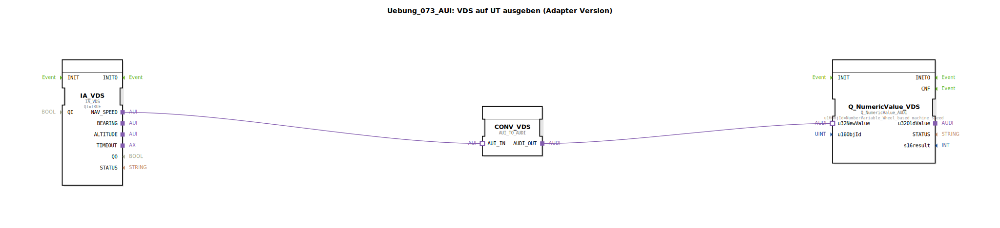

# Uebung_073_AUI: VDS auf UT ausgeben (Adapter Version)

* * * * * * * * * *

## Einleitung

Diese Übung zeigt, wie ein Geschwindigkeitswert aus dem VDS (Vehicle Data Server) über eine Adapterkonvertierung auf dem UT (Universal Terminal) als numerischer Wert ausgegeben wird. Dabei kommt ein spezieller Adapterbaustein zur Umwandlung des Datentyps von AUI (Application User Interface) nach AUDI (Application User Data Interface) zum Einsatz. Die Konfiguration ist als Subapplikation realisiert.

## Verwendete Funktionsbausteine (FBs)

| Bausteinname | Typ | Parameter | Kurzbeschreibung |
|---|---|---|---|
| **IA_VDS** | `isobus::tecu::IA_VDS` | QI = TRUE | Stellt die Verbindung zum VDS her und liefert den Wert für die radbasierte Maschinengeschwindigkeit über den Adapterausgang `NAV_SPEED`. |
| **CONV_VDS** | `adapter::conversion::unidirectional::AUI_TO_AUDI` | – | Konvertiert das AUI‑Adapter-Interface in ein AUDI‑Interface, sodass der Datenwert an nachfolgende UT‑Bausteine weitergegeben werden kann. |
| **Q_NumericValue_VDS** | `isobus::UT::Q::Q_NumericValue_AUDI` | u16ObjId = `NumberVariable_Wheel_based_machine_speed` | Zeigt den erhaltenen numerischen Wert auf dem UT‑Display an. Die Objekt‑ID verweist auf die Variable für die radbasierte Maschinengeschwindigkeit. |

## Programmablauf und Verbindungen

Die Subapplikation arbeitet in drei Schritten:

1. Der Baustein **IA_VDS** liest kontinuierlich die aktuelle Maschinengeschwindigkeit aus dem VDS. Der Wert wird über den Adapterausgang `NAV_SPEED` (Typ AUI) bereitgestellt.
2. Der **Konverterbaustein** `CONV_VDS` (AUI_TO_AUDI) wandelt das AUI‑Interface in ein AUDI‑Interface um. Dies ist notwendig, weil der anschließende UT‑Baustein einen AUDI‑Eingang erwartet.
3. Der konvertierte Wert gelangt über den AUDI‑Ausgang `CONV_VDS.AUDI_OUT` zum Dateneingang `u32NewValue` des Bausteins **Q_NumericValue_VDS**. Dieser ist mit der Objekt‑ID `NumberVariable_Wheel_based_machine_speed` konfiguriert und zeigt den Geschwindigkeitswert auf dem Universal Terminal an.

Die folgenden Adapterverbindungen realisieren den Datenfluss:

- `IA_VDS.NAV_SPEED` → `CONV_VDS.AUI_IN`
- `CONV_VDS.AUDI_OUT` → `Q_NumericValue_VDS.u32NewValue`

## Zusammenfassung

Die Übung veranschaulicht den Einsatz von Adapterbausteinen zur Interface‑Konvertierung (AUI ↔ AUDI) innerhalb einer ISOBUS‑Anwendung. Durch die klare Trennung von Datenquelle (VDS), Konvertierung und Ausgabe (UT) wird ein modulares und wiederverwendbares Design erreicht. Die Subapplikation kann einfach in übergeordnete Applikationen integriert werden.