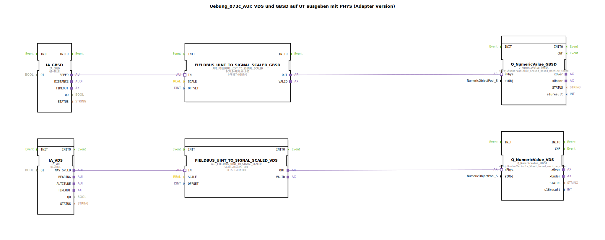

# Uebung_073c_AUI: VDS und GBSD auf UT ausgeben mit PHYS (Adapter Version)

* * * * * * * * * *
## Einleitung

Diese Übung demonstriert die Ausgabe der Geschwindigkeitssignale **Ground Based Speed (GBSD)** und **Vehicle/Drive Speed (VDS)** auf einem Universal Terminal (UT) unter Verwendung physikalischer Adressen (PHYS). Die Signale werden über ISOBUS-Adapter (IA) empfangen, skaliert und mittels der `Q_NumericValue_PHYSA`-Bausteine auf dem UT dargestellt.  
Die Übung vermittelt den Umgang mit Signal-Skalierung und dem Adapter-Konzept (*AUI*) in 4diac IDE.

> **Hinweis:** Derzeit wird als Zielobjekt für die Navigationsgeschwindigkeit ersatzweise `NumberVariable_Wheel_based_machine_speed` verwendet. Für die endgültige Umsetzung sollte `NumberVariable_Navigation_based_vehicle_speed` im Object Pool angelegt und der entsprechende Parameter gesetzt werden.

---

## Verwendete Funktionsbausteine (FBs)

Die Übung besteht aus sechs Funktionsbausteinen, die alle innerhalb der SubApp `Uebung_073c_AUI` angeordnet sind.

| Bausteinname | Typ | Parameter | Beschreibung |
|--------------|-----|-----------|--------------|
| `IA_GBSD` | `isobus::tecu::IA_GBSD` | QI = TRUE | ISOBUS-Schnittstellenbaustein für die **bodenbezogene Geschwindigkeit** (Ground Based Speed). Liefert den Messwert als UINT am Ausgang `SPEED`. |
| `IA_VDS` | `isobus::tecu::IA_VDS` | QI = TRUE | ISOBUS-Schnittstellenbaustein für die **fahrzeugbezogene Geschwindigkeit** (Vehicle/Drive Speed). Liefert den Messwert als UINT am Ausgang `NAV_SPEED`. |
| `FIELDBUS_UINT_TO_SIGNAL_SCALED_GBSD` | `logiBUS::signalprocessing::fieldbus::AUI_FIELDBUS_UINT_TO_SIGNAL_SCALED` | SCALE = 0.001, OFFSET = 0 | Skaliert den UINT-Wert von `IA_GBSD` auf einen REAL-Wert (Multiplikation mit 0.001). |
| `FIELDBUS_UINT_TO_SIGNAL_SCALED_VDS` | `logiBUS::signalprocessing::fieldbus::AUI_FIELDBUS_UINT_TO_SIGNAL_SCALED` | SCALE = 0.001, OFFSET = 0 | Skaliert den UINT-Wert von `IA_VDS` auf einen REAL-Wert (Multiplikation mit 0.001). |
| `Q_NumericValue_GBSD` | `isobus::UT::Q::Q_NumericValue_PHYSA` | stObj = `NumberVariable_Ground_based_machine_speed` | Zeigt die skalierte bodenbezogene Geschwindigkeit auf dem UT an. Verwendet die physikalische Adresse (PHYSA) des Object Pools. |
| `Q_NumericValue_VDS` | `isobus::UT::Q::Q_NumericValue_PHYSA` | stObj = `NumberVariable_Wheel_based_machine_speed` | Zeigt die skalierte fahrzeugbezogene Geschwindigkeit auf dem UT an. *(Hinweis: ersatzweise verwendet)* |

---

## Programmablauf und Verbindungen

Die Verbindungen zwischen den Bausteinen erfolgen über **Adapter (AUI)**. Der Datenfluss ist wie folgt:

1. **GBSD**  
   - `IA_GBSD` empfängt über den ISOBUS die rohe Geschwindigkeit (UINT).  
   - Der Ausgang `SPEED` wird über eine Adapterverbindung an den Eingang `IN` von `FIELDBUS_UINT_TO_SIGNAL_SCALED_GBSD` geleitet.  
   - Dieser Baustein skaliert den Wert mit `SCALE = 0.001` und gibt das Ergebnis als REAL am Ausgang `OUT` aus.  
   - Der skalierte Wert wird an den Eingang `rPhys` von `Q_NumericValue_GBSD` übergeben und auf dem UT angezeigt.

2. **VDS**  
   - `IA_VDS` liefert die Navigationsgeschwindigkeit als UINT am Ausgang `NAV_SPEED`.  
   - Dieser Wert wird über eine Adapterverbindung an den skalierenden Baustein `FIELDBUS_UINT_TO_SIGNAL_SCALED_VDS` weitergegeben.  
   - Nach der gleichen Skalierung (0.001) wird das Signal an den Eingang `rPhys` von `Q_NumericValue_VDS` geschickt und auf dem UT dargestellt.

Die Skalierung mit `0.001` wandelt die typischerweise ganzzahligen CAN-Bus-Werte (z. B. 0–65535) in physikalische Einheiten (z. B. m/s oder km/h) um. Der Offset ist hier auf 0 gesetzt.

> Der Kommentar im Netzwerk weist darauf hin, dass für die Navigationsgeschwindigkeit eigentlich `NumberVariable_Navigation_based_vehicle_speed` verwendet werden sollte. Die aktuelle Konfiguration nutzt als Platzhalter `NumberVariable_Wheel_based_machine_speed`.

---

## Zusammenfassung

Die Übung **Uebung_073c_AUI** zeigt, wie zwei Geschwindigkeitssignale (GBSD und VDS) über ISOBUS-Adapter (IA) eingelesen, mit einem Faktor von 0.001 skaliert und über die physikalischen Adressen eines Object Pools auf einem Universal Terminal ausgegeben werden. Der Einsatz von Adaptern (AUI) ermöglicht eine flexible Signalverarbeitung ohne feste Punkt-zu-Punkt-Verdrahtung der Ereignisse. Die Übung ist ein typisches Beispiel für die Visualisierung von ISOBUS-Messwerten in landwirtschaftlichen Steuerungen.