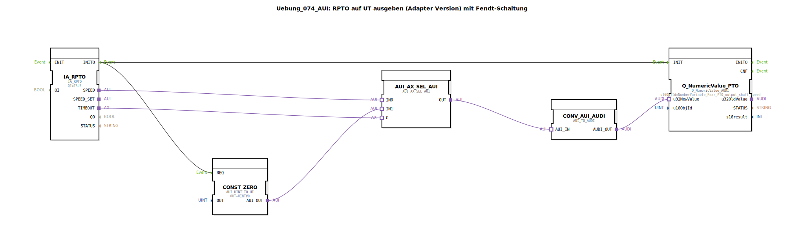

# Uebung_074_AUI: RPTO auf UT ausgeben (Adapter Version) mit Fendt-Schaltung

* * * * * * * * * *
## Einleitung
Diese Übung demonstriert die Ausgabe der Drehzahl der hinteren Zapfwelle (Rear PTO) auf ein User Terminal (UT) unter Verwendung von Adaptern. Sie implementiert eine sogenannte „Fendt-Schaltung“, die bei einem Timeout des PTO-Signals auf dem UT den Wert 0 anzeigt. Dadurch wird ein sicheres Verhalten bei Sensorausfall oder Kommunikationsstörungen erreicht.

Die Übung basiert auf dem Einsatz von ISOBUS-Komponenten (insbesondere des TECU‑Interfaces) und zeigt den Umgang mit Adapter‑Baugruppen zur Typumwandlung und Signalauswahl.

## Verwendete Funktionsbausteine (FBs)
Die SubApp enthält folgende Funktionsbausteine, die im Netzwerk miteinander verbunden sind:

### Sub-Bausteine: IA_RPTO
- **Typ**: `isobus::tecu::IA_RPTO`
- **Verwendete interne FBs**: keine (primitiver Baustein)
- **Parameter**: `QI = TRUE` (Initialisierungsqualität aktiv)
- **Ereignisausgänge**: `INITO`
- **Adapterausgänge**: `SPEED` (aktuelle Drehzahl als AUI‑Wert), `TIMEOUT` (Signal bei Timeout)
- **Funktionsweise**: Stellt die Schnittstelle zum TECU‑System für die hintere Zapfwelle dar. Liefert die gemessene Drehzahl und ein Timeout‑Flag.

### Sub-Bausteine: Q_NumericValue_PTO
- **Typ**: `isobus::UT::Q::Q_NumericValue_AUDI`
- **Verwendete interne FBs**: keine
- **Parameter**: `u16ObjId = NumberVariable_Rear_PTO_output_shaft_speed` (Identifikation des anzuzeigenden Objekts)
- **Ereigniseingänge**: `INIT`
- **Dateneingänge**: `u32NewValue` (AUDI‑kodierter Wert)
- **Funktionsweise**: Empfängt einen numerischen Wert im AUDI‑Format und zeigt ihn auf dem User Terminal unter der vorgegebenen Objekt‑ID an.

### Sub-Bausteine: AUI_AX_SEL_AUI
- **Typ**: `adapter::iec61131::selection::AUI_AX_SEL_AUI`
- **Verwendete interne FBs**: keine
- **Parameter**: keine
- **Adaptereingänge**: `IN0`, `IN1`, `G`
- **Adapterausgang**: `OUT`
- **Funktionsweise**: Ein 2‑zu‑1‑Auswahlbaustein. Wenn das Gate‑Signal `G` `TRUE` ist, wird der Wert von `IN1` an `OUT` durchgeschaltet; andernfalls der Wert von `IN0`. Dient hier der Realisierung der Fendt‑Schaltung.

### Sub-Bausteine: CONST_ZERO
- **Typ**: `adapter::conversion::unidirectional::AUI_UINT_TO_UI`
- **Verwendete interne FBs**: keine
- **Parameter**: `OUT = UINT#0` (konstanter Ausgangswert)
- **Ereigniseingänge**: `REQ`
- **Adapterausgang**: `AUI_OUT`
- **Funktionsweise**: Liefert als Antwort auf ein `REQ`‑Ereignis einen konstanten AUI‑Wert von 0. Wird als Ersatzsignal bei Timeout verwendet.

### Sub-Bausteine: CONV_AUI_AUDI
- **Typ**: `adapter::conversion::unidirectional::AUI_TO_AUDI`
- **Verwendete interne FBs**: keine
- **Parameter**: keine
- **Adaptereingang**: `AUI_IN`
- **Adapterausgang**: `AUDI_OUT`
- **Funktionsweise**: Wandelt einen AUI‑Wert in das AUDI‑Format um, das vom Anzeigebaustein `Q_NumericValue_PTO` erwartet wird.

## Programmablauf und Verbindungen
Die Übung wird als SubApp in einer größeren Anwendung eingesetzt, typischerweise in einem ISOBUS‑Steuergerät für Traktoren.

**Signalfluss**:
1. Nach der Initialisierung (Ereignis `INITO` von `IA_RPTO`) werden die Bausteine `Q_NumericValue_PTO` und `CONST_ZERO` aktiviert (`INIT` bzw. `REQ`).
2. Der aktuelle Drehzahlwert der Zapfwelle wird als AUI‑Wert über `IA_RPTO.SPEED` an den Eingang `IN0` des Selektors `AUI_AX_SEL_AUI` gesendet.
3. Gleichzeitig wird das Timeout‑Flag `IA_RPTO.TIMEOUT` an den Gate‑Eingang `G` des Selektors angelegt. Bei normalem Betrieb ist `TIMEOUT = FALSE`, sodass der Selektor den Wert von `IN0` (die gemessene Drehzahl) durchschaltet.
4. Bei einem Timeout (z.B. durch Sensorausfall) wird `TIMEOUT = TRUE`. Der Selektor schaltet dann auf den zweiten Eingang `IN1` um, der über `CONST_ZERO` mit dem konstanten Wert 0 belegt wird.
5. Der ausgewählte AUI‑Wert wird über `AUI_AX_SEL_AUI.OUT` an `CONV_AUI_AUDI.AUI_IN` übergeben, dort in das AUDI‑Format konvertiert und schließlich als `u32NewValue` dem Anzeigebaustein zugeführt.
6. `Q_NumericValue_PTO` stellt den Wert auf dem User Terminal dar – im Normalbetrieb die tatsächliche Drehzahl, bei Timeout eine 0.

**Lernziele**:
- Verständnis der Verwendung von Adaptern zur Kommunikation zwischen unterschiedlichen Protokollen (AUI, AUDI).
- Implementierung einer einfachen Fallback‑Logik (Fendt‑Schaltung) mit einem 2‑Kanal‑Selektor.
- Umgang mit ISOBUS‑TECU‑Befehlen und UT‑Anzeigebausteinen in 4diac.
- Erkennen und Behandeln von Timeout‑Situationen in der Feldbuskommunikation.

**Schwierigkeitsgrad**: Mittel  
**Vorkenntnisse**: Grundlagen der 4diac‑IDE, Aufbau von SubApp‑Typen, Verständnis von Adapter‑Schnittstellen und ereignisgesteuerter Programmierung.

**Hinweise zur Einrichtung**:  
Die Übung benötigt die Projekt‑Bibliotheken mit den verwendeten FPGA‑Bausteinen (z.B. `isobus`, `adapter`). Die Symbol‑ und Objekt‑ID (`NumberVariable_Rear_PTO_output_shaft_speed`) muss im verwendeten ISOBUS‑System definiert sein.

## Zusammenfassung
Die Übung `Uebung_074_AUI` realisiert eine sichere Anzeige der Zapfwellendrehzahl auf einem User Terminal. Durch die Kombination eines Adapter‑Selektors mit einem konstanten Nullwert im Fehlerfall wird eine einfache, aber robuste Fendt‑Schaltung umgesetzt. Sie vermittelt grundlegende Konzepte des ISOBUS‑Protokolls, der Adapter‑Kommunikation und der ereignisbasierten Datenvorverarbeitung in 4diac.