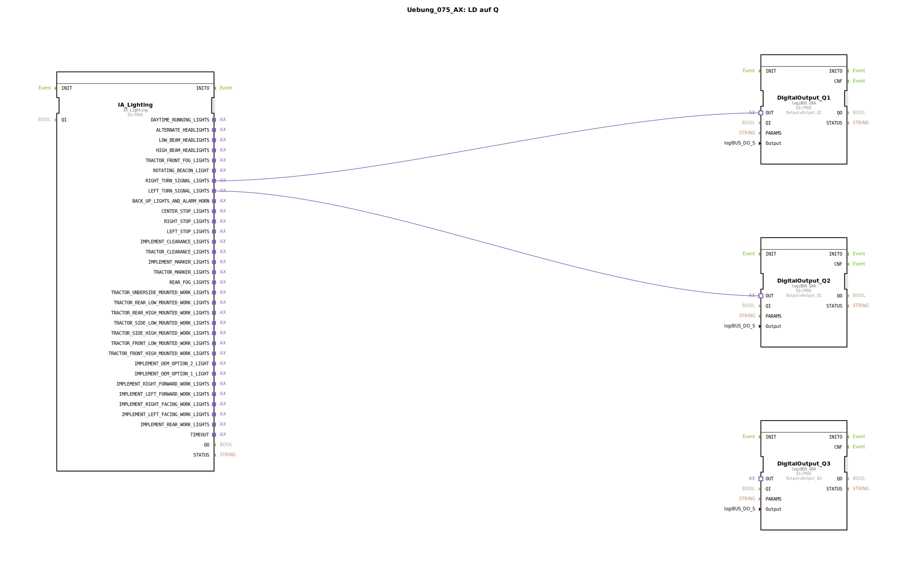

# Uebung_075_AX: LD auf Q

* * * * * * * * * *
## Einleitung

Diese Übung demonstriert die Ansteuerung digitaler Ausgänge über einen ISOBUS-Lichtadapter. Das SubApp-Element „Uebung_075_AX“ verarbeitet die Blinkersignale (rechts/links) eines Fahrzeugs und leitet sie auf entsprechende digitale Ausgänge (z. B. logiBUS-Ausgänge) weiter. Der Kommentar „LD auf Q“ deutet auf die Übertragung von Lichtdaten (LD) auf die Ausgänge (Q) hin.

## Verwendete Funktionsbausteine (FBs)

### Sub-Bausteine:

#### IA_Lighting
- **Typ**: `isobus::tecu::IA_Lighting`
- **Verwendete interne FBs**: keine
- **Parameter**:
  - `QI` = TRUE (Freigabe)
- **Funktionsweise**:  
  Dieser Funktionsbaustein stellt ein ISOBUS-konformes Lichtsteuerinterface bereit. Über Adapterausgänge werden verschiedene Lichtfunktionen bereitgestellt, darunter Rechts- und Linksblinker (`RIGHT_TURN_SIGNAL_LIGHTS`, `LEFT_TURN_SIGNAL_LIGHTS`). Die Signale werden aktiv, sobald eine übergeordnete Steuerung die entsprechenden Lichtbefehle sendet.

#### DigitalOutput_Q1, DigitalOutput_Q2, DigitalOutput_Q3
- **Typ**: `logiBUS::io::DQ::logiBUS_QXA`
- **Verwendete interne FBs**: keine
- **Parameter**:
  - `QI` = TRUE (Freigabe)
  - `Output` = `Output_Q1` / `Output_Q2` / `Output_Q3` (jeweils eigener Wert)
- **Funktionsweise**:  
  Diese Funktionsbausteine kapseln digitale Ausgänge der logiBUS-Hardware. Mit `QI = TRUE` sind sie aktiviert und schalten den angeschlossenen physischen Ausgang gemäß dem ankommenden Adaptersignal. Sie können z. B. für Lampen, Relais oder andere binäre Aktoren verwendet werden.

## Programmablauf und Verbindungen

Die Verdrahtung innerhalb des SubApp-Netzwerks erfolgt ausschließlich über **Adapterverbindungen**:

1. Der Baustein `IA_Lighting` empfängt (aus einer übergeordneten Applikation) die Blinkerbefehle und stellt diese an seinen Adapterausgängen bereit.
2. Die Verbindung  
   - **`IA_Lighting.RIGHT_TURN_SIGNAL_LIGHTS` → `DigitalOutput_Q1.OUT`**  
     leitet das Signal für den rechten Blinker zum digitalen Ausgang Q1.
   - **`IA_Lighting.LEFT_TURN_SIGNAL_LIGHTS` → `DigitalOutput_Q2.OUT`**  
     leitet das Signal für den linken Blinker zum digitalen Ausgang Q2.
3. Der dritte Ausgangsbaustein `DigitalOutput_Q3` bleibt in dieser Übung ungenutzt (kann als Reserve oder für Erweiterungen dienen).

Dank der Adaptertechnik entfällt eine aufwändige Parameterübergabe – die Signalpropagation erfolgt typisiert und automatisch.

**Lernziele**:  
- Verständnis von Adapterverbindungen (Socket/Plug) in 4diac IDE  
- Einbindung eines ISOBUS-Lichtadapters und logiBUS-Digitalausgängen  
- Erstellen wiederverwendbarer SubApp-Komponenten für Fahrzeuglichtsteuerungen  

**Schwierigkeitsgrad**: Einfach (grundlegende Adapterkonfiguration)  
**Vorkenntnisse**: Grundlagen der 4diac-IDE, Umgang mit Funktionsbausteinen und Netzwerken

## Zusammenfassung

Die Übung „Uebung_075_AX“ zeigt, wie ein ISOBUS-Lichtadapter über Adapterverbindungen zwei digitale Ausgänge ansteuert. Rechts- und Linksblinksignale werden auf die logiBUS-Ausgänge Q1 und Q2 übertragen. Die SubApp ist ein kompaktes, prototypisches Element für einfache Lichtsteuerungen in landwirtschaftlichen Fahrzeugen. Sie verdeutlicht die Vorteile der adapterbasierten Kommunikation in der IEC 61499 und kann als Grundbaustein für komplexere Lichtfunktionen dienen.