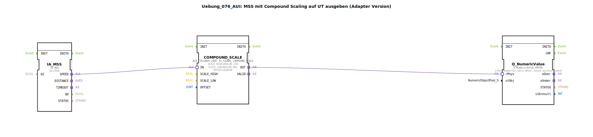

# Uebung_076_AUI: MSS mit Compound Scaling auf UT ausgeben (Adapter Version)

* * * * * * * * * *

## Einleitung

Diese Übung demonstriert die Verarbeitung der Machine Selected Speed (MSS) und deren Weiterleitung als physikalische Größe auf das Universal Terminal (UT).  
Dabei kommt ein Compound Scaling (zusammengesetzte Skalierung) zum Einsatz, um den Wertebereich der Signale an die Anforderungen des UT anzupassen. Die Kommunikation zwischen den Funktionsbausteinen erfolgt über Adapterverbindungen.

## Verwendete Funktionsbausteine (FBs)

### IA_MSS
- **Typ**: `isobus::tecu::IA_MSS`
- **Parameter**: QI = TRUE  
- **Funktionsweise**: Dieser FB stellt die Schnittstelle zur ISO-bus-basierten Maschinensteuerung dar. Er liefert die aktuelle Maschinensollgeschwindigkeit (MSS) als Ausgangssignal am Adapterport `SPEED`. Der Parameter QI (Qualifier Input) wird fest auf TRUE gesetzt, um die Datenbereitstellung zu aktivieren.

### COMPOUND_SCALE
- **Typ**: `logiBUS::signalprocessing::fieldbus::AUI_FIELDBUS_UINT_TO_SIGNAL_COMPOUND_SCALE`
- **Parameter**:
  - `SCALE_HIGH` = REAL#0.256  
  - `SCALE_LOW` = REAL#0.001  
  - `OFFSET` = DINT#0  
- **Funktionsweise**: Dieser FB empfängt den Rohwert (UINT) vom IA_MSS über den Adaptereingang `IN` und skaliert ihn mittels einer zusammengesetzten Skalierung (Compound Scaling) in einen physikalischen Wert. Die Skalierungsparameter legen die obere und untere Grenze des linearen Bereichs fest; der Offset bleibt hier Null. Der skalierte Wert wird am Ausgang `OUT` bereitgestellt.

### Q_NumericValue
- **Typ**: `isobus::UT::Q::Q_NumericValue_PHYSA`
- **Parameter**:
  - `stObj` = `NumberVariable_Wheel_based_machine_speed`  
- **Funktionsweise**: Dieser FB dient der Ausgabe eines physikalischen Werts auf das Universal Terminal (UT) über die ISO-bus-UT-Schnittstelle. Der Parameter `stObj` referenziert ein Objekt aus dem Object Pool (hier: `NumberVariable_Wheel_based_machine_speed`), das als Zielvariable für die Wertanzeige dient. Der skalierte Wert wird über den Adaptereingang `rPhys` übernommen.

> **Hinweis:**  
> Der verwendete Object-Pool-Eintrag ist nur ein Platzhalter. In der Praxis sollte ein eigenes `NumberVariable_Machine_selected_speed`-Objekt angelegt und der Parameter entsprechend geändert werden (siehe Kommentar im Netzwerk).

## Programmablauf und Verbindungen

Der Ablauf ist wie folgt:

1. Der Funktionsbaustein `IA_MSS` liefert die aktuelle Maschinensollgeschwindigkeit als UINT-Wert über seinen Adapterausgang `SPEED`.
2. Dieser Wert wird über eine Adapterverbindung an den Eingang `IN` des Funktionsbausteins `COMPOUND_SCALE` weitergeleitet.
3. `COMPOUND_SCALE` führt die zusammengesetzte Skalierung durch und gibt den resultierenden physikalischen Wert (Realer Wert) am Ausgang `OUT` aus.
4. Der skalierte Wert wird über eine weitere Adapterverbindung an den Eingang `rPhys` des Funktionsbausteins `Q_NumericValue` übergeben.
5. `Q_NumericValue` schreibt den Wert in das referenzierte Object-Pool-Objekt, sodass er auf dem UT angezeigt werden kann.

Die gesamte Kommunikation zwischen den Blöcken erfolgt über Adapter (keine direkten Daten- oder Ereignisverbindungen), was den modularen Aufbau und die Wiederverwendbarkeit erleichtert.

## Zusammenfassung

Die Übung veranschaulicht die typische ISO-bus-Datenverarbeitungskette:  
**Sensor/MSS → Skalierung → Ausgabe auf Terminal**.  
Durch die Verwendung von Adapterverbindungen bleibt die Konfiguration flexibel und erweiterbar.  
Lernziele sind unter anderem:
- Verständnis der MSS-Verarbeitung in der Landtechnik
- Anwendung von Compound Scaling (zusammengesetzte Skalierung)
- Arbeiten mit ISO-bus-Adapter-FBs und Object-Pool-Referenzen

Die Übung erfordert Grundkenntnisse in der 4diac-IDE und im Umgang mit ISO-bus-Funktionsbausteinen.