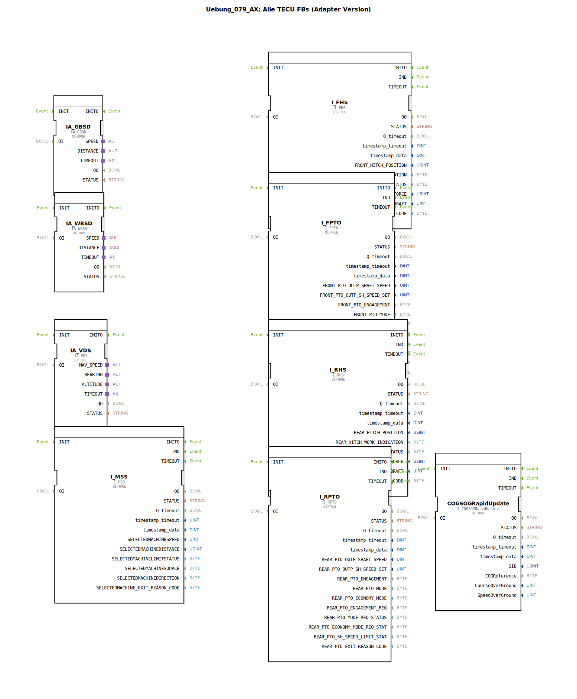

# Uebung_079_AX: Alle TECU FBs (Adapter Version)

* * * * * * * * * *

## Einleitung

Diese Übung dient der Einführung in die wichtigsten ISOBUS-konformen Funktionsbausteine (FBs) für die TECU-Plattform in der Adapter-Version. Sie lernen die grundlegenden Schnittstellenbausteine kennen, die in landwirtschaftlichen Anwendungen zur Steuerung und Überwachung von Traktor- oder Implementfunktionen eingesetzt werden. Die Übung stellt eine Sammlung aller benötigten ISOBUS-Adapter-FBs bereit, die als Grundlage für komplexere Steuerungsaufgaben innerhalb der 4diac-IDE dienen.

## Verwendete Funktionsbausteine (FBs)

Die Übung enthält ausschließlich die folgenden vordefinierten ISOBUS-Adapter-Funktionsbausteine aus der Bibliothek `isobus::tecu`. Jeder Baustein besitzt einen booleschen Eingang `QI` (Quality/Enable), der zur Aktivierung auf `TRUE` gesetzt ist. Es werden keine zusätzlichen Verbindungen zwischen den FBs hergestellt.

- **IA_GBSD** – Getriebe-/Bremssteuerung (Generic Brake System Device)
- **IA_VDS** – Virtual Display Server (Anzeige und Bedienung)
- **IA_WBSD** – Working Body Set Device (Arbeitsgeräte)
- **I_MSS** – Management System Server (Systemverwaltung)
- **I_FHS** – Front Hitch System (Frontkraftheber)
- **I_FPTO** – Front Power Take-Off (Frontzapfwelle)
- **I_RHS** – Rear Hitch System (Heckkraftheber)
- **I_RPTO** – Rear Power Take-Off (Heckzapfwelle)
- **COGSOGRapidUpdate** – (Course Guidance Update, Spurführung)

Alle Bausteine sind vom Typ `isobus::tecu::<Name>` und werden im Netzwerk ohne weitere Verschaltung nur zur Bereitstellung der Schnittstellen verwendet.

## Programmablauf und Verbindungen

In dieser Übung werden die ISOBUS-Adapter-FBs **nicht** miteinander verbunden oder in einen Ablauf integriert. Ziel ist es, die einzelnen Bausteine und ihre jeweiligen Funktionsbereiche kennenzulernen. Die Bausteine sind als reine Adapter-Versionen ausgeführt und können später in eigenen Anwendungen als Verbindungspunkte zu realen TECU-Geräten oder Simulationen eingesetzt werden.

**Mögliche Lernziele:**
- Erkennen der ISOBUS-Adapter-Struktur (QI-Eingang, Ereignis-, Datenports)
- Verstehen der Aufgabenbereiche der gängigen TECU-Funktionen (Zapfwelle, Kraftheber, Anzeige etc.)
- Vorbereitung für die Zusammenschaltung mehrerer Adapter zu einer funktionalen Steuerung

Die Übung kann direkt nach dem Import in die 4diac-IDE gestartet werden. Es sind keine weiteren Vorkenntnisse außer der grundlegenden Bedienung der IDE erforderlich.

## Zusammenfassung

Die Übung Uebung_079_AX stellt eine vollständige Auflistung aller wesentlichen ISOBUS-Adapter-FBs für TECU zur Verfügung. Sie bietet einen idealen Einstieg in die Modellierung landwirtschaftlicher Steuerungen mit 4diac und bildet die Basis für weiterführende Übungen, in denen die Bausteine miteinander verbunden und mit eigenen Logiken ergänzt werden.