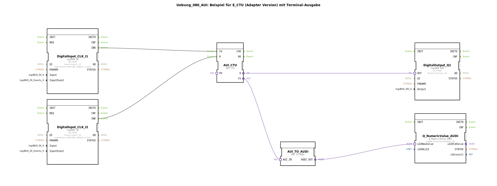

# Uebung_080_AUI: Beispiel für E_CTU (Adapter Version) mit Terminal-Ausgabe

* * * * * * * * * *

## Einleitung

Diese Übung demonstriert die Anwendung eines **Adapter-basierten Aufwärtszählers (AUI\_CTU)** in 4diac. Der Zähler wird über einen Ereigniseingang von einem Taster (Input\_I1) inkrementiert und über einen zweiten Taster (Input\_I2) zurückgesetzt. Der aktuelle Zählwert wird sowohl auf einem digitalen Ausgang (Output\_Q1) als auch als numerischer Wert über einen Terminal-Ausgang ausgegeben. Die Übung vermittelt den Umgang mit der Adapter-Schnittstelle für Ereignisse und deren Konvertierung in Datenwerte.

## Verwendete Funktionsbausteine (FBs)

Der Netzwerk-Editor der Subapplikation enthält sechs Funktionsbausteine. Nachfolgend werden diese im Einzelnen beschrieben.

### DigitalInput\_CLK\_I1
- **Typ**: `logiBUS::io::DI::logiBUS_IE`  
- **Parameter**:  
  - `QI` = `TRUE`  
  - `Input` = `Input_I1`  
  - `InputEvent` = `BUTTON_SINGLE_CLICK`  
- **Funktion**: Dieser Baustein reagiert auf einen einzelnen Tastendruck am physikalischen Eingang `Input_I1` und erzeugt das Ereignis `IND` am Ausgang.

### DigitalInput\_CLK\_I2
- **Typ**: `logiBUS::io::DI::logiBUS_IE`  
- **Parameter**:  
  - `QI` = `TRUE`  
  - `Input` = `Input_I2`  
  - `InputEvent` = `BUTTON_SINGLE_CLICK`  
- **Funktion**: Analog zu `DigitalInput_CLK_I1`, jedoch für den Reset-Taster an `Input_I2`.

### AUI\_CTU
- **Typ**: `adapter::events::unidirectional::AUI_CTU`  
- **Parameter**: Keine konfigurierten Parameter im XML.  
- **Funktion**: Dies ist ein Adapter-Funktionsbaustein, der einen Aufwärtszähler (Counter Up) realisiert. Er verfügt über die Ereigniseingänge `CU` (Inkrement) und `R` (Reset) sowie die Ereignisausgänge `Q` (Zählerstand erreicht) und `CV` (aktueller Zählwert als Adapter-Ausgang). Die Zählschwelle (PV) ist standardmäßig auf einen vorgegebenen Wert gesetzt.

### AUI\_TO\_AUDI
- **Typ**: `adapter::conversion::unidirectional::AUI_TO_AUDI`  
- **Parameter**: Keine konfigurierten Parameter.  
- **Funktion**: Dieser Baustein wandelt einen AUI-Adapterausgang (Ereignis mit Wert) in einen reinen Datenwert (AUDI) um. Er erhält am Adaptereingang `AUI_IN` das Signal `CV` und liefert am Datenausgang `AUDI_OUT` den aktuellen Zählwert als `UINT`-Wert.

### Q\_NumericValue\_AUDI
- **Typ**: `isobus::UT::Q::Q_NumericValue_AUDI`  
- **Parameter**:  
  - `u16ObjId` = `OutputNumber_N1`  
- **Funktion**: Dieser Baustein empfängt einen numerischen Wert (über den Adaptereingang `u32NewValue`) und stellt ihn als Ausgabe auf dem Terminal dar. Der Parameter `u16ObjId` legt die Objektkennung für die Terminalausgabe fest.

### DigitalOutput\_Q1
- **Typ**: `logiBUS::io::DQ::logiBUS_QXA`  
- **Parameter**:  
  - `QI` = `TRUE`  
  - `Output` = `Output_Q1`  
- **Funktion**: Dieser Baustein setzt den physikalischen Ausgang `Output_Q1` auf `TRUE`, sobald am Ereigniseingang `OUT` ein Ereignis eintrifft. Er dient dazu, den Zählerstand (z.B. Erreichen einer Schwelle) als binäres Signal anzuzeigen.

## Programmablauf und Verbindungen

Die Übung ist als Subapplikation (`Uebung_080_AUI`) angelegt und benötigt keine eigenen Schnittstellen – alle Ein- und Ausgänge sind interne Hardwarezuordnungen.

**Ereignisverbindungen**:
- Das Ereignis `IND` von `DigitalInput_CLK_I1` wird an den Ereigniseingang `CU` des AUI_CTU angeschlossen. Jeder Tastendruck an Input_I1 erhöht den Zähler um 1.
- Das Ereignis `IND` von `DigitalInput_CLK_I2` wird an den Ereigniseingang `R` des AUI_CTU angeschlossen. Ein Tastendruck an Input_I2 setzt den Zähler zurück.

**Adapterverbindungen**:
- Der Adapterausgang `Q` von `AUI_CTU` (zeigt an, dass der Zählerstand die Schwelle erreicht hat) ist mit dem Ereigniseingang `OUT` von `DigitalOutput_Q1` verbunden. Bei Erreichen der Schwelle wird der Ausgang `Output_Q1` aktiviert.
- Der Adapterausgang `CV` von `AUI_CTU` (aktueller Zählwert) ist mit dem Adapteingang `AUI_IN` des Konverters `AUI_TO_AUDI` verbunden.
- Der Datenausgang `AUDI_OUT` von `AUI_TO_AUDI` liefert den Zählwert als Ganzzahl und wird mit dem Adaptereingang `u32NewValue` des Terminal-Bausteins `Q_NumericValue_AUDI` verbunden. Dadurch wird der aktuelle Zählerstand kontinuierlich auf dem Terminal ausgegeben.

**Ablauf**:
1. Nach dem Start der Applikation ist der Zählerstand 0.
2. Jeder Druck auf `Input_I1` erhöht den Zähler um 1. Der neue Wert wird sofort auf dem Terminal angezeigt.
3. Wird der voreingestellte Schwellwert (PV) erreicht, wird `Output_Q1` auf `TRUE` gesetzt.
4. Ein Druck auf `Input_I2` setzt den Zähler zurück auf 0 (auch der Ausgang wird wieder `FALSE`).

## Zusammenfassung

Die Übung zeigt, wie ein Adapter-basierter Zähler (AUI_CTU) in 4diac mit Hardware-Eingängen und -Ausgängen verknüpft wird. Durch die Verwendung des Konverters `AUI_TO_AUDI` wird der adapternative Wert in einen einfachen Datenwert umgewandelt, der anschließend auf einem Terminal ausgegeben werden kann. Die separate Ansteuerung von Zähleingang und Reset sowie die binäre Rückmeldung über einen digitalen Ausgang machen diese Übung zu einem grundlegenden Beispiel für zeit- und ereignisgesteuerte Zählfunktionen in der IEC 61499-Architektur.

**Lernziele**:
- Verständnis der Adapter-Schnittstellen (AUI) für Ereignisse und Daten.
- Einbindung von Hardware-Eingängen (Taster) und -Ausgängen in ein Steuerungsprogramm.
- Konvertierung zwischen Adapter- und Datenformaten.
- Nutzung eines Terminal-Ausgabe-FBs zur Laufzeitbeobachtung.