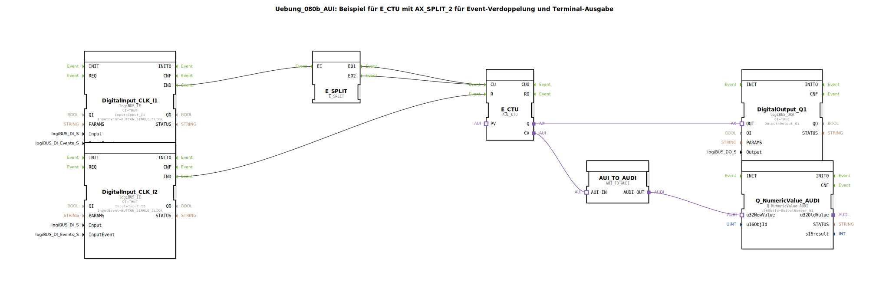

# Uebung_080b_AUI: Beispiel für E_CTU mit AX_SPLIT_2 für Event-Verdoppelung und Terminal-Ausgabe

* * * * * * * * * *
## Einleitung

Diese Übung demonstriert den Einsatz eines aufwärtszählenden Zählers (E_CTU) mit Ereignisverdoppelung durch einen E_SPLIT-Funktionsbaustein. Zwei Hardware-Taster (an Input_I1 und Input_I2) dienen als Zählimpulsgeber und Rücksetzsignal. Der aktuelle Zählerstand wird über einen Adapter-Ausgang (CV) ausgegeben und auf einem numerischen Terminal (OutputNumber_N1) dargestellt. Ein zusätzlicher digitaler Ausgang (Output_Q1) signalisiert den Q-Zustand des Zählers.

**Lernziele**:
- Anwendung des E_CTU-Zählers (Aufwärtszähler)  
- Nutzung des E_SPLIT zur Verdoppelung eines Ereignissignals  
- Verwendung von AUI-Adapter-Schnittstellen für Daten- und Ereignisübertragung  
- Parametrierung von logiBUS-Eingängen und -Ausgängen  
- Ausgabe numerischer Werte auf einem Terminal (Q_NumericValue_AUDI)

**Schwierigkeitsgrad**: Mittel  
**Vorkenntnisse**: Grundlagen der 4diac-IDE, Umgang mit Ereignis- und Datenverbindungen, Ein/Ausgabe-Konfiguration

## Verwendete Funktionsbausteine (FBs)

Folgende Funktionsbausteine werden im SubApp-Netzwerk eingesetzt:

### `DigitalInput_CLK_I1` (Typ: `logiBUS::io::DI::logiBUS_IE`)
- **Parameter**: `QI=TRUE`, `Input=Input_I1`, `InputEvent=BUTTON_SINGLE_CLICK`
- **Funktion**: Liest einen digitalen Eingang (Taster I1) und generiert bei einem einfachen Klick das Ereignis `IND`.

### `DigitalInput_CLK_I2` (Typ: `logiBUS::io::DI::logiBUS_IE`)
- **Parameter**: `QI=TRUE`, `Input=Input_I2`, `InputEvent=BUTTON_SINGLE_CLICK`
- **Funktion**: Liest einen digitalen Eingang (Taster I2) und generiert bei einem einfachen Klick das Ereignis `IND` (dient als Rücksetzsignal).

### `E_SPLIT` (Typ: `iec61499::events::E_SPLIT`)
- **Parameter**: keine
- **Funktion**: Teilt ein eingehendes Ereignis (EI) auf zwei identische Ausgangsereignisse (EO1, EO2) auf.

### `E_CTU` (Typ: `adapter::events::unidirectional::AUI_CTU`)
- **Parameter**: keine  
- **Funktion**: Aufwärtszähler mit zwei Ereigniseingängen: CU (Count Up) und R (Reset). Über den Adapter-Ausgang `Q` wird der Zählerstand als boolescher Wert (bei CV>0) ausgegeben, über `CV` der aktuelle Zählerstand (Datenadapter).

### `AUI_TO_AUDI` (Typ: `adapter::conversion::unidirectional::AUI_TO_AUDI`)
- **Parameter**: keine  
- **Funktion**: Wandelt einen AUI-Datenadapter (hier den Zählerwert CV) in einen AUDI-Datenadapter (u32) um, der von nachfolgenden Bausteinen verarbeitet werden kann.

### `DigitalOutput_Q1` (Typ: `logiBUS::io::DQ::logiBUS_QXA`)
- **Parameter**: `QI=TRUE`, `Output=Output_Q1`
- **Funktion**: Steuert einen digitalen Ausgang (Q1) basierend auf dem eingehenden Wert am Adapteranschluss `OUT`.

### `Q_NumericValue_AUDI` (Typ: `isobus::UT::Q::Q_NumericValue_AUDI`)
- **Parameter**: `u16ObjId=OutputNumber_N1`
- **Funktion**: Nimmt einen 32-Bit-Zahlenwert (via `u32NewValue`) entgegen und gibt diesen auf dem konfigurierten Terminalobjekt (hier `OutputNumber_N1`) aus.

## Programmablauf und Verbindungen

1. **Ereigniserzeugung**:  
   - Bei Betätigung des Tasters an `Input_I1` erzeugt `DigitalInput_CLK_I1` ein Ereignis `IND`.  
   - Bei Betätigung des Tasters an `Input_I2` erzeugt `DigitalInput_CLK_I2` ein Ereignis `IND`.

2. **Ereignisverdoppelung**:  
   - Das `IND`-Ereignis von I1 wird an den Eingang `EI` von `E_SPLIT` geleitet.  
   - `E_SPLIT` gibt zwei identische Ereignisse an seinen Ausgängen `EO1` und `EO2` aus.  
   - Beide Ereignisse werden – über separate Verbindungen – an den CU-Eingang des `E_CTU` angeschlossen. **Dadurch wird jeder Tastendruck auf I1 als zwei Zählimpulse gewertet.**

3. **Zähler**:  
   - Jedes CU-Ereignis erhöht den internen Zähler von `E_CTU` um 1.  
   - Das `IND`-Ereignis von I2 (Rücksetztaster) ist mit dem Eingang `R` von `E_CTU` verbunden und setzt den Zähler auf 0 zurück.

4. **Ausgabe**:  
   - Der Zählerausgang `Q` (Adapter) wird mit dem Adaptereingang `OUT` von `DigitalOutput_Q1` verbunden. Solange der Zählerstand > 0 ist, wird der digitale Ausgang Q1 aktiv (TRUE).  
   - Der Zählerstand `CV` (ebenfalls ein AUI-Adapter) wird über `AUI_TO_AUDI` in einen AUDI-Adapter konvertiert und an `Q_NumericValue_AUDI.u32NewValue` übergeben. Der Baustein zeigt den aktuellen Zählerwert auf dem konfigurierten Terminal (OutputNumber_N1) an.

**Zusammenfassung der Verbindungen** (aus dem XML):

| Quelle | Ziel | Typ |
|--------|------|-----|
| `DigitalInput_CLK_I1.IND` | `E_SPLIT.EI` | Event |
| `E_SPLIT.EO1` | `E_CTU.CU` | Event |
| `E_SPLIT.EO2` | `E_CTU.CU` | Event |
| `DigitalInput_CLK_I2.IND` | `E_CTU.R` | Event |
| `E_CTU.Q` | `DigitalOutput_Q1.OUT` | Adapter |
| `E_CTU.CV` | `AUI_TO_AUDI.AUI_IN` | Adapter |
| `AUI_TO_AUDI.AUDI_OUT` | `Q_NumericValue_AUDI.u32NewValue` | Adapter |

## Zusammenfassung

Die Übung **Uebung_080b_AUI** veranschaulicht die Kombination eines Aufwärtszählers mit einer Ereignisverdoppelung durch `E_SPLIT`. Der Zähler reagiert auf zwei Taster: einer zählt (mit verdoppelter Impulsrate), der andere setzt zurück. Die Ergebnisse werden sowohl auf einem digitalen Ausgang (Q1) als auch auf einem Terminal (OutputNumber_N1) ausgegeben. Sie lernen dabei den Umgang mit Adapter-basierten Daten- und Ereignisschnittstellen sowie die Konfiguration von logiBUS-Ein- und -Ausgängen in der 4diac-IDE.