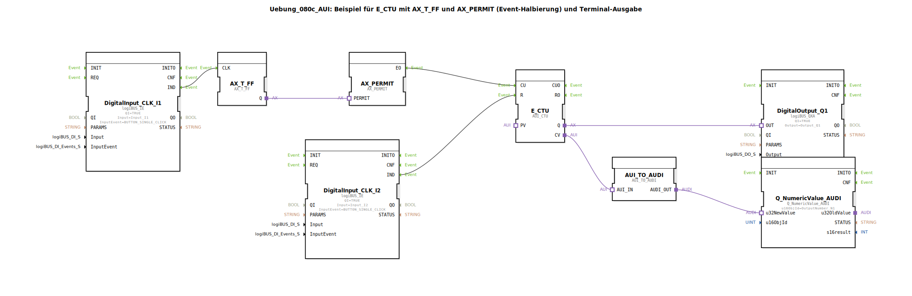

# Uebung_080c_AUI: Beispiel für E_CTU mit AX_T_FF und AX_PERMIT (Event-Halbierung) und Terminal-Ausgabe

* * * * * * * * * *

## Einleitung

Diese Übung demonstriert die Verwendung eines Aufwärtszählers (E_CTU) in Kombination mit einem T‑Flipflop (AX_T_FF) und einem Ereignis‑Freigabeblock (AX_PERMIT).  
Die Ereignisse eines Tasters (I1) werden durch das T‑Flipflop halbiert, bevor sie den Zähler erhöhen. Ein zweiter Taster (I2) dient als Reset.  
Der aktuelle Zählerstand wird über einen Konverter an eine numerische Ausgabe auf einem Terminal gesendet, und der Zählerstatus (Q) schaltet einen digitalen Ausgang.

---

## Verwendete Funktionsbausteine (FBs)

- **DigitalInput_CLK_I1** (Typ: `logiBUS::io::DI::logiBUS_IE`)  
  - Parameter: QI = TRUE, Input = `Input_I1`, InputEvent = `BUTTON_SINGLE_CLICK`  
  - Ereignisausgang: `IND` → verbunden mit `AX_T_FF.CLK`

- **DigitalInput_CLK_I2** (Typ: `logiBUS::io::DI::logiBUS_IE`)  
  - Parameter: QI = TRUE, Input = `Input_I2`, InputEvent = `BUTTON_SINGLE_CLICK`  
  - Ereignisausgang: `IND` → verbunden mit `E_CTU.R`

- **AX_T_FF** (Typ: `adapter::events::unidirectional::AX_T_FF`)  
  - Adaptereingang: `CLK` ← `DigitalInput_CLK_I1.IND`  
  - Adapterausgang: `Q` → `AX_PERMIT.PERMIT`

- **AX_PERMIT** (Typ: `adapter::events::unidirectional::AX_PERMIT`)  
  - Adaptereingang: `PERMIT` ← `AX_T_FF.Q`  
  - Ereignisausgang: `EO` → `E_CTU.CU`

- **E_CTU** (Typ: `adapter::events::unidirectional::AUI_CTU`)  
  - Ereigniseingang: `CU` ← `AX_PERMIT.EO`  
  - Ereigniseingang: `R` ← `DigitalInput_CLK_I2.IND`  
  - Adapterausgang: `Q` → `DigitalOutput_Q1.OUT`  
  - Adapterausgang: `CV` → `AUI_TO_AUDI.AUI_IN`

- **DigitalOutput_Q1** (Typ: `logiBUS::io::DQ::logiBUS_QXA`)  
  - Parameter: QI = TRUE, Output = `Output_Q1`  
  - Adaptereingang: `OUT` ← `E_CTU.Q`

- **AUI_TO_AUDI** (Typ: `adapter::conversion::unidirectional::AUI_TO_AUDI`)  
  - Adaptereingang: `AUI_IN` ← `E_CTU.CV`  
  - Adapterausgang: `AUDI_OUT` → `Q_NumericValue_AUDI.u32NewValue`

- **Q_NumericValue_AUDI** (Typ: `isobus::UT::Q::Q_NumericValue_AUDI`)  
  - Parameter: `u16ObjId` = `OutputNumber_N1`  
  - Dateneingang: `u32NewValue` ← `AUI_TO_AUDI.AUDI_OUT`

---

## Programmablauf und Verbindungen

1. **Ereignisquelle I1**  
   Ein Taster an `Input_I1` (konfiguriert auf `BUTTON_SINGLE_CLICK`) löst bei jedem Drücken ein einzelnes Ereignis am Ausgang `IND` von `DigitalInput_CLK_I1` aus.

2. **Ereignishalbierung**  
   Das Ereignis wird an den Takteingang `CLK` des T‑Flipflops `AX_T_FF` weitergeleitet. Dieses wechselt bei jedem Takt seinen Zustand (Q) und gibt somit nur jedes zweite Tasterereignis als aktiven Zustand weiter.

3. **Freigabe durch AX_PERMIT**  
   Der Ausgang `Q` von `AX_T_FF` wird mit dem `PERMIT`‑Eingang von `AX_PERMIT` verbunden. Solange `PERMIT` aktiv ist, wird ein eingehendes Ereignis am internen Eingang (hier nicht sichtbar) zum Ausgang `EO` durchgeschaltet. Dadurch wird die Ereignisfrequenz halbiert.

4. **Zähler E_CTU**  
   Das freigegebene Ereignis erreicht den Aufwärtszähler über seinen Eingang `CU`. Bei jedem Ereignis wird der interne Zählwert um 1 erhöht.  
   Ein zweiter Taster an `Input_I2` löst ein Ereignis aus, das über `DigitalInput_CLK_I2.IND` direkt mit dem Reset‑Eingang `R` von `E_CTU` verbunden ist – bei Betätigung wird der Zähler auf 0 zurückgesetzt.

5. **Ausgabe des Zählerstands**  
   - Der aktuelle Zählerwert (`CV`) wird über den Konverter `AUI_TO_AUDI` in einen analogen Datenwert umgewandelt.  
   - Dieser Wert wird an den Datenbaustein `Q_NumericValue_AUDI` übergeben, der ihn auf einem Terminal (z. B. über den konfigurierten `OutputNumber_N1`) anzeigt.  
   - Gleichzeitig liefert der Zähler einen binären Ausgang `Q`, der immer dann aktiv ist, wenn der Zählerstand > 0 ist. Dieser wird an den digitalen Ausgang `DigitalOutput_Q1` (an `Output_Q1`) weitergeleitet.

**Lernziele & Voraussetzungen:**  
- Grundlegendes Verständnis von IEC 61499‑Ereignissteuerung  
- Umgang mit Zählern, Flipflops und Ereignis‑Freigabe  
- Einfache Terminalausgabe über numerische IDs  

**Start der Übung:**  
Nach dem Laden der Subapplikation in die 4diac‑IDE und dem Verbinden mit einer passenden Hardwareplattform (z. B. logiBUS) kann die Übung durch Drücken der Taster I1 und I2 gestartet werden.

---

## Zusammenfassung

Die Übung `Uebung_080c_AUI` veranschaulicht die Kombination eines T‑Flipflops mit einer Ereignisfreigabe zur Reduzierung der Ereignisfrequenz sowie die Verwendung eines Aufwärtszählers.  
Durch die Kopplung mit einem Terminal‑Ausgabebaustein wird der Zählerstand visualisiert.  
Das Zusammenspiel von Ereignis‑, Adapter‑ und Datenverbindungen zeigt typische Muster für modulare Automatisierungslösungen nach IEC 61499.