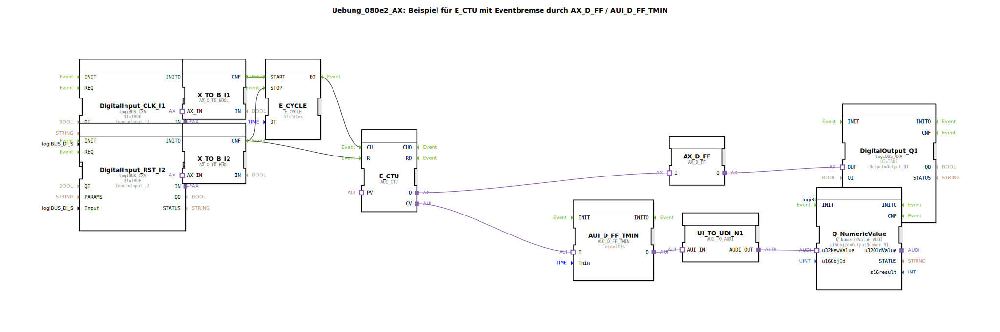

# Uebung_080e2_AX: Beispiel für E_CTU mit Eventbremse durch AX_D_FF / AUI_D_FF_TMIN

* * * * * * * * * *

## Einleitung

Diese Übung zeigt den Einsatz eines ereignisgesteuerten Zählers (E_CTU) in Kombination mit einer **Eventbremse**, die mit den Funktionsbausteinen `AX_D_FF` und `AUI_D_FF_TMIN` realisiert wird.  
Der Zähler wird über einen zyklischen Ereignisgeber (`E_CYCLE`) gesteuert, der durch einen externen digitalen Eingang (CLK) freigegeben wird. Ein zweiter digitaler Eingang (RST) setzt den Zähler zurück und stoppt den Zyklus. Der Zählerstand wird über eine minimale Haltezeit (`Tmin = 1 s`) auf einen numerischen Ausgang `N1` übertragen. Zusätzlich wird ein digitaler Ausgang `Q1` bei Erreichen des Zählerendwerts aktiviert.

## Verwendete Funktionsbausteine (FBs)

Die Übung besteht aus einer Sub-Applikation, die folgende Bausteine enthält:

- **DigitalInput_CLK_I1** – `logiBUS_IXA`  
  Digitaler Eingang `Input_I1` (CLK) als Quelle für die Freigabe des Zyklus.

- **DigitalInput_RST_I2** – `logiBUS_IXA`  
  Digitaler Eingang `Input_I2` (RST) zum Zurücksetzen des Zählers und Stoppen des Zyklus.

- **X_TO_B_I1** – `AX_X_TO_BOOL`  
  Konvertiert den Adapterwert von `DigitalInput_CLK_I1` in einen booleschen Wert.

- **X_TO_B_I2** – `AX_X_TO_BOOL`  
  Konvertiert den Adapterwert von `DigitalInput_RST_I2` in einen booleschen Wert.

- **E_CYCLE** – `E_CYCLE`  
  Erzeugt periodisch alle 1 ms ein Ereignis (`EO`). Wird über `START`/`STOP` gesteuert.

- **E_CTU** – `AUI_CTU`  
  Ereignisgesteuerter Vorwärtszähler. Der Zähleingang `CU` erhöht den internen Zählerstand `CV`. Bei Erreichen des maximalen Werts wird der Ausgang `Q` gesetzt. Der Eingang `R` setzt `CV` zurück.

- **AX_D_FF** – `AX_D_FF`  
  D-Flipflop auf Ereignisbasis. Speichert ein Ereignis (über `I`) und gibt es am Ausgang `Q` weiter. Dient als Puffer für das Zählersignal `Q`.

- **AUI_D_FF_TMIN** – `AUI_D_FF_TMIN`  
  D-Flipflop mit einstellbarer Mindestzeit (`Tmin = 1 s`). Ein anliegendes Ereignis wird erst nach Ablauf der Mindestzeit am Ausgang `Q` weitergegeben. Dient als **Eventbremse** für den Zählerstand `CV`.

- **UI_TO_UDI_N1** – `AUI_TO_AUDI`  
  Konvertiert das ereignisbasierte Signal des Flipflops `AUI_D_FF_TMIN` in ein datenorientiertes Signal.

- **Q_NumericValue** – `Q_NumericValue_AUDI`  
  Schreibt den konvertierten Zählerstand auf den numerischen Ausgang `OutputNumber_N1`.

- **DigitalOutput_Q1** – `logiBUS_QXA`  
  Digitaler Ausgang `Output_Q1`, gesteuert durch das Flipflop `AX_D_FF`.

## Programmablauf und Verbindungen

Der Ablauf wird über Ereignis- und Adapterverbindungen gesteuert:

1. **Eingangsverarbeitung**  
   - `DigitalInput_CLK_I1` liefert den Taktgeber (CLK) über `X_TO_B_I1` an den `E_CYCLE.START` (Ereignis CNF).  
   - `DigitalInput_RST_I2` liefert den Reset (RST) über `X_TO_B_I2` an `E_CTU.R` und gleichzeitig an `E_CYCLE.STOP`.

2. **Zyklischer Zähler**  
   - `E_CYCLE` erzeugt alle 1 ms ein Ereignis `EO`, sobald `START` aktiv ist. Dieses wird an `E_CTU.CU` geleitet. Der Zähler erhöht seinen Stand `CV` bei jedem Ereignis.  
   - Bei Aktivierung des Reset-Eingangs (RST) wird der Zähler zurückgesetzt und der Zyklus gestoppt.

3. **Ausgabe des Zählerstands**  
   - Der aktuelle Zählerstand `CV` von `E_CTU` wird über den Adapter an `AUI_D_FF_TMIN.I` übergeben.  
   - `AUI_D_FF_TMIN` gibt diesen Wert nach einer Verzögerung von mindestens 1 s als Ereignis an `AUI_D_FF_TMIN.Q` weiter (Eventbremse).  
   - Über `UI_TO_UDI_N1` (Konvertierung) gelangt der Wert an `Q_NumericValue` und wird auf den numerischen Ausgang `N1` ausgegeben.

4. **Digitaler Ausgang**  
   - Wenn der Zähler seinen Endwert erreicht hat, setzt `E_CTU.Q` ein Ereignis. Dieses wird vom `AX_D_FF` gespeichert und an den Digitalausgang `DigitalOutput_Q1` weitergegeben.  
   - Der Ausgang bleibt solange gesetzt, bis ein neues Ereignis (z. B. durch Reset) den Zustand ändert.

- **Lernziele**: Verständnis für ereignisgesteuerte Zähler, Steuerung von Zyklen mit externen Eingängen, Einsatz von Flipflops als Entprellung oder Mindesthaltezeit (Eventbremse).  
- **Schwierigkeitsgrad**: Fortgeschritten  
- **Vorkenntnisse**: Grundlagen der Ereignisverarbeitung in 4diac, Umgang mit Ein‑/Ausgangsbausteinen, Konzepte von Zählern und Flipflops.  
- **Hinweis**: Die Übung kann direkt in einer 4diac-IDE geladen und ausgeführt werden, sofern die benötigten Bibliotheken (logiBUS, isobus, adapter) verfügbar sind.

## Zusammenfassung

Die Übung `Uebung_080e2_AX` demonstriert, wie ein ereignisgesteuerter Zähler (`E_CTU`) mit einer **Eventbremse** aus zwei unterschiedlichen Flipflops (`AX_D_FF`, `AUI_D_FF_TMIN`) kombiniert wird. Durch die Mindestzeit des Flipflops wird eine ungewollt schnelle Aktualisierung des Ausgangswerts verhindert. Der Zähler wird von einem zyklischen Ereignisgeber getaktet, der über einen externen Eingang freigegeben und zurückgesetzt werden kann. Das Zusammenspiel der Bausteine vermittelt wichtige Konzepte der ereignisbasierten Steuerung in der Automatisierungstechnik.