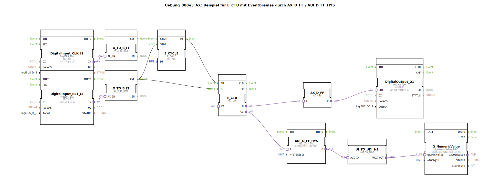

# Uebung_080e3_AX: Beispiel für E_CTU mit Eventbremse durch AX_D_FF / AUI_D_FF_HYS

* * * * * * * * * *
## Einleitung

Diese Übung demonstriert den Einsatz des universellen Aufwärtszählers **E_CTU** in Kombination mit einer **Eventbremse**, realisiert durch die Funktionsbausteine **AX_D_FF** (D-Flipflop) und **AUI_D_FF_HYS** (D-Flipflop mit Hysterese). Ziel ist es, den Zählerstand zu stabilisieren und auszugeben, sowie einen digitalen Ausgang bei Erreichen eines Zählerüberlaufs zu setzen.

## Verwendete Funktionsbausteine (FBs)

Die Übung verwendet ausschließlich primitive Funktionsbausteine (keine Sub-Applikationen). Nachfolgend sind alle eingesetzten Bausteine mit ihren Parametern und Verbindungen aufgeführt.

| Bausteinname | Typ | Parameter | Kurzbeschreibung |
|:---|:---|:---|:---|
| DigitalInput_CLK_I1 | logiBUS_IXA | QI = TRUE, Input = Input_I1 | Digitaler Eingang für das Taktsignal (CLK) |
| DigitalInput_RST_I2 | logiBUS_IXA | QI = TRUE, Input = Input_I2 | Digitaler Eingang für den Rücksetzimpuls (RST) |
| X_TO_B_I1 | AX_X_TO_BOOL | – | Konvertiert den Adapter-Eingang (AX) in einen Booleschen Wert |
| X_TO_B_I2 | AX_X_TO_BOOL | – | Gleiche Funktion für den Rücksetz-Eingang |
| E_CYCLE | E_CYCLE | DT = T#1ms | Zyklischer Taktgeber (Periode 1 ms) |
| E_CTU | AUI_CTU | – | Universeller Aufwärtszähler (Count Up) |
| AX_D_FF | AX_D_FF | – | D-Flipflop (AX-Welt), speichert einen booleschen Zustand |
| AUI_D_FF_HYS | AUI_D_FF_HYS | HYSTERESIS = UINT#25 | D-Flipflop mit Hysterese auf dem Zählerstand |
| UI_TO_UDI_N1 | AUI_TO_AUDI | – | Konvertiert AUI (unsigned integer) nach AUDI (adapter universal data interface) |
| Q_NumericValue | Q_NumericValue_AUDI | u16ObjId = OutputNumber_N1 | Ausgabe eines numerischen Wertes über den Feldbus |
| DigitalOutput_Q1 | logiBUS_QXA | QI = TRUE, Output = Output_Q1 | Digitaler Ausgang |

## Programmablauf und Verbindungen

Der Ablauf lässt sich in mehrere Schritte gliedern:

1. **Eingangssignale erfassen**  
   Die beiden digitalen Eingänge `DigitalInput_CLK_I1` und `DigitalInput_RST_I2` wandeln die physikalischen Signale in Adapterdaten um. Die nachgeschalteten Konverter `X_TO_B_I1` und `X_TO_B_I2` stellen daraus Boolesche Werte bereit (Ereignisausgang `CNF`).

2. **Taktgenerierung starten/stoppen**  
   - Das Taktsignal `CLK_I1` (über `X_TO_B_I1.CNF`) startet den zyklischen Taktgeber `E_CYCLE` (`START`-Ereignis).  
   - Das Rücksetzsignal `RST_I2` (über `X_TO_B_I2.CNF`) beendet den Taktgeber (`STOP`-Ereignis) und setzt gleichzeitig den Zähler `E_CTU` zurück (`R`-Ereignis).

3. **Zähler inkrementieren**  
   Der Taktgeber erzeugt alle 1 ms ein `EO`-Ereignis, das den Zähler `E_CTU` am Eingang `CU` (Count Up) erhöht.

4. **Ausgabe des Zählerstands**  
   - Der aktuelle Zählerstand (`CV`) wird dem Baustein `AUI_D_FF_HYS` übergeben. Dieses D-Flipflop mit Hysterese (Hysteresewert = 25) stabilisiert den Wert und gibt ihn an den Konverter `UI_TO_UDI_N1` weiter.  
   - Der konvertierte Wert gelangt schließlich an `Q_NumericValue` und wird als numerischer Ausgang zur Verfügung gestellt.

5. **Überlauf signalisieren**  
   Wenn der Zähler seinen Maximalwert erreicht (Überlauf, Ereignisausgang `Q`), wird das D-Flipflop `AX_D_FF` gesetzt. Dessen Ausgang `Q` schaltet den digitalen Ausgang `DigitalOutput_Q1` ein.

**Verbindungsübersicht (grafisch)**  
*Das Bildmaterial kann aus der 4diac-IDE exportiert werden.*

## Zusammenfassung

Die Übung veranschaulicht die Kopplung eines zyklischen Taktgebers mit einem Aufwärtszähler, einer **Ereignisbremse** (zur Vermeidung von schnellen Zustandswechseln) sowie einer **Hysterese** zur Glättung des Zählerstands.  
Nach Abschluss dieser Übung sind Sie in der Lage:  
- den Baustein `E_CTU` zu parametrieren und in eine Steuerungslogik einzubinden,  
- D-Flipflops zur Zustandsspeicherung zu verwenden,  
- eine Hysterese zur Stabilisierung von Zählerwerten anzuwenden,  
- und die Verbindung von Adapter-Bausteinen in der 4diac-IDE nachzuvollziehen.

**Lernziele**: Ereignisgesteuerte Zähler, Zustandsautomaten, Hysteresefilter.  
**Voraussetzungen**: Grundlegende Bedienung der 4diac-IDE, Verständnis von Ereignis- und Datenflüssen.  
**Schwierigkeitsgrad**: Mittel