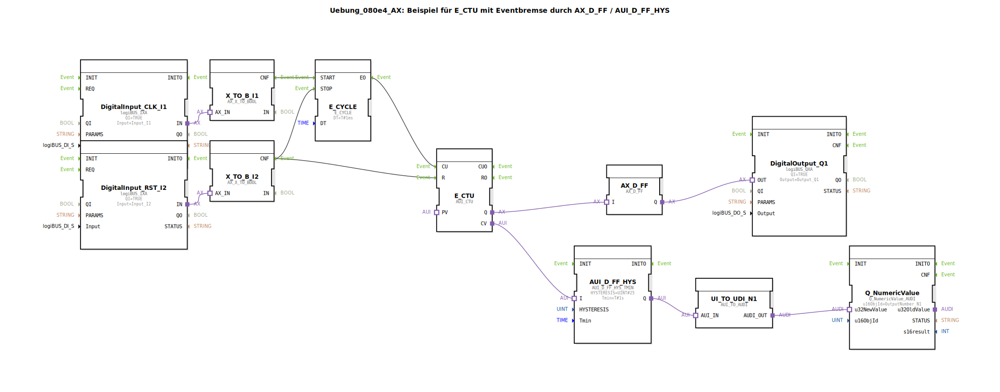

# Uebung_080e4_AX: Beispiel für E_CTU mit Eventbremse durch AX_D_FF / AUI_D_FF_HYS

* * * * * * * * * *

## Einleitung

Diese Übung zeigt die Verwendung eines **E_CTU**-Zählers in Kombination mit einer Ereignisbremse, die durch die Funktionsbausteine **AX_D_FF** (D‑Flipflop) und **AUI_D_FF_HYS** (D‑Flipflop mit Hysterese und Mindestzeit) realisiert wird. Der Zählerwert wird über einen digitalen Ausgang (Q1) und numerisch über ein Bus‑Objekt (N1) ausgegeben. Die Schaltung dämpft sprunghafte Änderungen des Zählerstandes und ermöglicht eine gezielte Filterung von Ereignissen.

## Verwendete Funktionsbausteine (FBs)

Die Subapplikation enthält keine eigenen Unterbausteine. Sie setzt sich aus vordefinierten Funktionsbausteinen zusammen:

- **DigitalInput_CLK_I1** – `logiBUS::io::DI::logiBUS_IXA`  
  Liest den binären Eingang **I1** (Taktgeber). Wird als Startimpuls für den Ereigniszyklus verwendet.

- **DigitalInput_RST_I2** – `logiBUS::io::DI::logiBUS_IXA`  
  Liest den binären Eingang **I2** (Reset). Setzt den Zähler zurück und stoppt den Ereigniszyklus.

- **X_TO_B_I1** – `adapter::conversion::unidirectional::AX_X_TO_BOOL`  
  Wandelt den AX‑Wert von `DigitalInput_CLK_I1` in ein BOOL‑Signal.

- **X_TO_B_I2** – `adapter::conversion::unidirectional::AX_X_TO_BOOL`  
  Wandelt den AX‑Wert von `DigitalInput_RST_I2` in ein BOOL‑Signal.

- **E_CYCLE** – `iec61499::events::E_CYCLE`  
  Erzeugt zyklisch ein Ereignis (Periode: 1 ms). Wird durch den Eingang I1 gestartet und durch I2 gestoppt.

- **E_CTU** – `adapter::events::unidirectional::AUI_CTU`  
  Aufwärtszähler. Zählt jedes Ereignis an seinem **CU**‑Eingang. Der aktuelle Zählwert liegt an **CV**, der Überlauf‑/Grenzwert‑Ausgang an **Q**. Der Zähler wird durch den Eingang **R** zurückgesetzt.

- **AX_D_FF** – `adapter::events::unidirectional::AX_D_FF`  
  D‑Flipflop. Übernimmt den logischen Zustand an **I** und gibt ihn über **Q** aus. Dient als Ereignisbremse: Der Zählerausgang Q des E_CTU wird nur nach dem Flipflop an den Digitalausgang weitergegeben.

- **AUI_D_FF_HYS** – `adapter::events::unidirectional::AUI_D_FF_HYS_TMIN`  
  D‑Flipflop mit Hysterese und Mindestzeit. Parameter:
  - `HYSTERESIS = UINT#25` – Hysteresebreite
  - `Tmin = T#1s` – minimale Verweildauer vor Zustandswechsel  
  Filtert den Zählerwert **CV**, sodass nur signifikante Änderungen (größer als die Hysterese) nach Ablauf der Mindestzeit weitergegeben werden.

- **UI_TO_UDI_N1** – `adapter::conversion::unidirectional::AUI_TO_AUDI`  
  Wandelt den gefilterten Zählerwert vom AUI‑Format in ein AUDI‑Format um.

- **Q_NumericValue** – `isobus::UT::Q::Q_NumericValue_AUDI`  
  Gibt den numerischen Wert über das Bus‑Objekt **OutputNumber_N1** aus.

- **DigitalOutput_Q1** – `logiBUS::io::DQ::logiBUS_QXA`  
  Setzt den digitalen Ausgang **Q1** entsprechend dem Zustand des Flipflops `AX_D_FF`.

## Programmablauf und Verbindungen

1. **Start/Stop der Zyklusabtastung**  
   Solange der Eingang **I1** (Taktgeber) aktiv ist, läuft der Ereigniszyklus `E_CYCLE` mit einer Periode von 1 ms. Wird **I2** (Reset) aktiv, wird der Zyklus gestoppt und gleichzeitig der Zähler zurückgesetzt.

2. **Zählerbetrieb**  
   Jedes vom `E_CYCLE` erzeugte Ereignis (**EO**) wird an den **CU**‑Eingang des `E_CTU` weitergeleitet – der Zähler erhöht sich bei jedem Zyklus um 1, solange kein Reset erfolgt.

3. **Ereignisbremse mit D‑Flipflop**  
   Der Überlauf‑/Grenzwert‑Ausgang **Q** des Zählers wird auf das **I** des `AX_D_FF` gegeben. Das Flipflop übernimmt diesen Zustand ereignisgesteuert und gibt ihn an den Digitalausgang `DigitalOutput_Q1` weiter. Dadurch wird der Ausgang nicht zyklisch durchgeschaltet, sondern nur bei einer Änderung des Zähler‑Q aktualisiert.

4. **Hysterese und Mindestzeit (Filterung des Zählerwerts)**  
   Der aktuelle Zählerwert **CV** wird dem Baustein `AUI_D_FF_HYS` zugeführt. Dieser gibt den Wert nur dann an den numerischen Ausgang weiter, wenn die Änderung größer als die eingestellte Hysterese (25 Einheiten) ist und der neue Wert mindestens 1 Sekunde stabil bleibt. So werden kurzzeitige Sprünge im Zählerstand unterdrückt.

5. **Ausgabe**  
   Der gefilterte Wert wird über `UI_TO_UDI_N1` und `Q_NumericValue` als numerisches Signal auf **OutputNumber_N1** ausgegeben. Der Digitalausgang **Q1** zeigt den Zustand des D‑Flipflops an.

**Lernziele:**
- Verständnis des Zusammenspiels von Ereigniszyklen (`E_CYCLE`) und Zählern (`E_CTU`)
- Einsatz von D‑Flipflops als Ereignisbremse
- Filterung von Zählerwerten mittels Hysterese und Mindestzeit
- Umgang mit Adapter‑Bausteinen und Formatwandlungen (AX ↔ BOOL, AUI ↔ AUDI)

**Schwierigkeitsgrad:** Fortgeschritten  
**Benötigte Vorkenntnisse:** Grundlegende 4diac‑IDE Bedienung, Wissen über Ereignis‑ und Datenflüsse, einfache Zähler und Flipflops.

## Zusammenfassung

Die Übung `Uebung_080e4_AX` demonstriert einen Aufwärtszähler, dessen Ausgang durch ein D‑Flipflop (Ereignisbremse) entkoppelt und dessen Zählwert durch einen weiteren D‑Flipflop mit Hysterese und Mindestzeit gefiltert wird. Dadurch wird ein stabiler, geglätteter Zählerstand sowohl digital als auch numerisch ausgegeben. Die Schaltung eignet sich besonders für Anwendungen, in denen kurze Störungen oder schnelle Zählereignisse unterdrückt werden müssen.