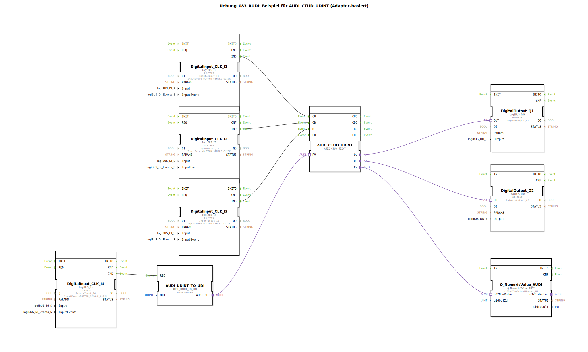

# Uebung_083_AUDI: Beispiel für AUDI_CTUD_UDINT (Adapter-basiert)

* * * * * * * * * *
## Einleitung

Diese Übung demonstriert die Verwendung eines Aufwärts-/Abwärtszählers auf Basis des Adapter-FBs `AUDI_CTUD_UDINT`. Vier digitale Eingänge (Taster mit Single-Click-Erkennung) steuern den Zähler: Zählen hoch (CU), Zählen runter (CD), Rücksetzen (R) und Übernahme eines neuen Zählerendwerts (PV). Der aktuelle Zählerwert (CV) wird auf einer numerischen Anzeige ausgegeben, während die Ausgänge QU und QD signalisieren, ob der Zähler den oberen oder unteren Grenzwert erreicht hat.

## Verwendete Funktionsbausteine (FBs)

- **DigitalInput_CLK_I1** (Typ: `logiBUS::io::DI::logiBUS_IE`)
    - Parameter: `QI = TRUE`, `Input = Input_I1`, `InputEvent = BUTTON_SINGLE_CLICK`
    - Erzeugt ein Ereignis `IND` bei Betätigung des Tasters an Eingang I1.

- **DigitalInput_CLK_I2** (Typ: `logiBUS::io::DI::logiBUS_IE`)
    - Parameter: `QI = TRUE`, `Input = Input_I2`, `InputEvent = BUTTON_SINGLE_CLICK`
    - Erzeugt ein Ereignis `IND` bei Betätigung des Tasters an Eingang I2.

- **DigitalInput_CLK_I3** (Typ: `logiBUS::io::DI::logiBUS_IE`)
    - Parameter: `QI = TRUE`, `Input = Input_I3`, `InputEvent = BUTTON_SINGLE_CLICK`
    - Erzeugt ein Ereignis `IND` bei Betätigung des Tasters an Eingang I3.

- **DigitalInput_CLK_I4** (Typ: `logiBUS::io::DI::logiBUS_IE`)
    - Parameter: `QI = TRUE`, `Input = Input_I4`, `InputEvent = BUTTON_SINGLE_CLICK`
    - Erzeugt ein Ereignis `IND` bei Betätigung des Tasters an Eingang I4.

- **AUDI_CTUD_UDINT** (Typ: `adapter::events::unidirectional::AUDI_CTUD_UDINT`)
    - Adapter-basierter Aufwärts-/Abwärtszähler für 32-Bit unsigned Integer.
    - Ereigniseingänge: `CU` (Count Up), `CD` (Count Down), `R` (Reset)
    - Datenausgänge: `CV` (aktueller Zählerwert), `QU` (High wenn CV ≥ PV), `QD` (High wenn CV = 0)
    - Daten/Adaptereingänge: `PV` (Preset Value) über Adapterverbindung
    - **Parametereinstellungen**: keine Angabe im XML (Standardwerte)

- **DigitalOutput_Q1** (Typ: `logiBUS::io::DQ::logiBUS_QXA`)
    - Parameter: `QI = TRUE`, `Output = Output_Q1`
    - Gibt den Zustand `QU` des Zählers als Binärausgang aus.

- **DigitalOutput_Q2** (Typ: `logiBUS::io::DQ::logiBUS_QXA`)
    - Parameter: `QI = TRUE`, `Output = Output_Q2`
    - Gibt den Zustand `QD` des Zählers als Binärausgang aus.

- **Q_NumericValue_AUDI** (Typ: `isobus::UT::Q::Q_NumericValue_AUDI`)
    - Parameter: `u16ObjId = OutputNumber_N1`
    - Zeigt einen numerischen Wert (hier den aktuellen Zählerwert CV) auf einer Anzeige mit Objekt-ID `OutputNumber_N1` an.

- **AUDI_UDINT_TO_UDI** (Typ: `adapter::conversion::unidirectional::AUDI_UDINT_TO_UDI`)
    - Parameter: `OUT = UDINT#5` (fester Sollwert 5)
    - Wandelt einen konstanten Wert (5) in ein Adaptersignal um, das als PV (Preset Value) für den Zähler dient.

## Programmablauf und Verbindungen

Die Schaltung arbeitet ereignisgesteuert über die Tastereingänge:

1. **Zählen hoch (CU)**: Ein Tastendruck an **I1** erzeugt ein `IND`-Ereignis, das mit dem Ereigniseingang `CU` des Zählers `AUDI_CTUD_UDINT` verbunden ist. Der Zähler erhöht sich um 1.
2. **Zählen runter (CD)**: Ein Tastendruck an **I2** erzeugt ein `IND`-Ereignis für den Eingang `CD`. Der Zähler verringert sich um 1.
3. **Rücksetzen (R)**: Ein Tastendruck an **I3** setzt den Zähler über den Eingang `R` auf 0 zurück.
4. **Preset-Wert übernehmen (PV)**: Ein Tastendruck an **I4** triggert den FB `AUDI_UDINT_TO_UDI` (Ereigniseingang `REQ`), der den konstanten Wert **5** über seinen Adapterausgang `AUDI_OUT` an den PV-Eingang des Zählers sendet. Der Zähler übernimmt diesen Wert als neuen oberen Grenzwert.

Die Ausgänge sind wie folgt verbunden:
- Der Adapterausgang `QU` des Zählers ist mit dem Steuereingang `OUT` von `DigitalOutput_Q1` verbunden. Wird der Zählerstand ≥ PV (hier initial Standardwert, sofern nicht überschrieben), leuchtet die Lampe Q1.
- Der Adapterausgang `QD` ist mit `DigitalOutput_Q2` verbunden. Bei Zählerstand = 0 leuchtet Q2.
- Der aktuelle Zählerwert `CV` wird über eine Adapterverbindung an den Eingang `u32NewValue` des Anzeigebausteins `Q_NumericValue_AUDI` weitergeleitet und auf einer numerischen Anzeige dargestellt.

Die Konstante `UDINT#5` am FB `AUDI_UDINT_TO_UDI` legt fest, dass bei Betätigung von I4 der Preset-Wert auf 5 gesetzt wird – der Zähler wird dann bei Erreichen von 5 den QU-Ausgang aktivieren.

## Zusammenfassung

Die Übung veranschaulicht den Einsatz eines Adapter-basierten Aufwärts-/Abwärtszählers (`AUDI_CTUD_UDINT`) in 4diac. Vier Tastereingänge dienen als Steuersignale (Hochzählen, Runterzählen, Rücksetzen und Preset-Übernahme). Die Ausgangssignale QU (Grenzwert erreicht) und QD (Nullpunkt) werden auf digitale Ausgänge geführt, der aktuelle Zählerwert wird numerisch angezeigt. Durch die Adaptertechnologie werden Ereignis- und Datenflüsse entkoppelt, was eine flexible und wiederverwendbare Verschaltung ermöglicht.